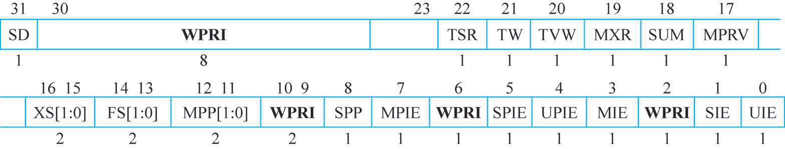
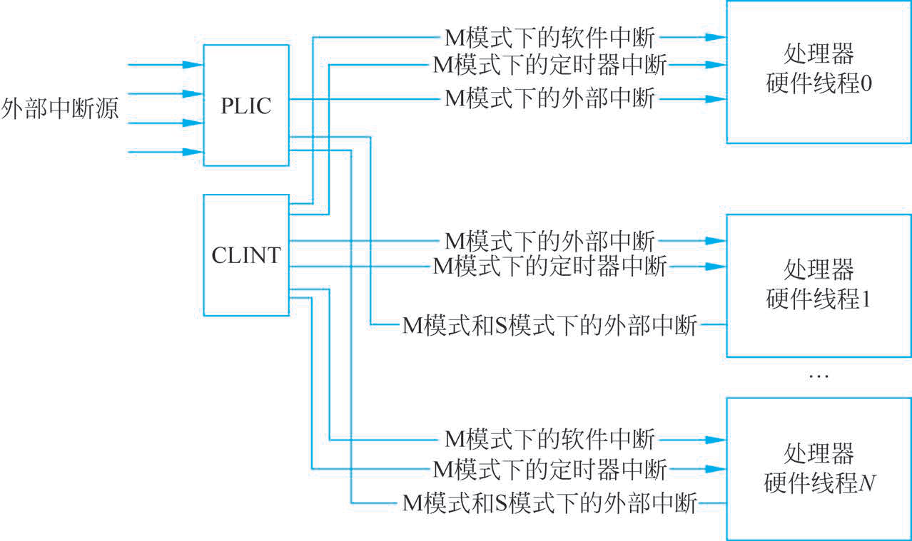
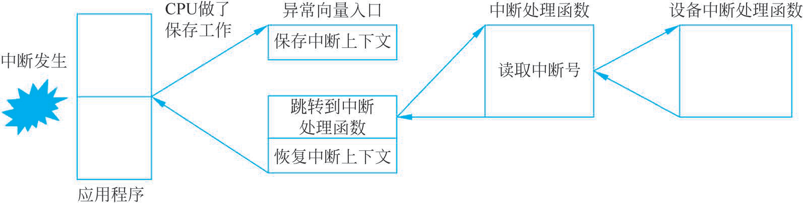

# 第3章 RISC-V架构的中断和异常

RISC-V架构中的中断和异常是处理器核心功能的重要组成部分,它们允许处理器响应内部和外部事件,以及处理非预期或非法的操作情况。理解这些概念对于开发和优化基于RISC-V的系统至关重要。

本章深入探讨了RISC-V架构中的中断和异常处理机制,旨在为读者提供一个关于如何识别、响应和管理中断与异常的全面指南。内容分为6个主要部分,每部分针对不同的概念和组件进行详细讲解,确保读者能够全面理解RISC-V架构下的中断和异常处理。

(1) 中断与异常基础。介绍了中断和异常的基本概念,区分了异步发生的外部中断和同步发生的异常,以及广义上的异常,为后续深入讨论打下基础。
(2) 异常处理机制。详细阐述了异常处理的整个流程,包括如何进入异常处理模式、在完成处理后如何退出,以及异常服务程序的角色和重要性。
(3) 中断处理。深入探讨了中断处理的各个方面,包括RISC-V支持的中断类型、中断处理的完整流程、中断的委派和注入机制、中断屏蔽与等待、中断优先级与仲裁,以及中断嵌套处理。此外,还比较了中断与异常的不同点,帮助读者更好地理解这两个概念之间的区别。
(4) 核心局部中断控制器(CLINT)。讲述了CLINT的作用和重要性,强调了其在管理和控制核心局部中断中的关键角色。
(5) PLIC管理多个外部中断。着重讲解了PLIC的功能和特点,包括其如何管理和分配多个外部中断,以及PLIC寄存器在中断管理中的应用。
(6) RISC-V结果预测相关CSR。简要介绍了控制和状态寄存器(Control and Status Register,CSR)在结果预测和性能优化中的应用,突出了其在提高RISC-V架构性能中的作用。

通过本章的学习,读者将获得对RISC-V架构中中断和异常处理机制的深入理解,包括其工作原理、处理流程及相关硬件组件的知识,为进一步研究和应用RISC-V架构提供了坚实的基础。

## 3.1 中断和异常

在计算机体系结构中,中断和异常是核心概念,它们允许操作系统响应异步事件及处理程序错误和特殊情况。虽然这两个术语经常被一起讨论,但它们代表不同的概念和处理机制。

### 3.1.1 中断

中断(Interrupt)机制,即处理器核在顺序执行程序指令流的过程中突然被别的请求打断而中止执行当前的程序,转而去处理别的事情,待其处理完别的事情,然后重新回到之前程序中断的点继续执行之前的程序指令流,其要点如下。

(1) 打断处理器执行程序指令流的“别的请求”便称为中断请求(Interrupt Request),“别的请求”的来源称为中断源(Interrupt Source)。中断源通常来自外围硬件设备。
(2) 处理器转而去处理的“别的事情”称为中断服务程序(Interrupt Service Routine,ISR)。
(3) 中断处理是一种正常的机制,而非一种错误情形。处理器收到中断请求之后,需要保存当前程序的现场,简称为保存现场。等到处理完中断服务程序后,处理器需要恢复之前的现场,从而继续执行之前被打断的程序,简称为“恢复现场”。
(4) 可能存在多个中断源同时向处理器发起请求的情形,因此需要对这些中断源进行仲裁,从而选择哪个中断源被优先处理。此种情况称为“中断仲裁”,同时可以给不同的中断分配优先级以便于仲裁,因此中断存在着“中断优先级”的概念。
(5) 还有一种可能是处理器已经在处理某个中断的过程中(执行该中断的ISR中),此时有一个优先级更高的新中断请求到来,此时处理器该如何是好呢?有如下两种可能。

第一种可能是处理器并不响应新的中断,而是继续执行当前正在处理的中断服务程序,待到彻底完成之后才响应新的中断请求,这种称为处理器“不支持中断嵌套”。
第二种可能是处理器中止当前的中断服务程序,转而开始响应新的中断,并执行其“中断服务程序”,如此便形成了中断嵌套(即前一个中断还没响应完,又开始响应新的中断),并且嵌套的层次可以有很多层。

### 3.1.2 异常

异常(Exception)机制,即处理器核在顺序执行程序指令流的过程中突然遇到了异常的事情而中止执行当前的程序,转而去处理该异常,其要点如下。

(1) 处理器遇到的“异常的事情”称为异常。异常与中断的最大区别在于中断往往是一种外因,而异常是由处理器内部事件或程序执行中的事件引起的,例如本身硬件故障、程序故障,或者执行特殊的系统服务指令而引起的,简而言之是一种内因。
(2) 与中断服务程序类似,处理器也会进入异常服务处理程序。
(3) 与中断类似,可能存在多个异常同时发生的情形,因此异常也有优先级,并且也可能发生多重异常的嵌套。

### 3.1.3 广义上的异常

中断和异常最大的区别是起因内外有别。除此之外,从本质上讲,中断和异常对于处理器而言基本上是一个概念。中断和异常发生时,处理器将暂停当前正在执行的程序,转而执行中断和异常处理程序;返回时,处理器恢复执行之前被暂停的程序。

因此,中断和异常的划分是一种狭义的划分。从广义上来讲,中断和异常都被认为是一种广义上的异常。处理器广义上的异常,通常只分为同步异常(Synchronous Exception)和异步异常(Asynchronous Exception)。

**1. 同步异常**

同步异常是指由于执行程序指令流或者试图执行程序指令流而造成的异常。这种异常的原因能够被精确定位于某一条执行的指令。同步异常的另外一个通俗的表象是,无论程序在同样的环境下执行多少遍,每次都能精确地重现出来。

例如,程序流中有一条非法的指令,那么处理器执行到该非法指令便会产生非法指令异常,能被精确地定位到这条非法指令,并且能够被反复重现。

**2. 异步异常**

异步异常是指那些产生原因不能够被精确定位于某条指令的异常。异步异常的另一个通俗的表象是,程序在同样的环境下执行很多遍,每次发生异常的指令PC都可能会不一样。

最常见的异步异常是“外部中断”。外部中断的发生是由外围设备驱动的,一方面外部中断的发生带有偶然性,另一方面中断请求抵达处理器核时,处理器的程序指令流执行到具体的哪条指令更带有偶然性。

对于异步异常,根据其响应异常后的处理器状态,可以分为两种。

(1) 精确异步异常(Precise Asynchronous Exception):指响应异常后的处理器状态能够精确反映为某条指令的边界,即某条指令执行完成后的处理器状态。
(2) 非精确异步异常(Imprecise Asynchronous Exception):指响应异常后的处理器状态无法精确地反映某条指令的边界,即可能是某条指令执行了一半然后被打断的结果,或者是其他模糊的状态。

常见的典型同步异常和异步异常如表3-1所示,此表可以帮助读者更加理解同步异常和异步异常的区别。

**表3-1 同步异常和异步异常**

| 类型 | 典型异常 |
|---|---|
| 同步异常 | 取指令访问到非法的地址区间。例如外设模块的地址区间往往是不可能存放指令代码的,因此其属性是“不可执行”,并且还是读敏感的。如果某条指令的PC位于外设区间,则会造成取指令错误。这种错误能够精确地定位到是哪条指令PC造成的 |
| 同步异常 | 读写数据访问地址属性出错。例如有的地址区间的属性是只读或者只写的,假设Load或者Store指令以错误的方式访问了地址区间(例如写了只读的区间),这种错误方式能够被存储器保护单元(Memory Protection Unit,MPU)或者MMU及时探测出来,则能够精确地定位到是哪条Load或Store指令访存造成的。MPU和MMU是分别对地址进行保护和管理的硬件单元,本书限于篇幅在此对其不做赘述,感兴趣的读者请自行查阅其他资料 |
| 同步异常 | 取指令地址非对齐错误。处理器ISA往往规定指令存放在存储器中的地址必须是对齐的,例如16位长的指令往往要求其PC值必须是16位对齐的。假设该指令的PC值不对齐,则会造成取指令不对齐错误。这种错误能够精确地定位到是哪条指令PC造成的 |
| 同步异常 | 非法指令错误处理器如果对指令进行译码后发现,这是一条非法的指令(例如不存在的指令编码),则会造成非法指令错误。这种错误能够精确地定位到是哪条指令造成的 |
| 同步异常 | 执行调试断点指令。处理器ISA往往会定义若干条调试指令,例如断点(EBREAK)指令。当执行到该指令时处理器便会发生异常,进入异常服务程序。该指令往往用于调试器(Debugger)使用,例如设置断点。这种异常能够被精确地定位于具体是哪条EBREAK指令造成的 |
| 精确异步异常 | 外部中断是最常见的精确异步异常 |
| 非精确异步异常 | 读写存储器出错是一种最常见的非精确异步异常,由于访问存储器(简称访存)需要一定的时间,处理器不可能坐等该访问结束(否则性能会很差),而是会继续执行后续的指令。等到访存结果从目标存储器返回来之后,发现出现了访存错误并汇报异常,但是处理器此时可能已经执行到了后续的某条指令,难以精确定位。并且存储器返回的时间时延也具有偶然性,无法被精确地重现。这种异步异常的另外一个常见示例便是写操作,将数据写入缓存行(Cache Line)中,然后该缓存行经过很久才被替换出来,写回外部存储器,但是写回外部存储器返回结果出错。此时处理器可能已经执行过了后续成百上千条指令,到底是哪条指令写的这个地址的缓存行早已是“前朝旧事”,不可能被精确定位,更不要说复现了。有关缓存的细节,本书限于篇幅在此对其不做赘述,感兴趣的读者请自行查阅其他资料 |

## 3.2 RISC-V架构异常处理机制

RISC-V架构通过一套精心设计的异常处理机制管理和响应各种异常和中断。这些机制包括一系列控制状态寄存器(Control and Status Register,CSR),以及专门的指令和处理流程。这些组成部分共同确保了系统能够有效地识别异常(包括中断),并采取相应的处理措施。

(1) CSR。RISC-V定义了多个CSR管理异常和中断,其中最关键的包括以下几个。
① 机器模式异常入口基地址寄存器(Machine Trap-Vector Base-Address Register,mtvec):存储异常处理程序的入口地址。它可以配置为直接模式或向量模式,分别用于所有异常使用单一入口点或为不同的异常指定不同入口点。
② 机器状态寄存器(Machine Status Register,mstatus):包含全局中断使能位和其他状态位,例如机器模式中断使能(Machine Mode Interrupt Enable,MIE)位用于全局控制中断的使能状态。
③ 机器模式异常原因寄存器(Machine Cause Register,mcause):记录最后一次异常或中断的原因,其中包括异常码和区分异常与中断的标志位。
④ 机器模式异常程序计数器(Machine Exception Program Counter,mepc):在发生异常时保存当前的程序计数器值,用于异常处理完成后返回到异常发生点。
⑤ 机器模式中断使能寄存器(Machine Interrupt Enable Register,mie)和机器中断等待寄存器(Machine Interrupt Pending Register,mip):分别用于控制各种中断源的使能状态和查看当前挂起的中断。

(2) 异常处理流程。当RISC-V处理器检测到异常或中断时,它会自动执行以下步骤。
① 保存上下文:将当前的程序计数器(PC)值保存到mepc寄存器中。
② 更新状态:更新mstatus,禁用进一步的中断(清除MIE位),以避免在异常处理过程中被其他中断打断。
③ 设置原因:将异常或中断的原因写入mcause。
④ 跳转处理程序:根据mtvec的配置,跳转到异常处理程序的入口点。

(3) 返回正常执行。异常处理程序完成后,通常使用特殊的指令,如机器返回(Machine RETurn,MRET)指令,恢复处理器状态并返回到异常发生前的位置继续执行。MRET指令会恢复mepc中保存的程序计数器值,并根据mstatus的内容恢复中断使能状态。

RISC-V的异常处理机制提供了灵活而强大的方式响应和处理各种异常和中断,确保了系统的稳定性和响应性。通过精心设计的CSR和处理流程,RISC-V支持高效的异常处理,同时为操作系统和应用程序提供了必要的灵活性和控制能力。

目前,RISC-V架构文档主要分为“指令集文档”和“特权架构文档”。RISC-V架构的异常处理机制定义在“特权架构文档”中。

狭义的中断和异常均可以被归于广义的异常范畴,以下将用“异常”作为统一概念进行论述,包含狭义上的“中断”和“异常”。

RISC-V的架构不仅可以有机器模式(Machine Mode)的工作模式,还可以有用户模式(User Mode)、监管模式(Supervisor Mode)等工作模式。在不同的模式下均可以产生异常,并且有的模式也可以响应中断。

RISC-V架构要求机器模式是必须具备的模式,其他的模式均是可选而非必选的模式。

### 3.2.1 进入异常

进入异常时,RISC-V架构规定的硬件行为可以简述如下。

(1) 停止执行当前程序流,转而从CSRmtvec定义的程序计数器地址开始执行。
(2) 进入异常不仅会让处理器跳转到上述的程序计数器地址开始执行,还会让硬件同时更新其他几个CSR,分别是:mcause、mepc、机器模式异常值寄存器(Machine Trap Value Register,mtval)、mstatus。

**1. 从mtvec定义的程序计数器地址开始执行**

RISC-V架构规定,在处理器的程序执行过程中,一旦遇到异常发生,则终止当前的程序流,处理器被强行跳转到一个新的程序计数器地址。该过程在RISC-V的架构中定义为“陷阱(trap)”,字面含义为“跳入陷阱”,更加准确的意译为“进入异常”。

RISC-V处理器进入异常后跳入的程序计数器地址由mtvec的CSR指定,其要点如下。

(1) mtvec是一个可读可写的CSR,因此软件可以通过编程更改其中的值。
(2) mtvec的详细格式如图3-1所示,其中的最低2位是MODE域,高30位是BASE域。

**图3-1 mtvec的详细格式**

假设MODE的值为0,则所有的异常响应时处理器均跳转到BASE值指示的程序计数器地址;假设MODE的值为1,则狭义的异常发生时,处理器跳转到BASE值指示的程序计数器地址。狭义的中断发生时,处理器跳转到BASE+4xCAUSE值指示的程序计数器地址。CAUSE的值表示中断对应的异常编号(Exception Code)。例如机器计时器中断的异常编号为7,则其跳转的地址为BASE+4×7=BASE+28=BASE+0x1c。

**2. 更新CSR mcause**

RISC-V架构规定,在进入异常时,mcause被同时更新,以反映当前的异常种类,软件可以通过读此寄存器查询造成异常的具体原因。

mcause的详细格式如图3-2所示,其中最高1位为中断(Interrupt)域,低31位为异常编号域。

**图3-2 mcause的详细格式**

此两个域的组合用于指示RISC-V架构定义的12种中断类型和16种异常类型。

当Interrupt的值为1、异常码的值为0~11时,对应的12种中断类型如下。

(1) 用户软件中断(User software interrupt)。
(2) 监督软件中断(Supervisor software interrupt)。
(3) 保留(Reserved)。
(4) 机器软件中断(Machine software interrupt)。
(5) 用户定时器中断(User timer interrupt)。
(6) 监督定时器中断(Supervisor timer interrupt)。
(7) 保留(Reserved)。
(8) 机器定时器中断(Machine timer interrupt)。
(9) 用户外部中断(User external interrupt)。
(10) 监督外部中断(Supervisor external interrupt)。
(11) 保留(Reserved)。
(12) 机器外部中断(Machine external interrupt)。

当序号≥12时:保留(Reserved)。

当Interrupt的值为0、异常码的值为0~15时,对应的16种异常类型。

(1) 指令地址错对齐(Instruction address misaligned)。
(2) 指令访问故障(Instruction access fault)。
(3) 非法指令(Illegal instruction)。
(4) 断点(Breakpoint)。
(5) 载入地址错对齐(Load address misaligned)。
(6) 载入访问故障(Load access fault)。
(7) 存储/AMO地址错对齐(Store/AMO access misaligned)。
(8) 存储/AMO访问故障(Store/AMO access fault)。
(9) 来自U模式的环境调用(Environment call from U-mode)。
(10) 来自S模式的环境调用(Environment call from S-mode)。
(11) 保留(Reserved)。
(12) 来自M模式的环境调用(Environment call from M-mode)。
(13) 指令页表错误(Instruction page fault)。
(14) 载入页表错误(Load page fault)。
(15) 保留(Reserved)。
(16) 存储/AMO页表错误(Store/AMO page fault)。

当序号≥16时:保留(Reserved)。

**3. 更新CSR mepc**

RISC-V架构定义异常的返回地址由mepc保存。在进入异常时,硬件将自动更新mepc的值为当前遇到异常的指令程序计数器值(即当前程序的停止执行点)。该寄存器将作为异常的返回地址,在异常结束之后,能够使用它保存的程序计数器值回到之前被停止执行的程序点。

(1) 值得注意的是,虽然mepc会在异常发生时自动被硬件更新,但是mepc本身也是一个可读可写的寄存器,因此软件也可以直接写该寄存器以修改其值。
(2) 对于狭义的中断和异常而言,RISC-V架构定义它们的返回地址(更新的mepc值)有些细微差别。
① 出现中断时,中断返回地址mepc的值被更新为下一条尚未执行的指令。
② 出现异常时,中断返回地址mepc的值被更新为当前发生异常的指令程序计数器。

注意:如果异常由ecall或ebreak产生,由于mepc的值被更新为ecall或ebreak指令自己的程序计数器,因此在异常返回时,如果直接使用mepc保存的程序计数器值作为返回地址,则会再次跳回ecall 或者 ebreak指令,从而造成死循环(执行ecall或者ebreak指令导致重新进入异常)。正确的做法是,在异常处理程序中,软件改变mepc指向下一条指令,由于现在ecall/ebreak(或c.ebreak)是4(或2)字节指令,因此改写设定mepc=mepc+4(或+2)即可。

**4. 更新CSR mtval**

RISC-V架构规定,在进入异常时,硬件将自动更新mtval,以反映引起当前异常的存储器访问地址或者指令编码。

(1) 如果是由存储器访问造成的异常,例如遭遇硬件断点、取指令和存储器读写造成的异常,则将存储器访问的地址更新到mtval中。
(2) 如果是由非法指令造成的异常,则将该指令的指令编码更新到mtval中。

注意:mtval又名mbadaddr,在某些版本的RISC-V编译器中仅识别mbadaddr名称。

**5. 更新CSR mstatus**

RISC-V架构规定,在进入异常时,硬件将自动更新机器模式状态寄存器(Machine Status Register,mstatus)的某些域。

(1) mstatus的详细格式如图3-3所示,其中的全局中断使能(MIE)域表示在机器模式下中断全局使能。

**图3-3 mstatus的详细格式**

① 当该MIE域的值为1时,表示机器模式下所有中断的全局打开。
② 当该MIE域的值为0时,表示机器模式下所有中断的全局关闭。

(2) RISC-V架构规定,异常发生时有如下情况发生。
① MPIE域的值被更新为异常发生前MIE域的值。MPIE域的作用是在异常结束之后,能够使用MPIE的值恢复出异常发生之前的MIE值。
② MIE的值被更新为0(意味着进入异常服务程序后中断被全局关闭,所有的中断都将被屏蔽,不被响应)。
③ 机器先前特权(Machine Previous Privilege,MPP)的值被更新为异常发生前的模式。MPP域的作用是在异常结束之后,能够使用MPP的值恢复出异常发生之前的工作模式。对于只支持机器模式的处理器核,则MPP的值永远为二进制的值11。

### 3.2.2 退出异常

当程序完成异常处理之后,最终需要从异常服务程序中退出,并返回主程序。RISC-V架构定义了一组专门的退出异常指令,包括MRET,监控返回(Supervisor Return,SRET),用户返回(User Return,URET)指令。其中MRET指令是必备的,而SRET和URET指令仅在支持监管模式和用户模式的处理器中使用。

在机器模式下退出异常时,软件必须使用MRET指令。RISC-V架构规定,处理器执行MRET指令后的硬件行为如下:

(1) 停止执行当前程序流,转而从CSR mepc定义的程序计数器地址开始执行;
(2) 执行MRET指令不仅会让处理器跳转到上述的程序计数器地址开始执行,还会让硬件同时更新CSR mstatus。

**1. 从mepc定义的程序计数器地址开始执行**

在进入异常时,mepc被同时更新,以反映当时遇到异常的指令的程序计数器值。通过这个机制,MRET指令执行后,处理器回到了当时遇到异常的指令的程序计数器地址,从而可以继续执行之前被中止的程序流。

**2. 更新CSR mstatus**

mstatus的详细格式见图3-3。RISC-V架构规定,在执行MRET指令后,硬件将自动更新mstatus的某些域。

RISC-V架构规定,执行MRET指令退出异常时有如下情况:

(1) mstatus MIE域的值被更新为当前MPIE的值;
(2) mstatus MPIE域的值则被更新为1。

在进入异常时,MPIE的值曾经被更新为异常发生前的MIE值,而MRET指令执行后,再次将MIE域的值更新为MPIE的值。通过这个机制,MRET指令执行后,处理器的MIE值被恢复成异常发生之前的值(假设之前的MIE值为1,则中断被重新全局打开)。

### 3.2.3 异常服务程序

当处理器进入异常后,即开始从mtvec定义的程序计数器地址执行新的程序,该程序通常为异常服务程序,并且程序还可以通过查询mcause中的异常编号决定进一步跳转到更具体的异常服务程序。例如当程序查询mcause中的值为0x2,则得知该异常是由非法指令错误引起的,因此可以进一步跳转到非法指令错误异常服务子程序中去。

## 3.3 RISC-V架构中断

在RISC-V架构中,中断是指由处理器外部的事件或内部的条件触发的异步事件,这些事件要求处理器暂停当前执行的任务,转而处理这个紧急事件。中断机制允许处理器响应外部设备、内部计时器等产生的信号,从而实现对这些事件的即时处理。RISC-V架构中的中断可以分为几个主要类别,并且通过一套标准化的流程进行管理和处理。

### 3.3.1 中断类型

在RISC-V架构中,中断和异常是处理器响应外部和内部事件的机制。中断是由外部设备发起的,通常用于指示外部设备需要处理器注意,如输入/输出操作完成。异常则是由程序执行中的事件引起的,如非法指令或访问违规。

RISC-V架构定义的中断类型分为4种。

(1) 外部中断。外部中断通常是指来自处理器外部设备(如串口设备等)的中断。RISC-V体系结构在M模式和S模式下都可以处理外部中断。为了支持更多的外部中断源,处理器一般采用中断控制器管理,例如,RISC-V体系结构定义了一个平台级别的中断控制器(Platform-Level Interrupt Controller,PLIC),用于外部中断的仲裁和派发功能。
(2) 定时器中断。定时器中断指的是来自定时器的中断,通常用于操作系统的时钟中断。在RISC-V体系结构中,在M模式和S模式下都有定时器。RISC-V体系结构规定处理器必须有一个定时器,通常实现在M模式。RISC-V体系结构还为定时器定义了两个64位的寄存器:机器模式计时器寄存器(Machine Time Register,mtime)和机器模式计时器比较值寄存器(Machine Time Compare Register,mtimecmp)。它们通常实现在CLINT中。
(3) 软件中断。软件中断指的是由软件触发的中断,通常用于处理器内核之间的通信,即处理器间中断(Inter-Processor Interrupt,IPI)。
(4) 调试中断。调试中断一般用于硬件调试功能。

在RISC-V处理器中,中断按照功能又可以分成如下两类。

(1) 本地中断:直接发送给本地处理器硬件线程,它是一个处理器私有的中断并且有固定的优先级。本地中断可以有效缩短中断时延,因为它不需要经过中断控制器的仲裁及额外的中断查询。软件中断和时钟中断是常见的本地中断。本地中断一般由处理器的CLINT产生。
(2) 全局中断:通常指的是外部中断,经过PLIC的路由,送到合适的处理器内核。PLIC支持更多的中断号、可配置的优先级和路由策略等。

中断框架如图3-4所示。

**图3-4 中断框架**

下面将分别予以详述。

**1. 外部中断**

在RISC-V架构中,外部中断是由处理器外部的事件触发的中断,这些事件通常来自外部硬件设备,如I/O设备、网络接口或其他外部源。外部中断提供了一种机制,使处理器能够响应外部设备的事件,如数据的到达、设备就绪或其他重要的状态变化。这是实现异步事件处理的关键机制,对于构建响应式系统和操作系统非常重要。

(1) 外部中断的工作原理。当外部设备发生一个事件需要处理器注意时,设备通过中断请求(Interrupt Request,IRQ)向处理器发送一个中断信号。处理器在完成当前指令的执行后,会检查中断信号。如果中断被允许,处理器会暂停当前的执行流程,保存当前的上下文(如寄存器状态),然后跳转到预定的中断服务程序(Interrupt Service Routine,ISR)响应这个中断。

中断服务程序执行必要的操作处理这个外部事件,比如读取数据或者重置设备状态。完成这些操作后,ISR会恢复之前保存的上下文,并通过特定的指令告诉处理器中断处理完成,处理器随后会返回到被中断的位置继续执行。

(2) RISC-V中外部中断的处理。在RISC-V中,中断处理由中断控制器负责,它负责管理和分发来自外部设备的中断请求。RISC-V定义了两种中断模式:直接模式和向量模式。
① 直接模式:所有的中断都会导致处理器跳转到同一个入口点(通常是mtvec指定的地址),ISR需要在这个地方根据中断源进行区分处理。
② 向量模式:每种类型的中断都有其对应的入口点。在这种模式下,mtvec指定的是一个基地址,处理器会根据中断源的不同,跳转到这个基地址偏移量不同的位置。

对于外部中断,RISC-V定义了两个重要的控制寄存器。

(1) mie:用于控制哪些中断是允许的。
(2) mip:用于指示哪些中断是待处理的。

外部中断通常通过PLIC管理,PLIC负责接收来自外部设备的中断请求,优先级排序,然后将中断请求发送给处理器。处理器通过读取PLIC提供的信息确定中断源和优先级,然后执行相应的ISR。

外部中断在RISC-V架构中是处理外部设备事件的关键机制。通过合理配置和使用中断控制器,RISC-V处理器可以高效地响应外部设备的请求,实现快速和灵活的事件处理。

RISC-V架构定义的外部中断要点如下。

(1) 外部中断是指来自处理器核外部的中断,例如外部设备UART、通用输入输出(General Purpose Input/Output,GPIO)等产生的中断。
(2) RISC-V架构在机器模式、监管模式和用户模式下均有对应的外部中断。由于本书为简化知识模型,在此仅介绍“只支持机器模式”的架构,因此仅介绍机器模式外部中断。
(3) 机器模式外部中断的屏蔽由CSRmie中的MEIE域控制,等待标志则反映在CSRmip中的MEIP域。
(4) 机器模式外部中断可以作为处理器核的一个单比特输入信号,假设处理器需要支持很多个外部中断源,RISC-V架构定义了一个PLIC可用于多个外部中断源的优先级仲裁和派发。
① PLIC可以将多个外部中断源仲裁为一个单比特的中断信号送入处理器核,处理器核收到中断进入异常服务程序后,可以通过读PLIC的相关寄存器查看中断源的编号和信息。
② 处理器核在处理完相应的ISR后,可以通过写PLIC的相关寄存器和具体的外部中断源的寄存器,从而清除中断源(假设中断来源为GPIO,则可通过GPIO模块的中断相关寄存器清除该中断)。
(5) 虽然RISC-V架构只明确定义了一个机器模式外部中断,同时明确定义了可通过PLIC在外部管理众多的外部中断源,并将其仲裁成为一个机器模式外部中断信号传递给处理器核。但是RISC-V架构也预留了大量的空间供用户扩展其他外部中断类型,具体有以下3种。
① CSR mie和mip的高20位可以用于扩展控制其他的自定义中断类型。
② 用户甚至可以自定义若干组新的mie<n>和mip<n>寄存器以支持更多自定义中断类型。
③ CSR mcause的中断异常编号域为12及以上的值,均可以用于其他自定义中断的异常编号。因此,在理论上,通过扩展,RISC-V架构可以支持无数个自定义的外部中断信号直接输入给处理器核。

**2. 定时器中断**

在RISC-V架构中,定时器中断是一种特殊类型的中断,用于处理与时间相关的事件。这种中断主要由处理器内部的计时器触发,而不是由外部设备直接引起。计时器中断在操作系统的调度、时间管理及实现定时任务等方面发挥着重要作用。

(1) 定时器中断的工作原理。RISC-V处理器通常包含一个或多个计时器(如mtime计时器),这些计时器以固定的频率递增计数值。当计时器的计数值达到某个预设的阈值时,就会触发一个计时器中断。处理器响应这个中断,执行相应的ISR,以处理定时事件或者更新系统时间。
(2) RISC-V中的定时器中断处理。在RISC-V标准中,定时器中断是由机器模式和监管模式(如果实现了的话)处理的。中断的具体处理方式取决于处理器的配置和当前的执行模式。
① 机器模式定时器中断(Machine Timer Interrupt,MTI):这是最常见的定时器中断类型,由机器模式处理。当定时器中断发生时,处理器会跳转到机器模式的ISR响应这个中断。
② 监管模式定时器中断(Supervisor Timer Interrupt,STI):如果处理器实现了监管模式,并且操作系统运行在监管模式下,定时器中断也可以配置为由监管模式处理。
(3) 设置和使用计时器中断。在RISC-V中,设置计时器中断通常涉及以下4个步骤。
① 设置计时器的比较值:通过写入一个特殊的控制寄存器(如mtimecmp)设置计时器中断的触发时间。当计时器的当前时间达到或超过这个比较值时,计时器中断会被触发。
② 启用计时器中断:通过修改中断使能寄存器(如mie)来启用计时器中断。这允许处理器响应计时器中断信号。
③ 实现ISR:编写ISR响应计时器中断。这个程序可以更新系统时间,执行定时任务,或者进行其他与时间相关的处理。
④ 返回和恢复:在ISR执行完毕后,处理器会返回到被中断的程序继续执行。

计时器中断是RISC-V架构中非常重要的功能,它使处理器能够精确地管理时间和执行定时任务。通过合理配置和使用计时器中断,可以为操作系统和应用程序提供强大的时间管理能力。

RISC-V架构定义的计时器中断要点如下。

(1) 计时器中断是指来自计时器的中断。
(2) RISC-V架构在机器模式、监管模式和用户模式下均有对应的计时器中断。由于本书为简化知识模型,在此仅介绍“只支持机器模式”的架构,因此仅介绍机器模式计时器中断。
(3) 机器模式计时器中断的屏蔽由mie中的MTIE域控制,等待标志则反映在mip中的MTIP域。
(4) RISC-V架构定义了系统平台中必须有一个计时器,并给该计时器定义了两个64位宽的寄存器mtime和mtimecmp,分别如图3-5和图3-6所示。mtime用于反映当前计时器的计数值,mtimecmp用于设置计时器的比较值。当mtime中的计数值大于或等于mtimecmp中设置的比较值时,计时器便会产生计时器中断。计时器中断会一直拉高,直到软件重新写mtimecmp的值,使其比较值大于mtime中的值,从而将计时器中断清除。

**图3-5 mtime**

**图3-6 mtimecmp**

值得注意的是,RISC-V架构并没有定义mtime和mtimecmp为CSR,而是定义其为存储器地址映射的系统寄存器,具体的存储器映射地址RISC-V架构并没有规定,而是交由SoC系统集成者实现。

另一点值得注意的是,RISC-V架构定义mtime为实时计时器,系统必须以一种恒定的频率作为计时器的时钟。该恒定的时钟频率必须为低速的电源常开的时钟,低速是为了省电,常开是为了提供准确的计时。

**3. 软件中断**

在RISC-V架构中,软件中断是一种特殊类型的中断,它不是由硬件事件直接触发,而是由软件显式地请求的。软件中断主要用于在不同的软件层次之间进行通信和同步,比如操作系统内核与用户空间之间的通信,或者不同的处理器核心之间的通信(在多核系统中)。软件中断提供了一种机制,允许软件主动触发中断处理流程,以执行特定的服务或处理特定的任务。

(1) 软件中断的类型。RISC-V架构定义了两种软件中断。
① 机器模式软件中断(Machine Software Interrupt,MSI):这是最低级别的软件中断,由机器模式处理。它可以由操作系统或其他机器模式的软件用于触发机器模式下的处理流程。
② 监管模式软件中断(Supervisor Software Interrupt,SSI):如果处理器支持监管模式,这种软件中断可以被用于监管模式下的软件,比如操作系统内核,触发监管模式下的处理流程。
(2) 软件中断的使用。软件中断的触发通常通过写入特定的控制寄存器实现。在RISC-V中,每个核心都有一个软件中断寄存器,通过对这个寄存器写入特定的值,可以触发相应模式下的软件中断。
① 触发软件中断:软件通过写入机器模式软件中断寄存器(Machine Mode Software Interrupt Pending Register,msip)或监管模式软件中断寄存器(ssip)触发软件中断。这些寄存器位于内存映射的控制和状态寄存器(CSR)空间内,可以通过CSR访问指令操作。
② 处理软件中断:当软件中断被触发时,处理器会根据当前的执行模式和中断使能状态,跳转到预设的ISR响应这个中断。ISR需要根据中断的原因执行相应的操作,比如处理来自用户程序的系统调用请求,或者处理来自其他核心的信号。
③ 中断返回:处理完软件中断后,ISR通过特定的指令(如mret或sret)完成中断处理,返回到被中断的程序继续执行。

软件中断在RISC-V架构中提供了一种灵活的机制,允许软件主动触发ISR,实现不同软件层次或处理器核心之间的通信和同步。通过合理利用软件中断,可以有效地实现操作系统服务、进程间通信,以及多核处理器间的任务协调等功能。

RISC-V架构定义的软件中断要点如下。

(1) 软件中断是指来自软件自己触发的中断。
(2) RISC-V架构在机器模式、监管模式和用户模式下均有对应的软件中断。由于本书为简化知识模型,在此仅介绍“只支持机器模式”的架构,因此仅介绍机器模式软件中断。
(3) 机器模式软件中断的屏蔽由mie中的MSIE域控制,等待标志则反映在mip中的MSIP域。
(4) RISC-V架构定义的机器模式软件中断可以通过软件写1至msip触发。

注意:msip和mip中的MSIP域命名不可混淆。且RISC-V架构并没有定义msip为CSR,而是定义其为存储器地址映射的系统寄存器,具体的存储器映射地址RISC-V架构并没有规定,而是交由SoC系统集成者实现。

(5) 当软件写1至msip触发了软件中断之后,CSR mip中的MSIP域便会置高,反映其等待状态。软件可通过写0至msip清除该软件中断。

**4. 调试中断**

在RISC-V架构中,调试中断是用于支持处理器调试功能的一种特殊中断机制。它允许调试器(如硬件调试器或软件调试工具)在不干扰正常程序执行的情况下,访问和控制处理器的状态。调试中断是实现高效、灵活调试功能的关键组成部分,特别是对于嵌入式系统和复杂的多核处理器系统。

(1) 调试中断的工作原理。调试中断允许调试器在任何执行状态下暂停处理器的执行,进入调试模式。在调试模式下,调试器可以读取和修改处理器的寄存器、内存和其他状态信息,设置断点和观察点,以及执行其他调试相关的操作。完成调试操作后,可以恢复处理器的执行,继续运行被调试的程序。
(2) 调试中断的触发方式。调试中断可以通过多种方式触发,包括外部调试请求、异常和断点、调试命令。
① 外部调试请求:通过外部调试接口(如JTAG或SWD接口)发出的调试请求可以触发调试中断,使处理器进入调试模式。
② 异常和断点:程序中的异常或软件设置的断点也可以被配置为触发调试中断,允许调试器在特定条件下自动暂停程序执行。
③ 调试命令:调试器可以通过写入特定的调试控制寄存器直接请求调试中断。
(3) 调试模式下的操作。进入调试模式后,调试器可以执行包括但不限于以下4种操作。
① 寄存器访问:读取和修改通用寄存器和CSR等。
② 内存访问:读取和修改处理器的内存空间。
③ 断点和观察点设置:设置断点以在特定程序地址处暂停执行,或设置观察点以在特定内存地址被访问时暂停执行。
④ 单步执行:允许调试器在每条指令执行后进行检查和修改。
(4) 调试中断与其他中断的关系。调试中断与其他中断(如软件中断、时钟中断、外部中断等)在处理器内部是分开处理的。调试中断通常具有更高的优先级,可以在任何执行状态下触发,包括在其他中断处理过程中。这使得调试器能够在几乎任何情况下控制和检查处理器的状态,为复杂问题的调试提供了强大的工具。

调试中断在RISC-V架构中提供了一种强大的机制,用于支持复杂的调试和错误诊断操作。通过调试中断,开发者可以在不干扰正常程序执行的情况下,对处理器进行详细的检查和控制,极大地提高了软件开发和系统调试的效率。

### 3.3.2 中断处理过程

触发中断后,默认情况下由机器模式响应和处理。处理器所做的事情与异常处理类似。这里假设中断已经委派并由监管模式处理。处理器做如下事情。

(1) 保存中断发生前的中断状态,即把中断发生前的SIE位保存到处理器的状态寄存器(sstatus)中的SPIE字段。
(2) 保存中断发生前的处理器模式状态,即把异常发生前的处理器模式编码保存到sstatus的SPP字段中。
(3) 关闭本地中断,即设置sstatus中的SIE字段为0。
(4) 把中断类型更新到scause中。
(5) 把触发中断时的虚拟地址更新到stval中。
(6) 当前程序计数器保存到系统模式程序计数器中。
(7) 跳转到异常向量表,即把stvec的值设置到程序计数器中。

操作系统软件需要读取和解析scause的值以确定中断类型,然后跳转到相应的中断处理函数中。

中断处理完成之后,需要执行子程序返回(SRET)指令退出中断。SRET指令会执行如下操作。

(1) 恢复SIE字段,该字段的值从sstatus中的串行外设中断使能集(SPIE)字段获取,这相当于使能了本地中断。
(2) 将处理器模式设置成之前保存到SPP字段的模式编码。
(3) 设置程序计数器为sepc的值,即返回异常触发的现场。

下面以一个例子说明中断处理的一般过程,如图3-7所示。假设有一个正在运行的程序,这个程序可能运行在内核模式,也可能运行在用户模式,此时,一个外设中断发生了。

**图3-7 中断处理过程**

(1) CPU会自动做上文所述的事情,并跳转到异常向量表的基地址。
(2) 进入异常处理入口函数,如do_exception_vector()。
(3) 在do_exception_vector()汇编函数里保存中断现场。
(4) 读取scause的值,解析中断类型,跳转到中断处理函数里。例如,在PLIC驱动里读取中断号,根据中断号跳转到设备中断处理程序。
(5) 在设备中断处理程序里处理这个中断。
(6) 返回do_exception_vector()汇编函数,恢复中断上下文。
(7) 调用SRET指令完成中断返回。
(8) CPU继续执行中断现场的下一条指令。

### 3.3.3 中断委派和注入

在RISC-V体系结构中,与异常一样,在中断默认情况下由机器模式响应和处理。运行在机器模式的软件(如OpenSBI)可以通过在机器中断委托(mideleg)寄存器中设置相应的位,有选择地将中断委托给监管模式。mideleg寄存器用设置中断委托。mideleg中的字段如表3-2所示。

**表3-2 mideleg中的字段**

| 字段 | 位 | 说明 |
|---|---|---|
| SSIP | Bit[1] | 把软件中断委托给监管模式 |
| STIP | Bit[5] | 把时钟中断委托给监管模式 |
| SEIP | Bit[9] | 把外部中断委托给监管模式 |

RISC-V体系结构提供一种中断注入方式(例如,使用机器模式下的mtimer定时器)把机器模式特有的中断注入监管模式。mip寄存器用来向监管模式注入中断,例如,设置mip中的STIP字段相当于把机器模式下的定时器中断注入监管模式,并由监管模式的操作系统处理。

### 3.3.4 中断屏蔽

RISC-V架构的狭义上的异常是不可以被屏蔽的,也就是说一旦发生狭义上的异常,处理器一定会停止当前操作转而处理异常。但是狭义上的中断则可以被屏蔽掉,RISC-V架构定义了CSR机器模式中断使能寄存器mie可以用于控制中断的屏蔽。

(1) mie的详细格式如图3-8所示,其中每个比特域用于控制每个单独的中断使能。

**图3-8 mie的详细格式**

① 在MEIE域控制机器模式下软件对外部中断的屏蔽。
② 在MTIE域控制机器模式下软件对计时器中断的屏蔽。
③ 在MSIE域控制机器模式下软件对软件中断的屏蔽。
(2) 软件可以通过写mie中的值达到屏蔽某些中断的效果。假设MTIE域被设置成0,则意味着将计时器中断屏蔽,处理器将无法响应计时器中断。
(3) 如果处理器只实现了机器模式,则监管模式和用户模式对应的中断使能位(SEIE、UEIE、STIE、UTIE、SSIE和USIE)无任何意义。

### 3.3.5 中断等待

RISC-V架构定义了CSR机器模式中断等待寄存器mip可以用于查询中断的等待状态。

(1) mip的详细格式如图3-9所示,其中的每个域用于反映每个单独的中断等待状态(Pending)。

**图3-9 mip的详细格式**

① MEIP域反映机器模式下的外部中断的等待状态。
② MTIP域反映机器模式下的计时器中断的等待状态。
③ MSIP域反映机器模式下的软件中断的等待状态。
(2) 如果处理器只实现了机器模式,则mip中监管模式和用户模式对应的中断等待状态位(SEIP、UEIP、STIP、UTIP、SSIP和USIP)无任何意义。

注意:为简化知识模型,在此仅介绍“只支持机器模式”的架构,因此对SEIP、UEIP、STIP、UTIP、SSIP和USIP等不做赘述。对其感兴趣的读者请参考RISC-V“特权架构文档”原文。

(3) 软件可以通过读取mip中的值达到查询中断状态的效果。如果MTIP域的值为1,则表示当前有计时器中断正在等待。

注意:即使mie中MTIE域的值为0(被屏蔽),如果计时器中断到来,则MTIP域仍然能够显示为1。MSIP和MEIP与MTIP同理。

(4) MEIP/MTIP/MSIP域的属性均为只读,软件无法通过直接写这些域改变其值。只有这些中断的源头被清除后将中断源撤销,MEIP/MTIP/MSIP域的值才能相应地归零。例如MEIP对应的外部中断需要程序进入ISR后配置外部中断源,将其中断撤销。MTIP和MSIP同理。

### 3.3.6 中断优先级与仲裁

对于中断而言,多个中断可能存在着优先级仲裁的情况。对于RISC-V架构而言,分为以下3种情况。

(1) 如果3种中断同时发生,其响应的优先级顺序如下,mcause将按此优先级顺序选择更新异常编号的值。
① 外部中断优先级最高。
② 软件中断其次。
③ 计时器中断再次。
(2) 调试中断比较特殊。只有调试器介入调试时才发生,正常情形下不会发生,因此在此不予讨论。
(3) 由于外部中断来自PLIC,而PLIC可以管理数量众多的外部中断源,多个外部中断源之间的优先级和仲裁可通过配置PLIC的寄存器进行管理。

### 3.3.7 中断嵌套

多个中断理论上可能存在着中断嵌套的情况。而对于RISC-V架构而言,过程如下。

(1) 进入异常之后,mstatus中的MIE域将会被硬件自动更新成为0(意味着中断被全局关闭,从而无法响应新的中断)。
(2) 退出中断后,MIE域才被硬件自动恢复成中断发生之前的值(通过MPIE域得到),从而再次全局打开中断。

由上可见,一旦响应中断进入异常模式后,中断被全局关闭再也无法响应新的中断,因此RISC-V架构定义的硬件机制默认无法支持硬件中断嵌套行为。

如果一定要支持中断嵌套,需要使用软件的方式达到中断嵌套的目的,从理论上来讲,可采用如下方法。

(1) 在进入异常之后,软件通过查询mcause确认这是响应中断造成的异常,并跳入相应的ISR中。在这期间,由于mstatus中的MIE域被硬件自动更新成0,因此新的中断都不会被响应。
(2) 待程序跳入ISR中后,软件可以强行改写mstatus的值,而将MIE域的值改为1,意味着将中断再次全局打开。从此时起,处理器将能够再次响应中断。

但是在强行打开MIE域之前,需要注意如下事项:

① 假设软件希望屏蔽比它优先级低的中断,而仅允许优先级比它高的中断打断当前中断,那么软件需要通过配置mie中的MEIE/MTIE/MSIE域,有选择地屏蔽不同类型的中断。
② 对于PLIC管理的众多外部中断而言,由于其优先级受PLIC控制,假设软件希望屏蔽比其优先级低的中断,而仅允许优先级比它高的新来的中断打断当前中断,那么软件需要通过配置PLIC阈值寄存器的方式有选择地屏蔽不同类型的中断。
(3) 在中断嵌套的过程中,软件需要注意保存上下文至存储器堆栈中,或者从存储器堆栈中将上下文恢复(与函数嵌套同理)。
(4) 在中断嵌套的过程中,软件还需要注意将mepc和为了实现软件中断嵌套被修改的其他CSR的值保存至存储器堆栈中,或者从存储器堆栈中恢复(与函数嵌套同理)。

除此之外,RISC-V架构也允许用户实现使用自定义的中断控制器实现硬件中断嵌套功能。

### 3.3.8 中断和异常比较

中断和异常虽说不是同一种指令,但却是处理器ISA非常重要的一环。同时中断和异常也往往是最复杂和难以理解的部分,可以说要了解一门处理器架构,熟悉其中断和异常的处理机制是必不可少的。

对ARM的Cortex-M系列或者Cortex-A系列比较熟悉的读者,可能会了解Cortex-M系列定义的嵌套向量中断控制器(Nested Vector Interrupt Controller,NVIC)和Cortex-A系列定义的通用中断控制器(General Interrupt Controller,GIC)。这两种中断控制器都非常强大,但也非常复杂。相比而言,RISC-V架构的中断和异常机制要简单得多,这同样反映了RISC-V架构力图简化硬件的设计。

## 3.4 核心局部中断控制器

RISC-V的CLINT是一种简单的中断控制器,主要用于处理与处理器核心相关的中断,特别是软件中断和定时器中断。CLINT设计用于简化系统的中断管理,特别是在嵌入式系统和简单的多核系统中。它直接连接到一个或多个RISC-V处理器核心,为每个核心提供定时器和软件中断功能。

**1. CLINT的主要功能**

软件中断:软件中断允许一个核心向另一个核心发送中断信号。这在多核处理器系统中非常有用,因为它允许实现核心之间的通信和同步。软件中断可以通过写入特定的寄存器触发。

定时器中断:CLINT为每个连接的核心提供了一个mtime,用于全局时间计数;一个mtimecmp,用于设置定时器中断的触发时间。当mtime的值等于或超过mtimecmp的值时,会触发定时器中断。这对于实现定时任务和操作系统的时间片调度非常关键。

**2. CLINT的组成**

CLINT通常包含以下3个关键部分。

(1) 机器模式软件中断寄存器(msip):每个核心都有一个msip,用于控制和指示软件中断的状态。写入该寄存器可以触发软件中断。
(2) 机器模式计时寄存器(mtime):一个64位的全局计数器,以固定频率递增,为系统提供一个统一的时间基准。
(3) 机器模式计时器比较值寄存器(mtimecmp):每个核心都有一个mtimecmp,用于设置定时器中断的触发时间。当mtime的值达到mtimecmp的值时,会触发定时器中断。

**3. CLINT的地址映射**

在RISC-V系统中,CLINT的寄存器通常通过内存映射的方式进行访问。这意味着CLINT的寄存器被映射到处理器的地址空间中的特定地址。软件通过读写这些内存地址控制CLINT的功能。CLINT的具体地址映射可能会根据具体的硬件设计而有所不同,因此需要参考具体的硬件文档。

**4. CLINT的使用场景**

CLINT由于其简单和高效的设计,特别适用于资源受限的嵌入式系统和简单的多核系统。它为这些系统提供了基本的中断管理功能,而无须复杂的外部中断控制器。在更复杂的系统中,可能会使用PLIC或其他更高级的中断控制器提供更多的功能和灵活性。

CLINT在RISC-V架构中扮演着重要的角色,特别是在简化系统的中断管理和支持多核处理器间通信方面。

RISC-V处理器一般支持软件中断、时钟中断这两种本地中断,它们属于处理器内核私有的中断,直接发送到处理器内核,而不需要经过中断控制器的路由。CLINT如图3-10所示。

**图3-10 CLINT**

CLINT支持的中断采用固定优先级策略,高优先级的中断可以抢占低优先级的中断。CLINT支持的中断如表3-3所示。中断号越大,优先级越高。

**表3-3 CLINT支持的中断**

| 名称 | 中断号 | 说明 |
|---|---|---|
| ssip | 1 | 监管模式下的软件中断 |
| msip | 3 | 机器模式下的软件中断 |
| stip | 5 | 监管模式下的时钟中断 |
| mtip | 7 | 机器模式下的时钟中断 |
| seip | 9 | 监管模式下的外部中断 |
| meip | 11 | 机器模式下的外部中断 |

FU740处理器的CLINT中的寄存器如表3-4所示。在CLINT控制器中,没有设置专门的寄存器使能每个中断,不过可以使用mie控制每个本地中断。另外,还可以使用mstatus中MIE字段关闭和打开全局中断。

**表3-4 CLINT中的寄存器**

| 名称 | 地址 | 属性 | 位宽 | 描述 |
|---|---|---|---|---|
| msip | 0x200 0000 | RW | 32 | 机器特权模式下的软件触发寄存器,用于处理器硬件线程0 |
| msip | 0x200 0004 | RW | 32 | 机器特权模式下的软件触发寄存器,用于处理器硬件线程1 |
| msip | 0x200 0008 | RW | 32 | 机器特权模式下的软件触发寄存器,用于处理器硬件线程2 |
| msip | 0x200 000C | RW | 32 | 机器特权模式下的软件触发寄存器,用于处理器硬件线程3 |
| msip | 0x200 0010 | RW | 32 | 机器特权模式下的软件触发寄存器,用于处理器硬件线程4 |
| mtimecmp | 0x200 4000 | RW | 64 | 定时器比较寄存器,用于处理器硬件线程0 |
| mtimecmp | 0x200 4008 | RW | 64 | 定时器比较寄存器,用于处理器硬件线程1 |
| mtimecmp | 0x200 4010 | RW | 64 | 定时器比较寄存器,用于处理器硬件线程2 |
| mtimecmp | 0x200 4018 | RW | 64 | 定时器比较寄存器,用于处理器硬件线程3 |
| mtimecmp | 0x200 4020 | RW | 64 | 定时器比较寄存器,用于处理器硬件线程4 |
| mtime | 0x200 BFF8 | RW | 64 | 定时器寄存器 |

其中MSIP寄存器主要用触发软件中断,用于多处理器硬件线程之间的通信,如IPI。

## 3.5 PLIC管理多个外部中断

RISC-V的PLIC是一个用于管理多个外部中断源的系统组件。它在RISC-V的中断处理架构中扮演着核心角色,特别是在支持多处理器系统中。

### 3.5.1 PLIC的特点

PLIC的主要特点如下。

(1) 中断源管理:PLIC能够管理来自不同外部设备(如定时器、串行端口、GPIO等)的中断请求。每个中断源被分配一个唯一的ID号。
(2) 优先级:在PLIC中,每个中断源都可以配置一个优先级。当多个中断同时到达时,优先级高的中断会被首先处理。这有助于确保关键任务的中断请求能够被及时响应。
(3) 目标处理器:PLIC支持将中断路由到一个或多个处理器。这意味着在多核处理器系统中,开发者可以指定哪些核心处理特定的中断,从而实现负载均衡和高效的中断处理。
(4) 中断使能:开发者可以通过配置PLIC使能或禁用特定的中断源。这提供了灵活的中断管理,允许系统根据需要动态地启用或禁用中断。
(5) 中断清除:对于某些类型的中断,处理器在处理完中断后需要向PLIC发送一个信号清除中断状态。这确保了中断线路被正确地重置,为接收后续的中断做好准备。
(6) 软件接口:PLIC通过一组内存映射的寄存器提供软件接口,开发者可以通过读写这些寄存器,配置和管理中断。这包括设置优先级、使能中断、选择目标处理器等操作。

通过这些特点,RISC-V的PLIC提供了一个强大而灵活的机制管理和处理多个外部中断,支持构建复杂的多任务和多处理器系统。

### 3.5.2 PLIC的中断分配

PLIC是RISC-V架构标准定义的系统中断控制器,主要用于多个外部中断源的优先级仲裁。

**1. PLIC支持的中断源**

PLIC理论上可以支持1024个外部中断源,在具体的SoC中,连接的中断源个数可以不同。PLIC连接了GIPO,UART,PWM等多个外部中断源,PLIC源中断号对应中断源分配如下。

PLIC源中断号0:预留位,表示没有中断。
PLIC源中断号1:WDOGCMPP。
PLIC源中断号2:RTCCMP。
PLIC源中断号3~4:UART0,UART1。
PLIC源中断号5~7:QSPI0,QSPIL,QSPI2。
PLIC源中断号8~39:GPIO0~GPIO31。
PLIC源中断号40~43:PWM0CMP0~PWM0CMP3。
PLIC源中断号44~47:PWM1CMP0~PWMLCMP3。
PLIC源中断号48~51:PWM2CMP0~PWM2CMP3。
PLIC源中断号52:I2C。

**2. PLIC的相关寄存器查看**

PLIC将多个外部中断源仲裁为一个单比特的中断信号,送入处理器核作为机器模式外部中断,处理器核收到中断进入异常服务程序后,可以通过读PLIC的相关寄存器查看中断源的编号和信息。

**3. 清除中断源**

处理器核在处理完相应的ISR后,可以通过写PLIC的相关寄存器和具体的外部中断源的寄存器清除中断源(假设中断来源为GPIO,则可以通过GPIO模块的中断相关寄存器清除该中断)。

### 3.5.3 PLIC寄存器

PLIC是一个存储器地址映射的模块,在某一RISC-V架构的微控制器中,PLIC寄存器的地址区间如表3-5所示。PLIC的寄存器只支持操作尺寸为32位的读写访问。

**表3-5 PLIC寄存器的地址区间**

| 地址 | 寄存器英文名称 | 寄存器中文名称 | 复位默认值 |
|---|---|---|---|
| 0x0C00_0004 | Source 1 priority | 中断源1的优先级 | 0x0 |
| 0x0C00_0008 | Source 2 priority | 中断源2的优先级 | 0x0 |
| ⋮ | ⋮ | ⋮ | ⋮ |
| 0x0C00_0FFC | Source 1023 priority | 中断源1023的优先级 | 0x0 |
| ⋮ | ⋮ | ⋮ | ⋮ |
| 0x0C00_1000 | Start of pending array (read-only) | 中断等待标志的起始地址 | 0x0 |
| ⋮ | ⋮ | ⋮ | ⋮ |
| 0x0C00_107C | End of pending array | 中断等待标志的结束地址 | 0x0 |
| ⋮ | ⋮ | ⋮ | ⋮ |
| 0x0C00_2000 | Target 0 enables | 中断目标0的使能位 | 0x0 |
| ⋮ | ⋮ | ⋮ | ⋮ |
| 0x0C20_0000 | Target 0 priority threshold | 中断目标0的优先级门槛 | 0x0 |
| 0x0C20_0004 | Target 0 claim/complete | 中断目标0的响应/完成 | 0x0 |

PLIC理论上可以支持多个中断目标。

下面对表3-5中的内容进行说明。

(1) “Source 1 priority”~“Source 1023 priority”对应每个中断源的优先级寄存器(可读可写)。虽然每个优先级寄存器对应一个32位的地址区间(4B),但是优先级寄存器的有效位可以只有几位(其他位固定为0值)。例如,假设硬件实现优先级寄存器的有效位为3位,则其可以支持的优先级个数为0~7这8个优先级。由于PLIC理论上可以支持1024个中断源,所以此处定义了1024个优先级寄存器的地址。
(2) “Start of pending array”~“End of pending array”对应每个中断源的IP中断等待寄存器(只读)。由于每个中断源的IP仅有一位宽,而每个寄存器对应一个32位的地址区间(4B),因此每个寄存器可以包含32个中断源的IP。按照此规则,例如“Start of pending array”寄存器包含中断源0~31的IP寄存器值,其他以此类推。每32个中断源的IP被组织在一个寄存器中,总共1024个中断源则需要32个寄存器,其地址为0x0C00_1000~0x0C00_107C的32个地址。

注意:由于PLIC理论上可以支持1024个中断源,所以此处定义了1024个等待阵列寄存器的地址。

(3) “Target 0 enables”对应每个中断源的中断使能寄存器(可读可写)。与IP寄存器同理,由于每个中断源的IE仅有一位宽,而每个寄存器对应于一个32位的地址区间(4B),因此每个寄存器可以包含32个中断源的中断允许控制寄存器(Interrupt Enable,IE)。按照此规则,对于“Target0”而言,每32个中断源的IE被组织在一个寄存器中,总共1024个中断源需要32个寄存器,其地址为0x0C00_2000~0x0C00_207C的32个地址区间。
(4) “Target 0 priority threshold”对应“Target 0”的阈值寄存器(可读可写)。虽然每个阈值寄存器对应一个32位的地址区间(4B),但是阈值寄存器的有效位个数应该与每个中断源的优先级寄存器有效位个数相同。
(5) “Target 0 claim/complete”对应“Target0”的“中断响应”寄存器和“中断完成”寄存器。

对于每个中断目标而言,由于“中断响应”寄存器为可读,“中断完成”寄存器为可写,因此将其合并作为一个寄存器共享同一个地址,成为一个可读可写的寄存器。

## 3.6 RISC-V结果预测相关CSR

在RISC-V架构中,与结果预测相关的CSR是指那些用于优化指令流执行、提高处理器性能的特殊寄存器。这些寄存器主要用于支持分支预测、指令预取、乱序执行等高级处理器功能。虽然RISC-V的基本设计保持了简洁性,但在其扩展中包含了对这些高级功能的支持,以适应不同应用场景对性能的需求。

结果预测相关的CSR可以分为几个类别,包括但不限于以下4项内容。

(1) 分支预测控制寄存器:这类寄存器用于调整处理器的分支预测策略。分支预测是现代处理器用来减少分支指令引起的流水线停顿的一种技术。通过预测分支的走向,处理器可以提前加载并执行预测路径上的指令,从而提高执行效率。
(2) 指令预取控制寄存器:指令预取是指处理器提前读取并缓存即将执行的指令的过程。通过调整预取策略,可以减少处理器访问指令存储时的时延,特别是在指令缓存未命中的情况下。
(3) 乱序执行控制寄存器:乱序执行是一种允许处理器根据资源可用性而非程序顺序执行指令的技术。这需要复杂的硬件支持,包括用于跟踪指令依赖性和确保最终结果正确性的逻辑。
(4) 内存访问预测控制寄存器:这些寄存器用于优化处理器对内存的访问,包括数据预取和缓存策略的调整。通过预测数据访问模式,处理器可以减少访问主内存时的时延。

尽管RISC-V的标准规范中定义了一些基本的CSR,用于控制和监视处理器状态,但具体到与结果预测相关的CSR,往往是在特定处理器实现的。这意味着,不同的RISC-V处理器可能会有不同的结果预测机制和相应的CSR。因此,要了解特定处理器的结果预测相关的CSR,最好的方式是参考该处理器的技术手册或设计文档。

将RISC-V架构中所有中断和异常相关的寄存器加以总结,如表3-6所示。

**表3-6 中断和异常相关的寄存器**

| 类型 | 名称 | 全称 | 描述 |
|---|---|---|---|
| CSR | mtvec | 机器模式异常入口基地址寄存器 | 定义进入异常的程序计数器地址 |
| CSR | mcause | 机器模式异常原因寄存器 | 反映进入异常的原因 |
| CSR | mtval(mbadaddr) | 机器模式异常值寄存器 | 反映进入异常的信息 |
| CSR | mepc | 机器模式异常程序计数器寄存器 | 用于保存异常的返回地址 |
| CSR | mstatus | 机器模式状态寄存器 | mstatus中的MIE域和MPIE域用于反映中断全局使能 |
| CSR | mie | 机器模式中断使能寄存器 | 用于控制不同类型中断的局部使能 |
| CSR | mip | 机器模式中断等待寄存器 | 反映不同类型中断的等待状态 |
| Memory Address Mapped | mtime | 机器模式计时器寄存器 | 反映计时器的值 |
| Memory Address Mapped | mtimecmp | 机器模式计时器比较值寄存器 | 配置计时器的比较值 |
| Memory Address Mapped | msip | 机器模式软件中断等待寄存器 | 用以产生或者清除软件中断 |
| | PLIC | PLIC的所有功能寄存器 | |
