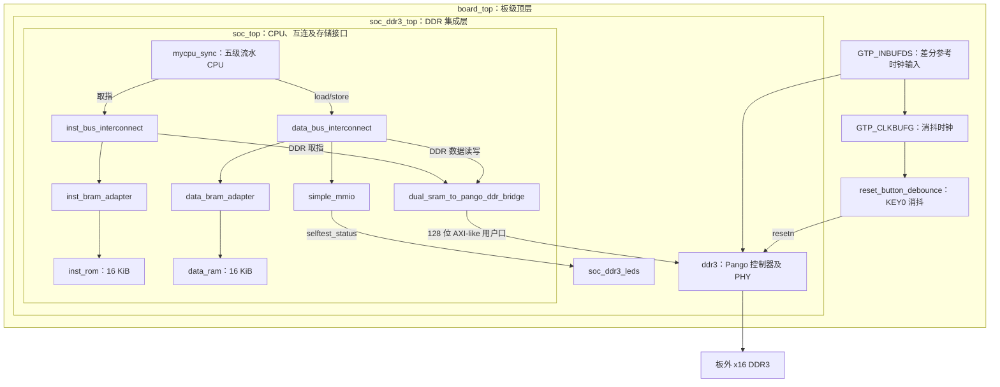

# 当前 SoC 结构说明

核对日期：2026-10-04。依据当前工作树 RTL、RISCV.pds、ROM/RAM IDF、板级自检镜像生成脚本及 doc/CODEX_HANDOFF.md。本文记录结构核对，不修改 RTL/IP/PDS，不重新运行仿真或实板测试。

## 1. 总体结构与工程入口

当前 PDS 设计顶层为 `board_top`，层次为 `board_top → soc_ddr3_top → soc_top → mycpu_sync`。它是一个单核 RV32I 五级流水 SoC，CPU 具有分离的指令/数据请求响应总线，片内分别连接启动 ROM 和数据 RAM，两路 DDR 请求共享一个桥和一个 Pango DDR3 IP。普通 `soc_top` 默认 ENABLE_DDR=0，但当前板级路径中的 `soc_ddr3_top` 明确设置 ENABLE_DDR=1。



图中主连线表示访问路径或控制关系；请求响应总线的返回方向省略。KEY 消抖输出还复位 soc_ddr3_top 的复位同步逻辑及 LED；CPU 和总线使用 DDR IP 生成的 core_clk。

## 2. 主要模块及实例

| 所属层 | 模块 | 实例名 | 作用 |
| --- | --- | --- | --- |
| 板级 | board_top | 工程顶层 | 汇集差分时钟、KEY0、三个 LED 及 DDR 实物引脚 |
| board_top | GTP_INBUFDS | u_ddr_ref_clk_buf | 125 MHz 差分时钟转单端参考时钟 |
| board_top | GTP_CLKBUFG | u_key_ref_clk_buf | 将参考时钟送全局时钟网络，供消抖计数 |
| board_top | reset_button_debounce | u_key0_debounce | 按下立即复位，释放稳定 20 ms 后解除 |
| board_top | soc_ddr3_top | u_soc | 集成 SoC、DDR IP、复位门控和 LED |
| soc_ddr3_top | soc_top | u_soc | CPU、两条互连、片内存储、MMIO 和 DDR 桥 |
| soc_ddr3_top | ddr3 | u_ddr3 | 厂家 DDR 控制器/PHY、初始化训练、物理引脚及 core_clk |
| soc_ddr3_top | soc_ddr3_leds | u_leds | 时钟心跳、DDR 就绪、自检结果及超时指示 |
| soc_top | mycpu_sync | u_cpu | 五级流水 CPU |
| soc_top | inst_bus_interconnect | u_inst_bus_interconnect | 指令地址译码，选择 ROM/DDR，返回未映射错误 |
| soc_top | inst_bram_adapter | u_inst_bram_adapter | 指令请求响应接口转同步 ROM 端口 |
| soc_top | inst_rom | u_inst_rom | 4096×32 位片内启动 ROM |
| soc_top | data_bus_interconnect | u_data_bus_interconnect | 数据地址译码，选择 RAM/MMIO/DDR |
| soc_top | data_bram_adapter | u_data_bram_adapter | 数据请求响应接口转同步 RAM 端口，传递字节写使能 |
| soc_top | data_ram | u_data_ram | 4096×32 位片内 RAM，当前预置 DDR 自检装载源 |
| soc_top.g_ddr | dual_sram_to_pango_ddr_bridge | u_ddr_bridge | 指令/数据仲裁，32 位 CPU 访问转 128 位 DDR 用户拍 |

DDR IP `ddr3` 内部两个主要子模块是 `ips2l_mcdq_wrapper_v1_2b u_ips_ddrc_top`（控制器）和 `ddr3_ddrphy_top u_ddrphy_top`（PHY）。物理 DDR3 芯片位于 FPGA 外；仿真 DDR3 模型和厂家 UART/BIST 示例不是当前 SoC 的板级模块。

## 3. CPU 内部结构

`mycpu_sync` 内部按 IF、ID、EX、MEM、WB 五级组织，流水寄存器和停顿/冲刷控制直接写在该模块内，并没有拆成五个独立流水级模块。

| 流水级 | 作用及关联模块 |
| --- | --- |
| IF | 发取指请求、等待响应、顺序预取、响应缓冲和错路响应丢弃 |
| ID | 译码、立即数、`regfile u_regfile` 读寄存器、前递选择、`br_alu u_br_alu` 分支判定和跳转重定向 |
| EX | `alu u_alu` 运算、访存地址、store 字节掩码及 load/store 请求发射 |
| MEM | 等待访存完成，`l_alu u_l_alu` 完成 load 字节/半字抽取和符号扩展 |
| WB | 写回寄存器堆，提交 CSR/异常/返回事件，输出调试信号 |

`csr_file u_csr_file` 提供 M 模式 CSR、异常入口及返回信息、三路中断状态。当前 `board_top` 把 external/software/timer IRQ 全接 0。前递优先级为 EX > MEM > WB > 寄存器堆；load-use、总线等待、串行指令和异常控制均在 CPU 内。

## 4. 总线和默认地址布局

CPU 总线是类 SRAM 请求响应协议：`req_valid && req_ready` 接受请求，`rsp_valid` 完成请求，`rsp_error` 报告错误。请求和响应可相隔多拍，每条 CPU 总线最多一笔未完成事务。互连先译码完整字节地址，再减对应 BASE，将局部地址送给从机。

| 访问通路 | 当前 board_top 默认字节地址 | 容量及用途 |
| --- | --- | --- |
| 指令 ROM | 0x00000000–0x00003FFF | 16 KiB，取指总线上的启动程序 |
| 数据 RAM | 0x00000000–0x00003FFF | 16 KiB，数据总线上的独立 RAM |
| MMIO | 0x10000000–0x10000FFF | 4 KiB 译码窗口，仅实现下列五个寄存器 |
| 共享 DDR | 0x40000000–0x5FFFFFFF | 512 MiB，指令取指与数据读写均可访问 |

ROM/RAM 是不同物理存储器，因分挂两条总线可使用相同基址：PC=0 从 ROM 取指，load 地址 0 从 RAM 读数据。数据总线没有访问启动 ROM 的路径，指令总线没有访问片内数据 RAM/MMIO 的路径。DDR 则由两条总线共同访问同一存储内容。

simple_mmio 寄存器：0x10000000 SCRATCH（可读写）；0x10000004 ID（只读固定 MMIO）；0x10000008 CYCLE（复位后周期计数）；0x1000000C STATUS（bit0=1）；0x10000010 TEST_STATUS（0=IDLE、1=RUN、2=PASS、3=FAIL，结果锁存至复位）。

DDR 桥一次仅处理一笔单拍事务，两个请求同时出现时数据优先。读时用局部地址 [3:2] 从 128 位拍选择一个 32 位槽；写时移位 32 位数据和四位字节使能，生成 128 位数据及 16 位使能。DDR 用户命令地址以 16 位字为单位。用户口为 AXI-like，没有标准 WVALID/B 通道和 RREADY，桥完成条件按厂家用户口定义处理。

## 5. 时钟、复位、LED 和当前启动流程

125 MHz 参考经 GTP_INBUFDS 进入 DDR IP。当前生成 IP 的实际速率为 750 Mb/s，输出 93.75 MHz core_clk，CPU、互连、片内存储、MMIO、桥及 LED 逻辑使用该时钟。KEY0 消抖使用参考时钟，避免依赖复位期间可能停下的 core_clk。

KEY0 按下立即复位，释放稳定 20 ms 后允许 DDR 初始化；`ddr_init_done && pll_lock` 经 core_clk 两拍管线释放 soc_resetn，CPU 才从 RESET_PC=0 启动。

当前实际 IP 初始化文件为 `MyCpu_test/board_selftest/boot_rom.dat` 和 `MyCpu_test/board_selftest/ddr_selftest.dat`。启动 ROM 中的程序由 CPU 执行，将片内 RAM 的 245 字自检代码复制至 0x40000000，再跳转到 DDR 取指执行。RAM 0x3FF0 附近的清单提供复制长度等信息。自检在 0x40001000 记录诊断/tohost，在 0x40002000 起读写测试，并向 MMIO TEST_STATUS 上报 RUN/PASS/FAIL。

soc_ddr3_leds：J16/led_clk_alive 为 1 Hz 心跳；M17/led_ddr_ready 表示 SoC 复位已在 DDR-ready/PLL-lock 后释放；K17/led_selftest 为 IDLE 灭、RUN 1 Hz 慢闪、PASS 常亮、FAIL/超时 4 Hz 快闪。默认超时 5 秒，从 soc_resetn 释放开始计入启动装载时间。

当前没有 Cache、DMA、桥端 burst、UART、CLINT、PLIC 或 RK3568 通信接口接入此板级路径。

## 6. 本次核对方式及边界

复现入口（PowerShell，D:/riscv/RISCV）：

```powershell
git status --short
git diff --stat
Get-Content myriscv/board_top.v
Get-Content myriscv/soc_ddr3_top.v
Get-Content myriscv/soc_top.v
rg -n 'module|u_regfile|u_alu|u_br_alu|u_l_alu|u_csr_file' myriscv/mycpu_sync.v
rg -n -A 2 'INIT_FILE' ipcore/inst_rom/inst_rom.idf ipcore/data_ram/data_ram.idf
rg -n 'board_top|tb_board_top_selftest' RISCV.pds
rg -n 'RESULT:|Errors:' sim/board_main_selftest/physical.log
```

实测效果：完成当前顶层、模块实例、连接、参数和主 IP 初始化路径核对，识别交接文档后半段的旧 ld_st/0x80000000 配置为历史记录。既有主物理自检日志为 RESULT: PASS、68928 cycles、Errors: 0、Warnings: 353；这是历史仿真证据，本次未重新仿真。未验证新下载、全容量/长期 DDR 稳定性、电气参数或实板诊断内容。工作树原有未提交内容保留，仅新增本文。

## 7. AGENTS.md 同步更新

用户随后要求修改根目录 AGENTS.md。本次将已核对的板级层次、模块职责、两条访问路径、CPU 核内子模块、时钟/复位、中断接线及启动镜像一致性要求补入长期约定，并加入本文入口；保留原地址、仿真和协作约束，不写入新的 PASS/FAIL 或实板结论。

复现检查：`Get-Content AGENTS.md`，并用 `rg -n 'module|u_soc|u_ddr3|u_leds|u_key0|irq_external|ENABLE_DDR' myriscv/board_top.v myriscv/soc_ddr3_top.v` 核对层次和接线。检查结果与当前 RTL 一致；仅修改 Markdown 文档，未重新运行硬件回归。
