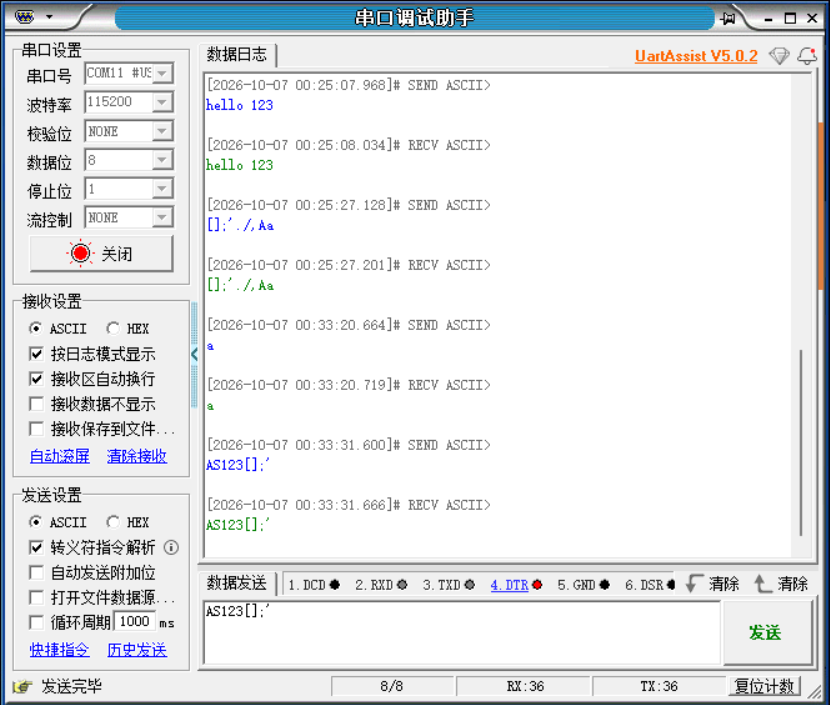
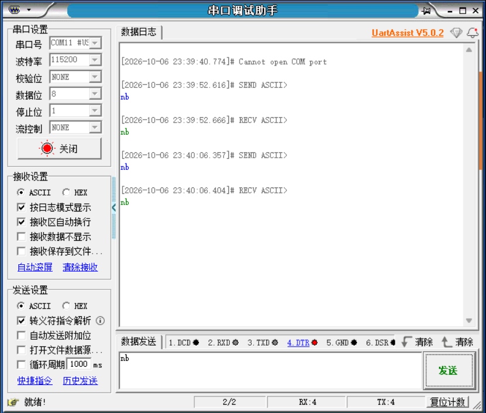
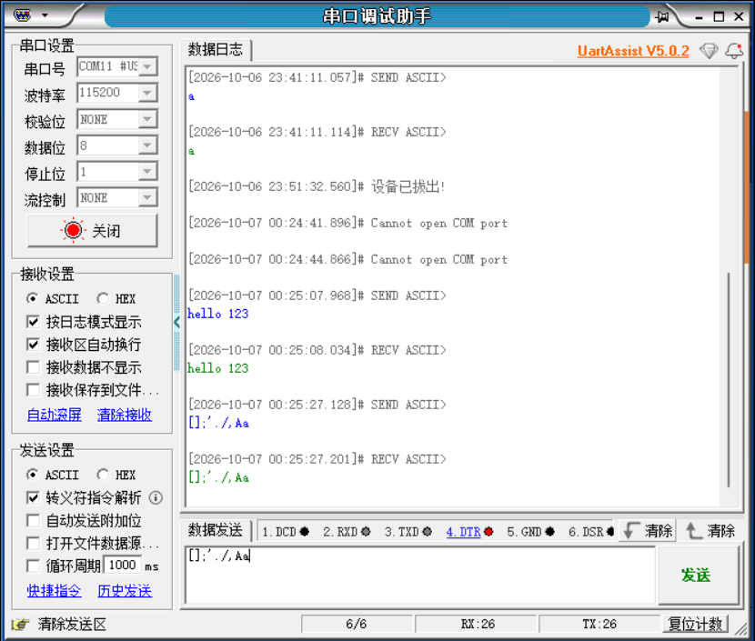

# UART Echo 实板基本回显确认

记录日期：2026-10-07（Asia/Shanghai）。目的：记录用户实板回显截图、连接确认及
复位后重复通信反馈，区分功能验收与尚未覆盖的压力/二进制/错误/IRQ专项。

## 最新补充：复位后重复回显成功，实板功能验收PASS

在建议“按KEY0复位，再发送A、hello123和连续多组字符”后，用户反馈“成功”，
并提交新截图。按本次操作反馈记录复位后通信与多组回显成功；复位动作本身
没有仪器轨迹，证据来源为用户操作反馈，截图只直接显示串口收发。
新截图增加00:33:20的小写a和00:33:31的字母/数字/符号混合文本，两组发送与
接收显示一致；累计TX/RX各36字节。历史带空格hello 123亦保留在画面上。



当前结论更新为：**Echo实板功能验收PASS（用户确认），复位后重复通信成功**。
未把截图改写成特定A/无空格hello123的原始字节捕获；没有据此宣称长时间
无间隙压力、二进制00/FF、错误注入、sticky error读数或IRQ实板验收。
下方“复位后重复尚未报告”为本次补充前的历史范围。

将当前build/main.dat直接复制为tests/pc_uart_fpga_uart_pc/main.dat，
作为与输出30归档一致的固定成功基准；没有重编译/转换，复制前后逐字节相同。
SHA-256仍为2cdb17a5a55869f46d14dcf3db5e91a749e010f904f787d8011bb4c64aa88c20。
verified_image.json保存来源及验收范围，build.ps1只写build/，不会覆盖根基准。
当前RAM IP仍引用原build/main.dat，未更改IP/PDS/RTL或下载。
下一开发阶段为PC→UART→DDR装载：先完成长度/地址范围/校验/ACK及读回校验，
随后验证跳转执行；此阶段代码尚未开始。

## 证据与实测（首次确认）

用户提交两张UartAssist V5.0.2截图，并在询问“已下载Echo位流、USB-TTL接到FPGA、
拆除适配器自身回环”后明确回复“对”。因此本次接收内容可记录为FPGA Echo回显证据。

- 第一张（截图日志2026-10-06）：两次发送nb，分别收到nb；TX/RX各4字节。
- 第二张（跨2026-10-06/07）：发送小写a、hello 123（中间有空格）、符号与大小写
  混合文本，均出现对应接收内容；截图累计TX/RX均为26字节。
- 两张截图设置均为COM11、115200、NONE parity、8 data bits、1 stop bit、NONE flow。
  这里的COM11是用户本次电脑端口，不是后续固定端口号。
- 日志曾出现端口无法打开/设备拔出，随后有成功收发；这些提示不作为CPU异常证据，
  也不据此推定已经完成KEY0复位验收。





## 当前配置与镜像

本机读取到data_ram.idf、data_ram.v、data_ram_tb.v三处INIT_FILE均已指向：
`D:/riscv/RISCV/tests/pc_uart_fpga_uart_pc/build/main.dat`。
这是用户完成下载步骤后的当前状态；本次记录没有修改IP或运行PDS。
本地DAT SHA-256仍与四层ModelSim/Icarus验收过的文件一致：

```text
2cdb17a5a55869f46d14dcf3db5e91a749e010f904f787d8011bb4c64aa88c20
```

现有程序由ROM loader从RAM搬至DDR，CPU轮询MMIO读取RX、写TX。
用户确认和截图支持其本次FPGA配置下的PC→FPGA→PC基本通信链路已贯通。
没有保存本次下载位流的哈希、原始串口字节捕获、DebugCore轨迹或实板CSR/error读数；
因此不把截图扩大为所有DDR区域、UART错误恢复或中断验收。

## 未覆盖及下一步（首次确认时的快照）

当前结论：**实板基本回显样本PASS，完整Echo专项待补齐**。
已有四层仿真各4/4 PASS及97字节精确比较继续保留为原仿真证据。
尚未报告KEY0复位后重复通信、连续多组/长串压力测试、实板二进制00/FF，
也未明确报告无空格hello123独立样本、sticky error/溢出寄存器或IRQ结果。
截图小写a和hello 123不能改写成已实测大写A及无空格hello123。

建议用户按KEY0复位后再发送A、hello123及连续多组字符，确认收发有序无丢失/重复。
之后固定实际镜像/位流和原始串口记录，再开发PC→UART→DDR装载协议；协议尚未实现。

## 首次文档改动

更新实验README、tests索引、根README、sim说明及CODEX_HANDOFF，保存用户截图。
仅记录用户观察并核对当前IP引用/DAT哈希；没有修改C/RTL/TB/镜像/IP/PDS/FDC，
没有重建、下载或重新运行仿真。本次无需用新的仿真结果替代用户实板证据。
