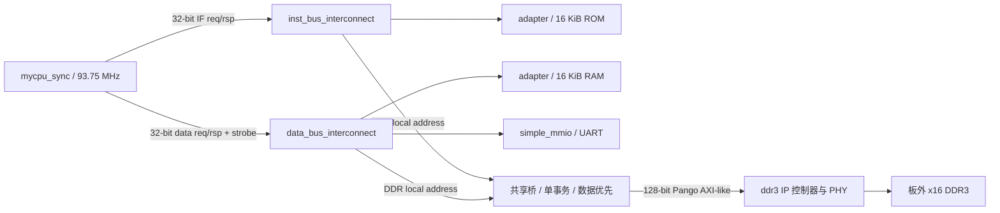

# CPU 与 DDR3 性能审查及分阶段优化方案

日期：2026-10-10（Asia/Shanghai）。状态：第一阶段静态审查完成，等待用户确认下一阶段。本次只审查代码、核对既有证据并新增本文；未修改 RTL、PDS/IP、软件镜像、门控或成功记录，未运行新仿真、综合、下载或串口操作。

## 1. 结论及证据边界

建议先建立准确的 DDR 路径性能基线，再逐项验证“桥事务周转”与“利用完整 128-bit 返回拍的 16-byte 取指缓冲”。根据结果决定扩大 I-Cache，之后分别评估 D-Cache、Burst、硬件乘法和 BTB。此顺序是依据改动范围、现有接口和可验证性提出的候选顺序，不表示已测得 DDR 或取指是主导瓶颈。

已确认的结构限制是：DDR 桥一次仅一笔事务；I/D 同时到达时数据优先；每笔读只保留 128-bit 中一个 32-bit 槽；桥响应周期不能接受新请求。CPU 数据等待会保持 ID/EX，阻塞前端。CoreMark 的指令、数据及栈均在 DDR，构建含 libgcc 软件乘除。上述事实并不直接给出各因素对总执行时间的占比。

尚未测得：计时区间 instret/CPI、DDR 实际响应延迟分布、I/D 等待交叠、可隐藏等待比例、分支恢复周期、乘除函数动态占比、缓存命中率及任何优化的实板收益。不把快模型的设定延迟、整段程序退休数或历史功能 PASS 当作这些数据。

先读的入口为 [AGENTS](../../AGENTS.md)、[交接](../CODEX_HANDOFF.md)、[性能起点](../CPU性能优化起点与验收约定_2026-10-10.md)、[十轮实板验收](../software/统一BSP与十轮复位下载实板验收_2026-10-10.md)、[结构说明](../SoC结构说明_2026-10-04.md)。历史章节按各自日期解释，当前状态以这些文件的 2026-10-10 补充为准。

### 固定基准

| 项目 | performance_60 | validation_60 |
| --- | --- | --- |
| GCC / ISA / 参数 | GCC 15.2.0，RV32I / ILP32，-Os，无 LTO | 相同 |
| 算法缓冲 / 迭代 | 2000 bytes / 60 | 相同 |
| 实板 ticks | 1664062366 | 1758030079 |
| 按 93.75 MHz 换算时间 | 17.749998571 s | 18.752320843 s |
| final CRC | a14c | 6770 |
| BIN 大小 | 15308 bytes | 15316 bytes |
| BIN SHA256 | 296513be6d55ae42df8481df5786671b0d73542a5bbb42bea94684d3a59dd8a1 | 694136814fd2d1dbc984d746b832c160082bc29cfba86c485b4e48d32edd19ed |

依据为第 9/10 轮原始 JSON 和性能起点文档，不是本次重新运行。当前六份关键 RTL（CPU、CSR、两互连、桥、soc_top）及两份 BIN 的 SHA256 均与 `sim/bsp_workflow/board/first_success/` 对应文件一致；`git diff -- myriscv` 无输出。这是限定文件范围的核对，不宣称核对了全部 518 项档案。

成功 Loader 位流仍为 `sim/uart_loader/build/verify_run_hello/pds_candidate/generate_bitstream/board_top.sbit`，SHA256 为 `31386f785e59f3de2a3499202fb404fc39dde6bbc4a2e5ecb906d754acc02eb0`。主 IP 仍是 load_stage10，性能候选应明确采用成功 verify_run_hello 的 ROM/RAM DAT 与匹配初始化。新硬件必须建立新候选、新门控，不能沿用旧硬件哈希的验收结论。

## 2. 实际架构与握手



CPU 每侧最多一笔未完成请求；请求接受条件是 `req_valid && req_ready`，完成条件是 `rsp_valid`，没有 CPU `rsp_ready`。请求接受与指令退休是不同事件。ROM/RAM 同基址但分挂两总线；DDR 为 `0x40000000–0x5fffffff` 的共享内容。CoreMark 链接 PROGRAM 位于低 60 KiB DDR，栈位于 `0x4000f000–0x4000ffff`；不能用纯 BRAM 运行结果替代 DDR 性能验收。

| 位置及代码依据 | 实际行为 | 性能含义与待测项目 |
| --- | --- | --- |
| [CPU IF](../../myriscv/mycpu_sync.v#L338)，338–401 行 | `inst_pending` 追踪 PC；一个返回缓冲；旧响应与新接受满足条件时可同拍；前端保持时缓存响应 | 不能把“单 outstanding”理解为所有取指都固定 N 周期；分开统计可用指令不足和被隐藏的响应等待 |
| [指令互连](../../myriscv/inst_bus_interconnect.v#L75)，75–104 行 | `can_accept = !pending || response_done` | 已支持响应/新接受同拍，DDR 端桥限制其实际周转 |
| [CPU data](../../myriscv/mycpu_sync.v#L838)，838–864 行 | EX 发请求；MEM 等响应；MEM 等待或 EX 无法前进形成 `data_pipeline_stall` | 一次 load/store 等待会阻塞年轻算术指令及前端；旧 WB 仍可能退休，不能把每个等待周期都当作零退休周期 |
| [数据互连](../../myriscv/data_bus_interconnect.v#L120)，120–154 行 | `m_req_ready = !pending && selected_ready`；响应当拍不接新请求 | 即使未来 D-Cache 命中，每次访问仍受此周转限制；是否改同拍接受应另作独立步骤 |
| [桥](../../myriscv/dual_sram_to_pango_ddr_bridge.v#L94)，94–218 行 | IDLE 接受；读走 RADDR/RDATA/RSP，写走 WADDR/WDATA/RSP；RSP 后回 IDLE；仅 IDLE ready | 有结构性周转空档，实际暴露损失取决于下一请求何时就绪 |
| 同上 | 128-bit 返回只选 `request_lane*32 +: 32`；写数据/strobe 置于一个 32-bit 槽 | 每次取指只利用返回拍的 4/16 bytes；没有保留其他三字，也没有合并相邻 store |
| [CPU 分支/退休](../../myriscv/mycpu_sync.v#L1222)，1222–1259 行 | ID 判定 taken branch/JAL/JALR 后 redirect；丢弃缓冲及未返回的错路请求；WB 正常退休，MRET 单独提交 | 分支事件数不等于冲刷周期；错路 DDR 请求不能撤回，还可能阻挡目标请求 |
| [CSR](../../myriscv/csr_file.v#L90) | 白名单未包含 cycle/instret CSR | 现有计时来自 MMIO CYCLE，不能直接使用 rdcycle/rdinstret 假定已实现 |

### 能从状态机证明的最短边沿关系

令 A 为 CPU DDR 请求被桥接受的上升沿，假设 DDR 已 ready、没有仲裁阻挡。最早 A+1 才能在用户口接受 AR 或 AW。若读数据与 AR 同拍返回，或 AW/W 同拍接受，桥进入 RSP，CPU 最早在 A+2 采到响应。A+2 桥回 IDLE，下一笔最早 A+3 接受。若读在 AR 后另一个边沿才返回，则 CPU 响应还会延后一拍。实际背压、训练后控制器排程、刷新和 I/D 竞争可继续增加周期。

这是 RTL 最小边沿间隔推导，未测量实板延迟，也不是每条指令的固定 CPI。桥支持 AR 握手当拍 RVALID，优化不能丢失这一路径。

### Pango Burst 的证据与限制

当前桥固定 `arlen=awlen=0`；用户口没有 WVALID、B/BRESP、RREADY/RRESP。写响应在数据拍 WREADY 接受后产生，不表示该拍已经写入 DRAM；不能将其解释成标准 AXI4 写完成。

本工程厂家 [读例程](../../ipcore/ddr3/example_design/rtl/test_rd_ctrl_v1_0.v#L243) 按 `arlen+1` 计返回拍，每拍内部地址加 8；[写例程](../../ipcore/ddr3/example_design/rtl/test_wr_ctrl_v1_0.v#L133) 使用 len=15，并按 WREADY 推进，每拍地址加 8。这支持“用户拍计数与 16-bit 字地址”的理解，也显示厂家例程存在多拍能力；尚未验收本 SoC 当前 IP 配置的多拍行为。物理 DDR3 的 BL8 与用户口一次几个 128-bit 拍是不同层次，不能混称为桥已经有 Burst。

## 3. 性能计数器设计

### 采样窗口与退休

先在新的隔离 TB/monitor 中使用 64-bit 计数，RTL 保持原样。硬件读出为后续独立候选：采用独立 perfmon 和原子快照；选择 DebugCore 或新增只读寄存器读出时另核接口与时序，不在本阶段分配新地址或修改 CSR。保留现有 MMIO CYCLE 地址及其语义。

窗口必须绑定成功 ELF/BIN 哈希，并从符号/反汇编识别 start_time、stop_time。现有 BSP 的 start/stop 最终都调用 `timer_cycles`，从 `0x10000008` 读值；simple_mmio 在请求接受边沿锁存旧 cycle_counter。因此采用开始读接受沿 S 到结束读接受沿 T 的半开区间 `[S,T)`，开始边沿计入、结束边沿不计入，得到 `cycles=T-S`，应与软件 ticks 完全一致。不能用函数入口、返回、UART 输出或所有 timer 读作为边界：BSP 自检和延时也读 timer。

退休事件定义为 `retire = normal_retire || mret_commit`，两者互斥。包括正常完成的 store、branch、写 x0、CSR、FENCE/WFI 和 MRET；异常指令、ECALL/EBREAK、非法 CSR、access-fault 及硬件 IRQ 入口不计退休。CSR 提交不再另加一次。规范说明同步异常指令不退休，见 [RISC-V counters](https://docs.riscv.org/reference/isa/v20260120/unpriv/counters.html)。当前 `normal_retire` 明确排除 MRET，因此直接沿用旧 TB 的该信号会漏数正常返回指令。

### 六项主计数器

所有事件在同一 core_clk 上升沿按边沿前信号采样，仅统计窗口内且 resetn=1 的样本。下面三个 stall 计数使用后述互斥优先级，另保留原始诊断事件；命名和版本写入结果 JSON。

| 计数器 | 定义 | 防止误计 |
| --- | --- | --- |
| cycles | `[S,T)` 内 core_clk 边沿数 | 不含下载、VERIFY、BSP 自检、打印及驻留；64-bit，与 MMIO ticks 对齐 |
| instret | 窗口内 retire 脉冲数 | 按 WB 完成计一次，不数 IF 请求或 RF 写使能；不等于所有动态执行指令数 |
| mem_stall_cycles | 互斥分类中归为 MEM 的周期，原始条件为 `data_pipeline_stall` | MEM 等响应与 EX 无法发请求作 OR，不能重复加；同步 trap/MRET redirect 当拍归控制 |
| if_stall_cycles | 互斥分类中归为 IF 的周期：`fetch_valid && inst_if_id_accept && !inst_buffer_valid && !inst_response_good` | 只统计本拍有机会补充 IF/ID 却没有可用指令；branch 恢复另分类，后端阻塞时隐藏的 IF 等待不计在这里 |
| ddr_transactions | Pango 用户命令接受数：ARVALID&&ARREADY 加 AWVALID&&AWREADY | 这是命令数，不是 CPU 请求数或数据拍数；Burst 仍一命令，分别保留 I/D/read/write 来源 |
| branch_flush_cycles | 互斥分类中归为 branch 的周期：redirect 当拍，以及恢复窗口内无法交付目标指令的前端空槽 | 包含 taken conditional branch、JAL、JALR；不含 trap/MRET；不是 branch_redirect 次数 |

branch 恢复窗口由 `branch_redirect` 开始，记录目标 PC/代际，到目标指令实际装入 IF/ID 的边沿关闭；目标交付边沿不算空槽。目标已返回但因 MEM/控制保持在缓冲中时，不继续把这些周期算作分支。trap、MRET、复位取消窗口。早先 outstanding 的错路返回要排空并单独记录，不能误认作目标到达。以后 BTB 引入预测时重新定义该事件为实际错误预测恢复，并升级计数版本，不能把两代不同口径直接比较。

### 互斥周期分类及原始诊断

按顺序只匹配第一项：

1. 同步 trap / IRQ 入口 / MRET redirect 当拍：control_redirect。
2. data_pipeline_stall：MEM。
3. flow_state 非 RUN、serial_candidate、fault_inflight、irq_candidate：control_hold。
4. 有效 IF/ID 的 load_use：load_use。
5. branch_redirect 当拍，或 branch 恢复窗口内前端可推进但无目标指令：branch。
6. 前端可推进而无可用响应/缓冲：IF。
7. 其余：other。

必须满足 `cycles = control_redirect + MEM + control_hold + load_use + branch + IF + other`。该分类表示同拍前端/流水控制条件，不能据此写 `cycles = instret + stalls`：老指令可能在被分类为 MEM 或 IF 的周期退休，而且流水线填充、排空与单拍退休互相交叠。CPI 始终独立计算 `cycles/instret`。

同时保存以下原始诊断计数，允许重叠但不能相加当作总周期占比：

- IF 请求背压 `inst_req_valid && !inst_req_ready`、响应等待 `inst_pending && !inst_rsp_valid`；前端 hold 时返回缓存、pending_drop 返回次数及丢弃 bytes。
- EX 数据请求背压 `data_req_valid && !data_req_ready`；MEM 响应等待 `ex_mem_valid && ex_mem_mem_pending && !data_rsp_valid`。按 DDR/RAM/MMIO/UART、load/store 分类。
- CPU/互连/桥各边界的接受/响应数；桥 RADDR、RDATA、WADDR、WDATA、RSP 占用；双方请求同时有效、data 胜出及 IF 最长等待。
- AR/AW 命令数，RVALID read beats 和在已接受 write command 内的 WREADY write beats；ID、last 和预期拍数校验。将来增加 DMA 时全局数和每主机数分开，不能将 DMA 流量算成 CPU demand。
- load-use、CSR/FENCE/WFI 排空、trap、IRQ、MRET 事件；条件分支 taken/not-taken，JAL/JALR 及每次恢复窗口长度。
- 基于退休 PC 的函数分布，单独统计 __mulsi3/__divsi3/__udivsi3/__modsi3/__umodsi3；函数内退休数与调用次数/区间 cycles 分开，排除计时区间外格式化和除法。
- 未来 Cache 增加 lookup/hit/miss、refill、替换、失效、dirty/writeback 等；预取与 demand 分开。

时间戳覆盖 CPU 接受→响应、CPU valid 首次等待→接受、bridge 接受→AR/AW、AR→R 首/末拍、AW→W 首/末拍。输出样本数、min/max/mean、p50/p95/p99 及直方图。接受于窗口内但完成于窗口外的事务作为独立 cohort 跟踪到完成，不延长 cycles；窗口起止 outstanding 状态必须记录。

计数验收要求：同拍旧响应/新接受不丢不重；`accepted-responses = pending_end-pending_start` 在每个单 outstanding 边界成立；错路 IF 响应仍算原始 response；一拍 retirement 至多一条；32-bit 低位回绕、reset、stall 中 trap/IRQ/MRET 和快响应均有定向 oracle。设计独立的已知指令数与已知背压时序用例核对 monitor，不能用 monitor 自己生成的计数作为唯一预期。

## 4. 优化候选、收益条件与风险

以下为候选排序，最终每一步由上一阶段数据调整。总体加速没有实测估计值。Amdahl 估算 `speedup=1/((1-p)+p/s)` 中的 p 必须来自可验证的执行时间分解或单项对照实验，不能直接使用可重叠等待事件占比。

| 候选 | 建议位置 | 可预计的局部收益，非整机承诺 | 复杂度及主要风险 |
| --- | --- | --- | --- |
| 桥响应/新请求周转 | 首批独立实验 A | 对已就绪连续请求，消除当前 RSP 后的一个接受空档；受 DDR 固有延迟及数据互连周转影响 | 低至中；同拍响应归属、请求元数据切换、数据优先、复位及快返回必须保持；新组合 ready 路径影响时序 |
| 16-byte 单项取指缓冲 | 首批独立实验 B，和 A 分别比较 | 捕获完整 128-bit；理想连续四字取指由四个 AR 变一个，I 命令最多减少 75%；未证明 CoreMark 四倍加速 | 中；命中仍逐笔 req/rsp，错路丢弃、代码写入失效及 refill/store 竞态 |
| 小 I-Cache | 取指复用统计支持后 | 小循环热命中不必访问 DDR，减少 I/D 争用；命中率/工作集决定收益 | 中；先直接映射、阻塞式、16-byte line，候选容量 1/2/4 KiB；同步 RAM 命中流水与 tag 时序。必要时再评估更大容量/两路 |
| D-Cache | I 路优化后 MEM 等待仍显著 | 命中 load 避免 DDR 事务；CoreMark 缓冲和栈可能有复用，需 trace 验证 | 中至高；先 write-through/no-write-allocate、无写缓冲，store 仍等待；字节掩码、RAW、代码写入/Loader VERIFY 一致性；数据互连两拍周转另验 |
| DDR Burst | line>16 bytes 或流式 DMA 需要后 | 32/64-byte line 由 2/4 个单拍命令改为一个多拍命令；并不等于首字延迟降低 | 高；无 RREADY、无 WVALID，必须预留完整返回空间/准备完整写 burst；ID/last、拍间停顿、边界、读写顺序及长 burst 阻塞其他主机 |
| 硬件乘法 / RV32M | 依据计时区间 libgcc 动态占比，可提前于 D-Cache | 减少软件乘法循环的指令和取指请求；完整 M 可进一步减少除法，但只对新编译的 ISA 镜像生效 | 高；EX 多周期/旁路、年轻 store、精确异常/IRQ、misa/镜像审查和新编译条件；divider 逻辑成本与长延迟 |
| BTB + 条件预测 | I 路低延迟且分支剩余损失可见后 | 预测命中减少目标取指空槽；不能消除 cache miss 或不可取消 DDR 请求本身的延迟 | 高；PC/tag/方向/目标预测、not-taken 错预测、JALR、flush 代际与精确状态。首版可评估 16/32 项 BTB+2-bit 方向，RAS 留后续 |

桥首批 A/B 不同时实现；每个实验均有关闭参数及同一 BIN 前后对照，确认独立效果后才考虑组合。若 A 的暴露空档很少或 timing 风险高，跳过 A，先做 B。若软件乘法占比超过数据缓存可改善部分，硬件乘法提前，避免固定按 Cache→完整 M 的路线推进。

已验收 performance BIN 反汇编在 `0x40003228` 存在 __mulsi3 移位/加法/分支循环；__divsi3 等也已链接。这只是软件实现事实，不能由函数存在推断动态占比。可先评估完整 Zmmul 乘法子集，再决定 divider；仅实现 MUL 不能宣称完整 Zmmul/RV32M，misa.M 只能在完整 M 支持时设置。规范参见 [M/Zmmul](https://docs.riscv.org/reference/isa/v20240411/unpriv/m-st-ext.html) 和 [misa](https://docs.riscv.org/reference/isa/priv/machine.html)。原 RV32I BIN 不会自动使用新 MUL/DIV；RV32IM/Zmmul 比较需报告 instret 变化并单列条件。

旧成功完整 SoC 最终 seed4 为 LUT6486、FF7360、DRM54、APM0，慢角 setup 余量仅 0.144 ns，见 [资源审查](../reference/AI加速器集成可行性审查_2026-10-10.md)。这是完整 DDR/PHY/Loader 系统的旧实现资源，并非 CPU 独立资源。容量有余不能保证新 Cache、ready 组合路径或乘法旁路满足 93.75 MHz；必须重新做布局布线及各角时序验收。此路线固定主频，不同时提频。

## 5. 32-bit CPU 接口、Line 填充及 DMA 兼容

### 保留 CPU 接口

CPU 仍使用现有 I/D 两条 32-bit req/rsp、字节地址、数据 strobe，每侧一笔 outstanding。首批 16-byte I 缓冲可在桥内捕获整拍；扩大 Cache 时建议放在互连选出的 DDR 分支，ROM、RAM、MMIO 和 UART 保持原访问路径。Cache 命中也必须先接受请求后返回一次响应；现互连依赖 pending，不能擅自引入同一新请求接受沿上的零延迟响应。

不能仅在现有 32-bit 桥外加 Cache，然后用四次 CPU 字读拼 16-byte line：这没有利用已经返回的完整拍。需要在 DDR 侧保留 128-bit 数据，后续抽象内部 line 请求接口，例如 byte-aligned line address、read/write、beat count、128-bit data、16-bit strobe、source ID、beat index/last。这个接口是新内部接口，CPU 端不用增加 burst 信号；Pango 地址换算只放在一个适配器中。

16-byte line 使用一个 128-bit beat，不要求 Burst。32-byte line 使用两拍、64-byte 使用四拍，按当前例程理解候选 len 为 1/3、内部半字地址每拍加 8，最终要经实际 IP 验证。首版对齐整行，避免跨越已定义边界；不假定控制器支持 wrap/critical-word-first。第一版等整行完整后返回 demand，early restart 与预取单独留后续。

### 一致性是 Cache 第一版验收条件

成功 Loader 的 `startup.S:52` 只有 `fence rw,rw`，CPU 目前只识别 opcode 0001111/funct3=000 的 FENCE，未识别 funct3=001 的 FENCE.I。旧回归也将 fence_i 列为已知缺口。普通 FENCE 不能当作 I-Cache 同步机制；规范明确使用 FENCE.I 同步指令与数据流，见 [Zifencei](https://docs.riscv.org/reference/isa/unpriv/zifencei.html)。

为保持成功 Loader DAT 与 CoreMark BIN，首批 I 缓冲/Cache 候选必须有硬件代码写入失效：被接受的 DDR store 若命中 I line 地址，失效对应 line；复位清 valid；并阻止冲突 refill 在失效后重新把旧数据标为有效。全部缓存/缓冲层都需接收到失效，错路返回不能恢复失效 line。测试同址重新下载、写后跳转、失效与返回同拍、全字/字节写及正在填行时写入。

失效缓存本身不能撤回已经交给 CPU 的旧指令；若未来需要不复位的自修改程序执行，仍须实现明确的 instruction synchronization，包括前端 pending/buffer/pipeline 处理。当前 Loader 先从 ROM 下载、VERIFY、FENCE 后首次跳入 DDR，兼容验收限定于这一明确启动顺序。新增 FENCE.I/维护入口应独立实现和验收，不能静默修改冻结成功 Loader 镜像。

D-Cache 第一版采用 write-through/no-write-allocate、阻塞 store，维持现有错误与排序语义。write-back 与写缓冲暂缓：它们需要 clean/invalidate、FENCE 排空、Loader VERIFY 对物理 DDR 的可见性，以及未来 DMA 所有权转交。厂家口没有标准写错误返回，不能承诺新增 write buffer 仍可精确报告迟来的标准 AXI BRESP。

### 未来 DMA

未来 DMA 与 I refill、D refill/uncached demand 在同一 DDR 命令仲裁器下共享 Pango 适配器，不绕过控制器或把该口直接当 AXI4 slave。第一版仍一次一个 burst，独占到末拍；采用有限 burst 长度、轮询/带等待上限仲裁，防止持续 DMA 或数据流饿死 IF。保留每主机 ID/错误/统计归属，但暂不实现多 outstanding；后者要求每命令元数据、返回 FIFO、ID/last 验证及复位中在途事务处理。

最初 DMA 缓冲建议通过 DDR 范围属性设为 uncached，保持已有 DDR_BASE/窗口和 UART/MMIO 地址；由新软件链接布局明确区域，不新增同内存地址 alias。若将来必须共享缓存数据：CPU→DMA 前 clean 并等待写完成，DMA→CPU 前等待 DMA 完成并 invalidate；write-through 仍不能解决 DMA 写导致的 D-Cache 旧副本。DMA 写可执行数据还需要 I 侧失效和取指同步。协议完成必须明确是控制器接受还是全局可见，并用物理读回验收；目前工程没有 DMA，不把兼容设计写成已完成能力。

## 6. 分阶段实施及验收

| 阶段 | 范围 | 进入下一阶段的标准 |
| --- | --- | --- |
| 1，本次 | 静态审查、计数口径、候选与验收设计 | 本文完成；停止，等待确认 |
| 2A | 在 `sim/cpu_performance/` 新隔离 runner/TB/monitor；保持 RTL/BIN 不变；微基准位于新的独立 tests 实验根 | 计数 oracle 通过；两配置 1 次完整 CRC；物理 IP/DDR 模型完成代表性取指、数据微基准；计时 ticks 对齐，获得 I/D/branch/libgcc 分解。快用户口模型仅验功能，性能报告须明确来源 |
| 2B | 独立计数观测硬件候选；不做行为优化，沿用成功 Loader DAT 与成功 CoreMark BIN | 新位流/门控/时序通过，观测开销 A/B 可解释；由用户进行实板测量。完成两组 60 次与 DDR 微基准，基线数据和重复性齐全；不能从快模型推断实板 CPI |
| 3A / 3B | 分别验证桥周转与 16-byte I 缓冲；任一无收益可跳过 | 同 BIN、同频率对照；请求/响应/退休一次；CRC 正确；空档或 DDR I 命令按预期下降；完整回归和新时序通过。每候选独立记录，确认后组合 |
| 4 | 根据取指 miss/工作集扩大 I-Cache，仍 16-byte line/单 outstanding | 容量扫描有测量依据；冷/热、冲突、代码写入和 reset 全通过；两组正式 CoreMark 及综合/时序满足门槛 |
| 5，分支选择 | 分别做 D-Cache、Burst，或先 Zmmul/M；每次一个主要功能 | 数据缓存字节与 RAW/维护正确；Burst 在完整 IP+物理模型验证拍数/ID/last及无背压返回；M 独立全指令/边界/IRQ验收，新 ISA 镜像单列 |
| 6 | 若分支剩余损失值得改善再做 BTB；DMA 在实际有任务时单列 | 预测错误/间接跳转/延迟返回/异常精确性通过；性能优势超过时序/资源代价；DMA 另有公平性及所有权验收 |

2A 先做短物理微基准，再评估完整 1 次 CoreMark 物理联仿耗时；需要节约仿真时间时只报告采样区间实际测得的数据，不能把部分执行外推成完整 CoreMark PASS。正式 60 次性能最终以实板为准。2B 的 DebugCore/只读计数读出、是否增加软件测试入口需要在实施前明确，不能扩大既有软件门控的部署对象。

### 微基准矩阵

所有用于宣称性能的用例的指令与目标数据均经实际 DDR 桥、当前 Pango IP/PHY+物理模型或实板 DDR。BRAM 可作为计数 oracle/功能对照，但其时间不列入 DDR 优化成绩。

| 类别 | 用例及控制变量 | 正确性与观测 |
| --- | --- | --- |
| CoreMark | performance/validation 各 1 次做快速 CRC，各 60 次正式；硬件对比保持相同 BIN | 全算法 CRC、final CRC、无 ERROR；记录 ticks/iteration、instret/iteration、CPI、时间及来源 |
| DDR 顺序取指 | 展开的无数据访存 ALU/ADDI 流、固定小循环；16-byte 内四字、跨行、容量内/外代码、冲突地址；冷/热分别测 | 已知寄存器校验和/退休数；测每行 I 命令、cycles/instruction、line hit/miss |
| DDR 随机取指与分支 | 固定 seed 的跳转块链；always taken/not taken、交替/难预测、JAL/JALR；短块与跨行分别测 | 固定路径 checksum/步骤数；测 redirect、丢弃、恢复周期及 miss，避免把 cache 效果全归给 BTB |
| DDR 顺序数据 | 对齐 word 读、写、copy、read-modify-write；步长 4/16/32/64；工作集 256 B、2 KiB、8 KiB、32 KiB 等 | 数据由运行时生成，volatile/汇编保持访问；检查 CRC/哨兵；报 cycles/word、有用 bytes/s 和 DDR commands/beats |
| DDR 随机数据 | 预生成固定 seed 的置换；依赖 pointer-chase 与独立随机 load 分开；容量及映射冲突扫描 | 固定 checksum、禁止编译消除；不把随机数生成/模运算耗时当成 DDR 延迟；生成工作在计时区间外 |
| load-use / 算术 | load 后立即消费及插入独立 ALU；无访存依赖/独立算术链；软件乘除调用与后续 M 指令边界 | 已知结果与指令数，记录函数热点、多周期等待；M 零除、溢出、有符号高乘积、rd=x0等单验 |
| I/D 竞争与一致性 | DDR 取指中连续 load/store；跨 128-bit 槽的 SB/SH/SW/LB/LH/LW；写后读、代码重写、reset/IRQ 在等待中 | 每次写/副作用只一次，正确退休/异常 PC，桥最长 IF 等待；未来 Burst/DMA 另测饥饿和维护 |

新微基准需独立注册构建、ELF/BIN/ISA审查和预期结果；现有 `--tag` 不会自动支持任意新 C 程序。用独立实验目录保存 main.c/功能.c.h、startup/linker/build，不建立 tests/common/src 新分层，不覆盖成功程序。

### 每个候选的统一门槛

1. 正确性优先：CRC/checksum/内存哨兵、完整退休轨迹及请求响应守恒；不得为了提升速度绕过前递、load-use、等待、精确异常/IRQ或 UART 副作用。
2. 按影响范围运行 DDR RV32I、I/D overlap/backpressure、异常/access-fault、CPU/UART IRQ 的 ROM/DDR 两种代码位置、原 MMIO/UART CPU、Loader LOAD/VERIFY/RUN，以及两条完整 DDR 物理回归。fence_i/ma_data 是现有已知缺口，明确单列，不能写全 RV32I 通过；新增 FENCE.I 时该项必须转为真实通过。
3. 两条物理脚本从 `ipcore/ddr3/sim/modelsim` 执行 `do soc_ddr3_sim.tcl`、`do soc_ddr3_regress_sim.tcl`，同时检查 RESULT: PASS、无 FAIL、Errors: 0。这两条已有测试不自动覆盖新 Cache/Burst，须增加完整物理模型定向用例。
4. 综合/P&R 保持 93.75 MHz 与 DDR 配置，报告 LUT/FF/DRM/APM、各时序角 setup/hold 与未约束路径；优化后时序不得沿用旧 0.144 ns PASS。
5. 实板由用户执行，候选先 Hello/CRC32、两组短 CRC、两组正式 CoreMark 及受影响复位/下载流程。建议每个配置至少 5 轮，基线/候选交替，报 median/min/max 和离散度，不只展示最快轮。
6. 建议性能采纳门槛：两组 CoreMark ticks/iteration 均改善，改善高于测量波动；优先要求两组中位数至少改善 5%，微基准无未解释的重大退化。5% 是待确认的工程门槛，不是收益预测；若一组退化或资源/时序代价过高，保留结果再评审。
7. 优化后 60 次低于 10 秒时，新建并审查更高迭代镜像；同迭代同 BIN 对照和正式长运行分开，报 ticks/iteration。32-bit CYCLE 一轮须小于约 45.813 s，工具现有 40 s 截止；64-bit perfmon 不会自动修复旧软件计时/主机截止。

结果记录至少包含：RTL/模型/工具/ELF/BIN/Loader DAT/位流 SHA256、编译参数、频率、迭代、冷/热状态、物理模型或实板来源、cycles、instret、CPI、执行时间、三类 stall、命令/拍数、结果 CRC、资源/时序、原始日志及未覆盖范围。

## 7. 待用户确认的关键决策

1. 下一步是否先进行 2A：只增加隔离 monitor/DDR 微基准，保持 RTL、成功 BIN 和位流不变；测量后再选单项优化？建议同意此步骤，2B 和行为优化另行确认。
2. 第一批是否优先保持 RV32I、93.75 MHz、现有 32-bit CPU 接口及成功 Loader DAT，用同 BIN 评估桥/I 路；允许测量证明乘法更值得时再单列 Zmmul/RV32M？建议采用。
3. 是否采用上述两组 CoreMark、至少 5 轮、建议 5% 中位数收益门槛；Cache 初期以小容量直接映射/16-byte line、D-Cache write-through 为候选，DMA 先保留内部接口和 uncached 所有权方案？容量、实板计数读出和资源预算在 2A 数据出来后确定。

当前没有自动启动以上阶段。任何测量或实现工作均等待用户对下一步范围的确认。

## 8. 本次审查复现及检查

工程根目录只读检查入口：

```powershell
git status --short
git diff --stat
git diff -- myriscv
rg -n 'inst_pending|inst_buffer|inst_req_fire|data_pipeline_stall|frontend_hold|normal_retire|mret_commit|branch_redirect' myriscv/mycpu_sync.v
rg -n 'pending|can_accept|req_ready|response_done' myriscv/inst_bus_interconnect.v myriscv/data_bus_interconnect.v
rg -n 'STATE_|axi_arlen|axi_awlen|request_lane|selected_ctrl_addr' myriscv/dual_sram_to_pango_ddr_bridge.v
rg -n 'timer_cycles|start_time|stop_time' tests/bsp_workflow/core_portme.c tests/bsp_workflow/timer.c tests/bsp_workflow/build/performance_60/program.dis
rg -n 'fence|loader_enter_app' tests/uart_loader/candidates/verify_run_hello -g '*.S'
rg -n 'axi_arlen|req_rd_cnt|normal_rd_addr' ipcore/ddr3/example_design/rtl/test_rd_ctrl_v1_0.v
rg -n 'axi_awlen|req_wr_cnt|normal_wr_addr' ipcore/ddr3/example_design/rtl/test_wr_ctrl_v1_0.v
Get-FileHash tests/bsp_workflow/build/performance_60/program.bin -Algorithm SHA256
Get-FileHash tests/bsp_workflow/build/validation_60/program.bin -Algorithm SHA256
```

本次实测效果仅为静态结构/文件身份核对：六份关键 RTL 和两份 BIN 对应成功快照一致，识别了互连周转差异、桥拍内数据丢弃、退休/MRET差异、MMIO计时锁存边沿、FENCE.I缺口及单拍模型限制。未覆盖新性能计数正确性、新物理性能测量、缓存命中率、DMA、多 outstanding 或优化后板级时序。本次只新增本文，不重写冻结输入/旧结论。

文内本地链接目标均存在，本文无行尾空格。仓库全局 `git diff --check` 报告既有 impl.tcl、DDR 日志和 multiseed_summary.csv 的行尾空格，本次未清理这些无关内容。本文按现有 `.gitignore:106` 的 `/doc/*` 规则保存为本地文档，未修改 Git 规则或暂存文件。
