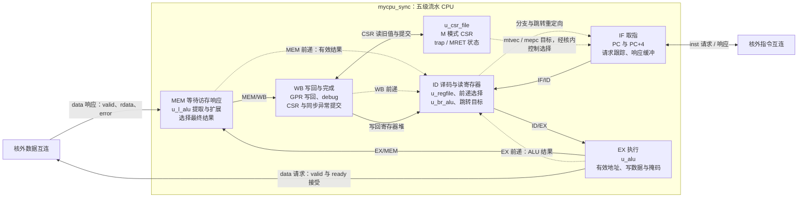
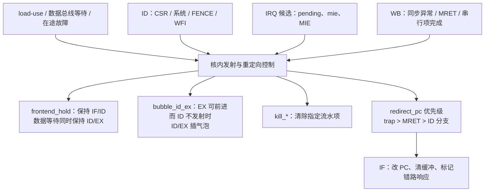

# CPU 内部结构与五级流水线

核对日期：2026-10-07。本文依据当前工作树 `myriscv/mycpu_sync.v` 及 `regfile.v`、`alu.v`、`br_alu.v`、`l_alu.v`、`csr_file.v`，以实际赋值、握手和时序块为准。旧 `doc/cpu/CPU现状_2026-09-27.md` 可作历史参考，其中工程顶层和外设状态不作为本图依据。

## 1. 内部结构总图

CPU 是单发射、顺序执行的五级流水核。IF、ID、EX、MEM、WB 是核内逻辑区域，直接写在 `mycpu_sync` 中；只有图中标出的 `u_*` 是实际例化子模块。边上的 IF/ID 等名称表示级间寄存器，不是总线或独立模块。虚线表示前递或重定向，实线表示主数据通路、总线或写回。



指令和数据是两路分离的类 SRAM 请求—响应接口。CPU 内没有直接例化 ROM、RAM、UART 或 DDR IP；这些设备在 SoC 互连之后。每路最多一笔未完成事务，请求接受和响应返回可以间隔多拍。指令侧支持旧响应完成与新请求接受同沿发生，数据侧也可在旧 MEM 完成时接受下一笔 EX 请求。

## 2. 每级负责什么

| 流水级 | 主要工作 | 关键实现 |
| --- | --- | --- |
| IF：取指 | 保存下一笔请求 PC，顺序 PC+4，跟踪已接受请求的 PC；响应直接进入 IF/ID 或暂存；重定向后丢弃错路响应 | `pc`、`inst_pending_*`、`inst_buffer_*`，约第 329 行 |
| ID：译码 | 解析指令，生成立即数及控制字，组合读取两个源寄存器，选择前递值；比较分支、计算跳转目标；检测 load-use 和 ID 异常 | `u_regfile`、`id_rs1/id_rs2`、`u_br_alu`，约第 466、559、1126、1165 行 |
| EX：执行 | ALU 计算、load/store 有效地址、数据地址对齐检查；生成 store 移位数据与字节写使能；发起数据请求 | `u_alu`、`data_req_*`、`data_req_fire`，约第 802 行 |
| MEM：访存完成 | 保持已接受事务直到响应；load 选择字节/半字/字，符号或零扩展；记录访问故障；普通 ALU 指令传递运算结果 | `ex_mem_mem_pending`、`u_l_alu`、`mem_fwd_data`，约第 974 行 |
| WB：写回 | 普通指令写 GPR，CSR 指令把 CSR 旧值写入 rd，并提交合法 CSR 修改；提交同步异常和 MRET；输出调试信息 | `rf_we/rf_wdata`、`u_csr_file`、`sync_trap_event`，约第 1071 行 |

`regfile` 为 32×32 位寄存器堆，两路组合读、一路上升沿写；x0 恒为 0。`alu` 实现加减、逻辑、移位和比较，当前无硬件乘除法。

分支条件比较由 ID 的 `br_alu` 完成；JAL/JALR 的链接值 PC+4 则由 EX 的 `alu` 完成。JALR 目标为 `(id_rs1 + imm) & ~1`，B/J 型目标为 `if_id_pc + imm`。

## 3. 四组流水寄存器

| 边界 | 实际字段前缀 | 保存的内容 |
| --- | --- | --- |
| IF → ID | `if_id_*` | 指令、PC、valid、取指访问故障 |
| ID → EX | `id_ex_*` | 已选择操作数、独立 store 源数据、ALU 控制、rd、load/store 类型、PC/实际后继 PC、CSR/异常元数据、valid |
| EX → MEM | `ex_mem_*` | ALU 结果/地址、rd、load 类型、访存 pending 与读写标志、PC/实际后继 PC、CSR/异常元数据、valid |
| MEM → WB | `mem_wb_*` | 最终普通写回数据、rd、写回许可、PC/实际后继 PC、CSR/异常元数据、valid |

每一级读取上一组寄存器的输出，经组合逻辑处理，再在时钟上升沿锁入下一组寄存器。因此，同一拍内各级处理不同指令。`valid=0` 表示气泡；指令字段里写入 NOP 或哨兵值只是波形辅助，不能代替有效位判断。

注意 store 地址运算用 `src2=imm`，写入内存的数据另存为 `id_ex_rs2_data`，不能把地址偏移误当成存数数据。

## 4. 流水线如何重叠

下表仅表示取指持续供给、无总线等待、无跳转和串行指令时的逻辑级重叠；IF 表示取指阶段，不是从复位开始的精确外部请求周期。

| 指令 / 周期 | C1 | C2 | C3 | C4 | C5 | C6 | C7 |
| --- | --- | --- | --- | --- | --- | --- | --- |
| I1 | IF | ID | EX | MEM | WB | — | — |
| I2 | — | IF | ID | EX | MEM | WB | — |
| I3 | — | — | IF | ID | EX | MEM | WB |

五级流水意味着指令可在不同阶段重叠，充分供给时稳态最多每拍完成一条；不意味着每条指令在实际 DDR 访问中固定五拍，也不意味着能每拍完成五条。

## 5. 前递为什么统一回到 ID

`id_rs1/id_rs2` 是寄存器读值和各级前递值的统一选择点，优先级为：

**EX > MEM > WB > 寄存器堆。**

同一寄存器被多条在途指令写入时，EX 中的指令比 MEM/WB 中的更年轻，应使用 EX 的新结果。前递要求有效项、允许写 GPR、rd 非零且无相关故障；EX 中的 load 被屏蔽，MEM 中的 load 只有收到无错误响应时才可前递。

ID 的操作数选择、分支比较、JALR 目标、store 源数据和寄存器形式 CSR 源数据都使用该统一结果。例如 `addi x1,x0,5` 后接 `add x2,x1,x1`，后条在 ID 可用前条 EX 的 ALU 结果，无需等待前条写回。

## 6. 停顿、气泡与冲刷

### 6.1 load-use：保持消费者，向 EX 插气泡

```asm
lw  x1, 0(x2)
add x3, x1, x4
```

当 `lw` 位于 EX、`add` 位于 ID，EX 只有访存地址，尚无 load 数据。`load_use` 根据真实使用的 rs1/rs2 与 load.rd 匹配：保持 IF/ID，禁止该消费者发射；在 EX 能前进时清除 ID/EX.valid，插入气泡。下一拍 load 位于 MEM，若响应已到，就经 MEM→ID 前递发射 `add`。

| 本地周期 | lw | add | EX 的新输入 |
| --- | --- | --- | --- |
| T | EX：请求被接受 | ID：检测相关并保持 | 气泡 |
| T+1 | MEM：假定响应已到 | ID：取 MEM 前递并发射 | add |
| T+2 | WB | EX | 后续指令或气泡 |

此表假设请求在 T 被接受、响应在 T+1 返回，所以表现为一拍相关停顿。若请求未被接受或响应更晚，还会叠加总线等待，不能笼统说所有 load-use 都固定停一拍。

### 6.2 总线等待：保持已有流水项

数据请求未获 ready，或 MEM 的请求尚未收到 rsp_valid 时，`data_pipeline_stall=1`：IF/ID、ID/EX 保持；等待中的 EX/MEM 项保持直到完成。WB 中已有的老指令仍可以完成，MEM 无新完成项时 MEM/WB 变为气泡，避免重复写回。

这不是向所有级不停插 NOP，也不是把整个 CPU 的所有寄存器全部冻结。指令侧还能在容量允许时预取，ID 被保持时返回的指令进入一个响应缓冲；PC 在请求被接受时才加 4。

### 6.3 分支：在 ID 发射成功后重定向

条件分支成立、JAL 或 JALR 在 ID 通过 `id_fire` 真正发射且无 ID 异常时，产生 `branch_redirect`。本条仍进入 EX，清除 IF/ID，清空取指响应缓冲，把下一请求 PC 改为目标。已被外部接受的错路请求无法撤销，使用 `inst_pending_drop` 等响应回来后丢弃。

普通分支不清掉已在 EX/MEM/WB 中的老指令，也不清掉本拍发射的分支本身。实际跳转等待取决于取指响应和背压，不能把源码中的简化“一拍惩罚”注释当作所有场景的固定时延。

### 6.4 异常、中断和串行指令

ID/EX/MEM 发现的同步异常随有效项传到 WB；WB 产生 trap，保存 `mepc/mcause/mtval` 并重定向到 `mtvec`。trap/MRET 的 kill 范围包括四组流水寄存器。核内逻辑还在老故障已知时阻止年轻 EX 请求，尤其阻止年轻 store 写副作用。

store 的写事务在 EX 的 `data_req_valid && data_req_ready` 被接受时发出，随后 MEM 等响应、WB 处理完成/异常；并非到 WB 才发起写事务。

CSR、MRET、ECALL、EBREAK、FENCE、WFI 使用串行控制：保持 ID 中的串行项，等待 ID/EX、EX/MEM、MEM/WB 全部为空，再单独发射；等它到 WB 后解除串行等待。当前 WFI 为串行 NOP，不进入真实低功耗状态。

外部/软件/定时器 IRQ 由 CSR 的 pending、mie、mstatus.MIE 判定。停止新的 ID 发射，排空已发射项后再接受中断，续执行地址取 `arch_next_pc`；同步异常优先，IRQ 优先级为 external > software > timer。IRQ 接受发生在排空后的控制事件，不必有一条普通指令占据 WB。



## 7. 本次核对与复现

目的：依据当前 RTL 解释 CPU 内部结构，避免把教材固定延迟模型、旧核或核外 SoC 模块混入图中。

改动：仅新增本文，含可编辑 Mermaid 总图、控制图、级间字段说明和时序示例；未修改 RTL、IP、PDS、软件镜像或已有工作树改动。

复现静态核对可在工程根目录执行：

```powershell
git status --short
git diff --stat
rg -n 'module|u_regfile|u_alu|u_br_alu|u_l_alu|u_csr_file' myriscv/mycpu_sync.v
rg -n 'load_use|id_fire|data_req_fire|ex_mem_complete|data_pipeline_stall|fwd_.*_en|redirect_pc|kill_' myriscv/mycpu_sync.v
Get-Content myriscv/regfile.v
Get-Content myriscv/alu.v
Get-Content myriscv/br_alu.v
Get-Content myriscv/l_alu.v
Get-Content myriscv/csr_file.v
```

实测效果：已逐项静态核对五级边界、五个子模块、三级前递、load-use、访存握手、分支重定向及串行/中断排空控制。本文的周期表是带前提的结构示意，不是新采集的波形。

未覆盖：本次未运行 RTL 仿真、综合或实板测试，未测量实际 CPI、Fmax 或分支/DDR 周期数；文档核对不增加任何新的仿真或实板 PASS 结论。
