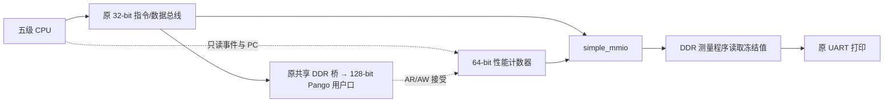

# CPU 性能计数器 2B：MMIO、UART 读出与隔离候选

后续状态：计数器已并入myriscv主文件，重复candidate、未使用的独立工程与旧生成脚本已按用户要求清理；原冻结源码及必要验证证据保留。当前工程入口见[主RTL集成](CPU性能计数器2B并入主RTL_2026-10-10.md)，清单见[清理记录](CPU计数器2B冗余文件清理_2026-10-10.md)。下文隔离设计/旧脚本路径为首次实现记录。

日期：2026-10-10。用户确认执行下一步，并选择独立测量 BIN 通过 UART 打印；计数器本体使用 MMIO。
本轮新增可综合观察计数器与隔离候选，未实现 Cache/M/Burst/BTB，没有提速结论。生产 RTL/PDS/IP、原成功 BIN/位流和旧门控保留。

## 硬件范围和连接

候选为 `myriscv/candidates/perf_2b/{mycpu_sync,soc_top,simple_mmio}.v`。
CPU 仅增加只读事件、分支目标和实际 IF/ID 接收 PC 输出；原流水线、总线、异常、IRQ 逻辑不改。
SoC 将这些观察信号、退休 PC 和实际 DDR AR/AW 接受事件送给 simple_mmio 内的 cpu_perf_counters。
DDR 桥和 UART 完全沿用原实现，CPU 32-bit 请求/响应接口及 MMIO 4KiB/UART/DDR 地址窗口不改。

独立 PDS 克隆当前主工程和已验收 verify_run_hello Loader IP 初始化，每次构建保存 RTL snapshot；不改主工程初始化，也不把新硬件套进旧成功哈希门控。

## MMIO 接口

下表为绝对地址，所有新寄存器仅接受对齐的 32-bit 访问；命令/PC 配置要求 SW 的全部 write strobes。旧 0x0/4/8/C/10 寄存器与握手保持原语义。

| 地址 | 内容 | 访问 |
| --- | --- | --- |
| 0x10000100 | ID `0x50524601`，版本1 | R |
| 0x10000104 | STATUS bit1:0：IDLE0/ARMED1/RUNNING2/DONE3；bit2/3 start/stop PC seen | R |
| 0x10000108 | CMD：1 ARM，2 CANCEL，3 MANUAL_START，4 FREEZE；读0 | W/R |
| 0x1000010C / 110 | START_PC / STOP_PC，0 表示不按 PC 过滤 | RW，仅 IDLE/DONE |
| 0x10000114 / 118 | 原 32-bit CYCLE 在 S/T 的完整值 | R |
| 0x10000140–1A4 | 13 个 64-bit 冻结计数器，每项8字节，低32位在前 | R，仅 DONE |

ARM 清旧值，等待起始 CYCLE；RUNNING 时 ARM/修改 PC/读取计数银行均报总线错误。CANCEL 允许中止，但不形成成功快照。
MANUAL_START 仅 IDLE/DONE 可用，FREEZE 仅 RUNNING 可用。未知命令、保留地址、只读写和新寄存器的部分访问报错，非法访问不执行副作用。
DONE 后计数不再更新，软件低/高两次 LW 一致；单软件拥有者负责 ARM/读取，当前 IRQ 默认关闭，不引入并发写者协议。

寄存器顺序：cycles、instret、if_stall_cycles、mem_stall_cycles、branch_flush_cycles、control_redirect_cycles、control_hold_cycles、load_use_cycles、other_cycles、ddr_transactions、branch_redirects、ddr_ar_commands、ddr_aw_commands。

## 窗口与计数口径

计时范围为成功接受 CYCLE 读取的 `[S,T)`：包含 S 边沿、排除 T 边沿。软件选用原 32-bit timer 的 LW。
硬件默认自动 ARM，并用正常退休 PC `0x400007d0/0x400007f4` 标记原成功 CoreMark 起止函数，然后等待实际 CYCLE 访问；Loader/BSP 其他 timer 读取不启动窗口。
测量 BIN 在 portable_init 的 BSP 自检后写 CANCEL、两个 PC=0、ARM，随后 CoreMark 的两次 timer 读取直接确定 S/T。
原成功 BIN 可被自动统计，但没有打印新计数的代码；用户选定的板级读出用新的独立测量 BIN。

为避免新观察使能拖慢 CPU，事件/分类/起止/清零控制增加一级寄存。边沿 E 的计数样本在 E+1 加入；T 边沿加入最后一个 T−1 样本，DONE 可见时银行已完整冻结。
start/stop tick 仍捕获 S/T 的原 CYCLE，64-bit cycles 与 32-bit 模差一致。功能测试的 carry 通过预置临界值，不假称实际运行了2^32周期。

- cycles：窗口内每个 core_clk 周期。
- instret：`normal_retire || mret_commit`，MRET一次；store、branch、rd=x0、合法 CSR 也退休；同步异常/非法 CSR不退休。不使用 RF 写使能或取指数替代。
- 互斥周期分类优先级：trap/MRET redirect → MEM 停顿 → CSR/IRQ/fault 控制排空 → load-use → branch recovery → IF 缺指 → other。七项之和严格等于 cycles。
- branch_flush：taken branch/JAL/JALR 重定向以及目标指令实际交给 IF/ID 前的恢复等待；目标地址必须匹配，较高优先级等待归其分类。不是误预测率或 BTB 可消除周期。
- ddr_transactions：本窗口实际 ARVALID&ARREADY 加 AWVALID&AWREADY，支持同边沿+2；AR/AW子项守恒。当前单拍条件下统计用户口命令，不是物理DDR内部命令，也不表示写入物理提交。
- branch_redirects 是独立事件，不加入周期占比。instret 可与等待分类同周期发生，因此不能使用 `cycles=instret+所有stall`。

当前无 DMA，DDR 命令来自 CPU 两路。未来 DMA 共享用户口需按 owner 区分 CPU/DMA；Burst 时 command 数也不能当 beat 数。
硬件初版不实现延迟直方图和请求/响应原始统计，保留2A仿真 observer 提供这些详细观察。

## 软件、仿真与验收

独立软件入口 [tests/cpu_performance_2b](../../tests/cpu_performance_2b/README.md)，最终构建 `measure_20261010_c`，performance BIN15936字节、validation15944字节，1/60各一份。
保持 GCC15.2.0、RV32I/ILP32、-Os、无LTO、2000-byte静态buffer、93.75MHz。计数打印使用现有轻量 printf 支持的 `%u/%08x`；首次误用长格式已修正，早期构建/失败证据保留。
读出发生在 PORT_DONE 之后，下载、CRC32、BSP自检、打印和结束循环都不计入。后续基线/优化候选固定同一测量 BIN，不能把新旧软件布局差异当硬件提速。

最终仿真在 [sim/cpu_performance_2b](../../sim/cpu_performance_2b/README.md)：

| 验证 | 最终证据目录 / 范围 |
| --- | --- |
| MMIO/窗口/分类/64-bit carry | `build/oracle_20261010_d`；手动及PC模式、非法访问、冻结读与旧寄存器 |
| 真实 CPU 两组短 CoreMark | `build/pipelined_coremark_20261010_a`；CRC、UART打印、13项硬件与observer逐项相等 |
| 完整 Pango IP/PHY/物理 DDR 微基准 | `build/pipelined_physical_20261010_a`；九组DDR程序行为，首窗口硬件13项对照 |
| 两条既有 DDR 定向 Tcl | `build/pipelined_ddr_20261010_a`；新候选编译、输出隔离、PASS/Errors0/无ERROR |
| RV32I / I-D 并发 / 背压 | `build/pipelined_rv32i_20261010_a`；40个支持用例、6个并发/背压；FENCE.I/ma_data缺口原RTL同失败 |
| IRQ / UART IRQ | `build/pipelined_irq_20261010_a`；32 CPU +2 UART，ROM/DDR前台，精确恢复/MRET |
| 地址/access-fault/MMIO/UART CPU | `build/pipelined_mmio_20261010_a`；沿用既有TB判断 |
| 六应用 LOAD/VERIFY/RUN | `build/pipelined_loader_*`；Hello原速引脚，CRC32、两组短CRC全执行；60次只启动 |
| PC下载/输出读出工具离线 | `build/transport_20261010_a`；129响应、唯一RUN、等待完整PERF尾、错误帧/错误计数/多余输出拒绝 |

功能模型 CoreMark 中 instret=829739/882363，与既有算法路径计数一致；其 cycles/CPI/分类份额不作为实板 DDR 瓶颈证据。
九窗口物理结果已与2A相同装载方式的 direct 基线逐窗口比较，cycles、instret、DDR命令数全部相等；1199条退休逐条解释器核验。不能和 CPU copy-loader 相位差混作硬件改变。
物理模型仍有厂家训练/原语 warning，保留时间检查；无ERROR不等于实板训练时序已验收。

## 隔离 PDS 与部署门控

直接组合使能草案 `pds_20261010_a` 的慢角 seed2/3/4 均负余量，首个关键路径由 CPU 访存逻辑到计数器 CE；保留但禁止部署。
最终寄存候选 `build/pds_20261010_b` 四个布局种子均通过：setup余量 +0.094/+0.450/+0.050/+0.526ns，best seed5。
93.75MHz、PG2L100H -6 FBG484，最终报告 All Constraints Met；既有未约束IO warning范围不扩大为完整板级IO时序结论。

PDS CLI 在加载前先以 Tcl 探测 `-file`，保留两条启动诊断：`invalid command name "open_project"` 与 Flow-0163。随后按工程命令文件成功加载 combined.pds，Compile/Synthesize/Device Map/Place & Route/Report Timing/Generate Netlist/Generate Bitstream 全部完成，成功加载后的流程无 E:。门控精确核对这两条启动诊断及完整后续流程，不宣称整份 CLI 日志零错误。

最终 LUT6910、FF7070、DRM8、APM0；对比2026-10-10主工程最终表 LUT5714/FF6052/DRM8，增加1196 LUT及1018 FF。
旧带 DebugCore 的成功候选是54 DRM的不同配置，不直接相减。本轮不以布线最大频率估计作 CPU 提速。

`audit.py` 核对 Loader 两块IP完整8192初始化字、实现网表8个存储实例、候选 RTL snapshot、源与证据哈希，生成独立 `build/deployment_gate.json`。
门控已为 `PERF2B_PRE_BOARD_AUDIT_PASS`，冻结246项输入/副本及339项证据。52项2A基准输入全部一致，包含主RTL/PDS/IP/成功 BIN/位流与CoreMark算法。六份离线计划共564个响应、各一次RUN，serial_opened均false。旧门控不改。

候选位流：`sim/cpu_performance_2b/build/pds_20261010_b/generate_bitstream/board_top.sbit`。
SHA256 `dc5121b8857a08c053698def358cc07f3be083252cb0b7274f27e6277b5dbb46`。
实板操作与六个命令见 [用户工具](../../tools/uart_loader/candidates/perf_2b/README.md)。每次 KEY0 后重新 LOAD/VERIFY/RUN，正式60次要求同门控/位流/模式的短测量 BIN 实板CRC日志。
工具等待 PERF2B_DONE，不能在前面的 PORT_DONE 提前结束；40秒截止、零重试、原始帧/输出/计数独立核验，离线计划不打开串口。

## 停止位置

本轮完成计数器实现、软件读出和隔离候选准备；正式60次完整运行/实板 counters、CPI及停顿分解仍 NOT_TESTED。
Codex 不打开 COM11、不执行 JTAG/KEY0；下一步由用户上板读取两组60次统计，再冻结测量基线。
16-byte I读缓冲保持独立下一轮，在同测量 BIN/93.75MHz下比较，不与计数器验证混为一轮优化。
