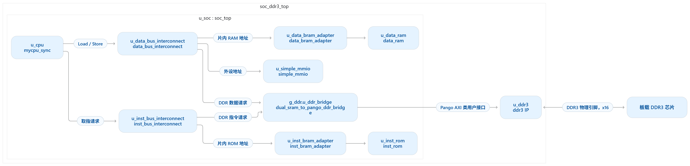
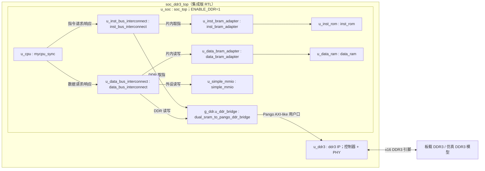
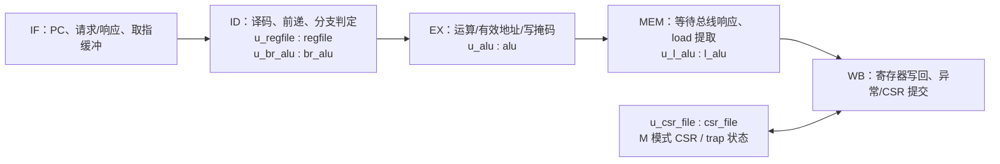

# CPU / SoC 现状快照（截至 2026-09-27）

2026-10-03 实现增量索引：DDR IP 板卡 CA/DQS 分组修复，主工程 board_top 完整 PNR 成功，Slow/Fast corner 已约束 setup/hold 均 0 失败，两条 DDR 物理定向联仿 PASS。CPU RTL 未修改，未作实板结论；记录见 [DDR IP 板卡引脚分组修复](../ddr/DDR_IP板卡引脚分组修复_2026-10-03.md)。下方仍为 9 月 27 日快照。

> 日期是本文件的状态分界线：只记录截至 **2026-09-27** 在当前工程中能从 RTL、
> 工程配置或已有仿真结果确认的事实。以后实现新功能时另写新日期快照，不把
> 后来的成果倒填为今天已经完成的功能。

后续增量索引（不改变本快照日期）：2026-10-02 的三路 LED 输出、MMIO 自检状态及验证见 [LED 状态指示与 MMIO 自检上报](../board/LED状态指示与MMIO自检上报_2026-10-02.md)；最新工程状态见 `CODEX_HANDOFF.md`。

板级顶层增量：2026-10-02 新增 `board_top → soc_ddr3_top → soc_top → CPU`，R4/T4 先经差分输入缓冲；PDS 设计顶层已切换并编译为 board_top，内部 debug/status/IRQ 不再作为板级端口。当前 DDR IP 为 125 MHz 参考、750 Mbps 实际速率，非本快照历史 100 MHz 配置。完整约束/验证/上板 TODO 见 [板级顶层与 125 MHz 回归](../board/板级顶层与125MHz回归_2026-10-02.md)；后续成果不倒填到 9 月 27 日图中。

## 本次记录的目的、工作与效果

- 目的：给后续总线、DDR3、启动程序和外设开发建立可核对的基线。
- 工作：依据当前 RTL、PDS 配置和已有仿真日志绘制模块图，列出功能、验证证据和缺口；本次只更新文档，没有修改硬件逻辑。
- 效果：以后可按日期新增快照，逐项对照“已实现、已验证、已上板”三个层次，而不覆盖历史状态。

## 1. 一句话定位

当前是一个 **RV32I、单发射、顺序执行、五级流水、仅 M 模式** 的 CPU 核
`mycpu_sync`。它通过分离的指令和数据类 SRAM 请求/响应接口连接到最小 SoC：
片内指令 ROM、片内数据 RAM、一个简单 MMIO 从机，以及可选的共享 DDR3 路径。
CPU + 总线 + DDR3 IP 的完整行为联仿已通过写、读、取指闭环，随后又通过
四槽、部分字节写、相邻拍与 DDR 连续取指的定向回归；
**板级 DDR3 运行和完整软件启动尚未完成**。

本文区分三个层次：

| 状态 | 含义 |
| --- | --- |
| RTL 已实现 | 模块和连接存在，不等于所有用例都通过 |
| 仿真已验证 | 对应测试输出了明确 PASS，只能说明该测试覆盖的行为 |
| PDS / 实板已启用 | 工程顶层、时钟、引脚和板级运行都就绪；当前 DDR3 路径尚未达到此状态 |

## 2. 当前模块结构

### 2.1 当前 SoC 结构

下图对应 `soc_ddr3_top` 中的 `u_soc : soc_top`，展示已完成单次联仿的
**DDR3 集成版 RTL**。图中的箭头主要表示请求去向；读数据和握手响应会
沿相同连接返回。`x16` 表示 DDR3 数据位宽，不是全部物理引脚数。

从**当前 PDS 默认综合配置**看，顶层仍是 `soc_top`，`ENABLE_DDR=0`：
`u_cpu` 的指令侧经 `u_inst_bus_interconnect` 访问
`u_inst_bram_adapter → u_inst_rom`；数据侧经
`u_data_bus_interconnect` 访问 `u_data_bram_adapter → u_data_ram`
或 `u_simple_mmio`。此配置**没有启用**图中的 `g_ddr.u_ddr_bridge`
和外层 `u_ddr3`。只有以 `soc_ddr3_top` 为顶层、使能 `ENABLE_DDR=1`
时，指令/数据两路才共享 DDR 桥和 DDR3 IP。

下面保留可编辑的 Mermaid 结构图源码，便于以后修改模块时同步更新图片：

`soc_ddr3_top` 使用 DDR3 IP 输出的 `core_clk` 运行 CPU、互连和桥；
`ddr_init_done && pll_lock` 满足后，再同步释放 `soc_resetn`。外部参考时钟
端口 `ddr_ref_clk` **要求已经缓冲的单端信号**。现有顶层未包含 RK3568
板所需的差分输入缓冲和引脚约束，不能把这张图理解为已经可直接下载上板。

PDS 的默认仿真顶层仍列为 `tb_soc_top`；`soc_ddr3_top` 目前通过独立
ModelSim 脚本运行，尚未纳入 PDS 默认综合配置。RK3568 的 ARM 没有接入
上述 CPU/DDR3 数据通路。

### 2.2 CPU 核内部

下图的 IF/ID/EX/MEM/WB 是 `mycpu_sync` **内部流水级**，不是五个独立
Verilog 模块；标在级内的 `u_*` 才是实际例化名。

级间由 `if_id_*`、`id_ex_*`、`ex_mem_*`、`mem_wb_*` 寄存器和有效位连接。
取指侧、数据侧各使用 `req_valid / req_ready` 与 `rsp_valid / rsp_error`
握手；数据访存等待响应期间，流水线保持状态，而不是假定 DDR 固定一拍返回。

## 3. CPU 已实现的功能

### 3.1 指令与流水线

- RV32I 普通整数指令：`ADD/SUB`、逻辑运算、比较、移位及其已定义的立即数
  形式；`LUI/AUIPC`；六类条件分支；`JAL/JALR`；`LB/LBU/LH/LHU/LW`
  和 `SB/SH/SW`。指令为固定 32 位，不支持压缩指令。
- 六条 CSR 指令：`CSRRW/CSRRS/CSRRC/CSRRWI/CSRRSI/CSRRCI`；
  `ECALL/EBREAK/MRET` 已译码并接入 trap 流程。
- ID 级判断分支与跳转；EX、MEM、WB 到 ID 的前递优先级为
  **EX > MEM > WB > 寄存器堆**。EX 中的 load 不可前递，遇到真正的
  load-use 相关时停顿。
- `valid` 位表示流水项，分支和 trap 可冲刷年轻指令；总线等待可冻结相应
  流水级。CSR、系统指令、`FENCE` 和 `WFI` 使用串行排空控制。
- `FENCE` 当前是流水线串行屏障；没有 Cache、写缓冲和多个 outstanding
  事务，尚不能声称已实现完整 SoC 级存储顺序。`WFI` 是合法的串行 NOP，
  **不会进入真实低功耗等待**。`FENCE.I` 未实现，会作为非法指令处理。

### 3.2 异常、中断与 CSR

- 实现了非法指令/非法 CSR、`ECALL`、`EBREAK`、指令或数据地址非对齐、
  指令访问故障及 load/store 访问故障的 RTL 路径；故障信息传到 WB 提交，
  同时抑制错误指令及年轻指令的副作用。**DDR3 用户口没有标准
  `BRESP/RRESP`，所以 DDR 桥目前把 `rsp_error` 固定为 0；DDR 内部错误
  尚不能像未映射地址那样上报 CPU。**
- 支持机器软件、定时器、外部三路电平中断输入，优先级
  `MEI > MSI > MTI`。接中断前排空已发射指令；同步异常优先。
- `csr_file` 保存或提供 `mstatus/misa/mie/mtvec/mstatush/mscratch/mepc/
  mcause/mtval/mip` 及机器信息 CSR 的首版行为。`mtvec` 仅 Direct 模式，
  `misa` 固定标识 RV32I；当前没有 U/S 模式、PMP、虚拟内存或性能计数器。
- SoC 只有三路中断输入线，尚无 CLINT/PLIC、可编程 `mtimecmp`、板级
  异步输入同步器等完整外设基础设施。

### 3.3 当前存储和总线

| CPU 地址窗口 | 模块 | 当前性质 |
| --- | --- | --- |
| `INST_ROM_BASE` 起 16 KiB | `inst_rom` + `inst_bram_adapter` | 指令侧；默认基址跟随 `RESET_PC` |
| `DATA_RAM_BASE` 起 16 KiB | `data_ram` + `data_bram_adapter` | 数据侧；默认基址也跟随 `RESET_PC` |
| `0x1000_0000` 起 4 KiB | `simple_mmio` | `SCRATCH`、只读 `ID/CYCLE/STATUS` 四个寄存器；不是 UART/GPIO |
| `0x4000_0000` 起 512 MiB | `dual_sram_to_pango_ddr_bridge` → `ddr3` | `ENABLE_DDR=1` 时指令/数据共享 |

ROM 与 RAM 默认可以具有相同的基址，因为它们分别挂在指令总线与数据总线；
这只是当前测试便利配置，**不等于最终统一物理地址空间的推荐布局**。
TB 中常把 `RESET_PC` 设为 `0x8000_0000`，但 `soc_top` 源码的默认值是 0；
正式上板前必须统一复位入口、ROM 内容与链接地址。

DDR 桥采用单笔 outstanding、数据优先仲裁、单个 128 位数据拍访问。
CPU 是 32 位字节地址，DDR 用户口地址按 16 位字计数；桥负责地址换算、
32→128 位槽位选择和 4→16 位写字节使能扩展。这是 Pango **AXI-like**
用户接口，不是完整标准 AXI4。当前没有 Cache、burst、DMA 或通用 AXI
互连；指令访存与数据访存共享同一桥，可能互相等待。

## 4. 截至本日的验证证据

| 范围 | 已有证据 | 不能据此推断 |
| --- | --- | --- |
| RV32I 测试镜像 | `MyCpu_test/dat` 有 42 组 ROM 镜像；此前项目记录为 40/42 通过，未过项为 `fence_i` 与 `ma_data`。本快照**未重新跑完 42 项**。 | 不能说 DDR 路径已通过 40 项测试 |
| 流水线/异常/中断 | `difftest/` 包含黄金轨迹、CSR、异常、中断及访问故障的定向 TB 和历史 PASS 日志。 | 旧 README 中关于“固定一拍接口/没有总线”的描述已过时，应以当前 RTL 为准 |
| DDR 桥/互连 | `source/tb_dual_sram_to_pango_ddr_bridge.v`、`source/tb_ddr_bus_path.v` 用行为模型做协议定向测试。 | 行为模型不是 DDR3 PHY/DRAM 模型 |
| 厂家 DDR3 例程 | 2026-09-27 的 `sim.log` 显示训练完成并有存储器读写流量。 | `simulation finish` 文本本身不是 CPU 测试 PASS |
| CPU＋真实 DDR3 IP：第 1 步 | `soc_ddr3_sim.log` 在约 78.442 µs 检查读回 `42`，约 79.132 µs 输出 `RESULT: PASS soc_ddr3_top DDR store/load/fetch`，ModelSim `Errors: 0`；第 2 步后也已回归通过。 | 单次写、读、取指不能证明完整地址换算 |
| CPU＋真实 DDR3 IP：第 2 步 | `soc_ddr3_regress_sim.log` 完成 14 条 CPU load 写回检查，并在约 87.712 µs 输出 `RESULT: PASS DDR regression lanes/masks/boundary/DDR-code`，ModelSim `Errors: 0`。 | 仍是定向仿真，不是随机压力测试或板级验收 |

完整 DDR 联仿使用 `source/tb_soc_ddr3_top.v`；片内 ROM/RAM 在这个 TB
中由 `source/tb_soc_ddr3_mem.v` 的**仿真专用行为模型**替代，但 DDR3 IP
和外部 DRAM 仍是厂家模型。两步分别用编译开关选程序；复现方式见
`doc/ddr/DDR3集成仿真第1步_CPU写读与取指.md` 和
`doc/ddr/DDR3集成仿真第2步_槽位字节掩码与连续取指.md`。

## 5. 当前边界与建议扩充

1. **继续扩充 DDR 回归。**四槽、相邻拍、字节/半字写掩码和符号扩展已有
   定向 PASS；下一轮应增加随机化地址/数据、连续长时间请求、复位插入、
   指令与数据同拍争用及仲裁优先级检查。当前仍没有随机压力和覆盖率数据。
2. **定义真实启动路径。**DDR3 易失，校准完成不代表程序已装入。近期保留
   `inst_rom`，由启动代码搬运程序到 DDR 后跳转；程序来源可以后续从 FPGA
   可访问的 Flash、串口或 RK3568 与 FPGA 的实际通信接口中选择。需要
   明确链接地址、装载完成信号、复位释放条件及异常向量位置。
3. **完成板级集成。**核对 RK3568 板的 DDR 型号、参考时钟、差分缓冲、
   DDR 管脚/Bank 约束与实际 IP 配置；将 `soc_ddr3_top` 纳入 PDS 的专用
   综合配置，再做 DDR 初始化和读写的上板自检。当前 100 MHz 参考时钟
   配置是仿真配置，不能凭此认定与板上时钟匹配。
4. **补可用的基础外设。**把 `simple_mmio` 测试寄存器逐步扩展或替换为
   UART、GPIO、定时器/软件中断源，并为外部中断输入加同步与清除机制。
5. **性能阶段再引入 Cache/burst。**I-Cache、D-Cache 与突发搬运能显著
   减少 DDR 单拍访问开销；加入 Cache 或写缓冲后，要重新定义 `FENCE`
   完成条件并实现 `FENCE.I` 的取指失效/重取机制。之后才评估分支预测、
   M 扩展、DMA/加速器等功能，避免把功能正确性与性能问题混在一起。
6. **建立统一验收口径。**分别保存片内 RAM 路径和 DDR 路径的测试结果，
   增加当前代码的可重复回归、覆盖清单、综合 Fmax/LUT/FF/BRAM 数据以及
   上板记录；不要把历史 40/42 与新 DDR 路径的覆盖率合并计算。

## 6. 核对入口

- CPU 与子模块：`myriscv/mycpu_sync.v`、`alu.v`、`br_alu.v`、`l_alu.v`、
  `regfile.v`、`csr_file.v`、`csr_defs.vh`。
- SoC 与存储路径：`myriscv/soc_top.v`、`soc_ddr3_top.v`、
  `inst_bus_interconnect.v`、`data_bus_interconnect.v`、
  `inst_bram_adapter.v`、`data_bram_adapter.v`、`simple_mmio.v`、
  `dual_sram_to_pango_ddr_bridge.v`。
- 工程与联仿：`RISCV.pds`、`source/tb_soc_ddr3_top.v`、
  `source/tb_soc_ddr3_mem.v`、
  `ipcore/ddr3/sim/modelsim/soc_ddr3_sim.tcl`、
  `ipcore/ddr3/sim/modelsim/soc_ddr3_sim.log`、
  `ipcore/ddr3/sim/modelsim/soc_ddr3_regress_sim.tcl`、
  `ipcore/ddr3/sim/modelsim/soc_ddr3_regress_sim.log`。
