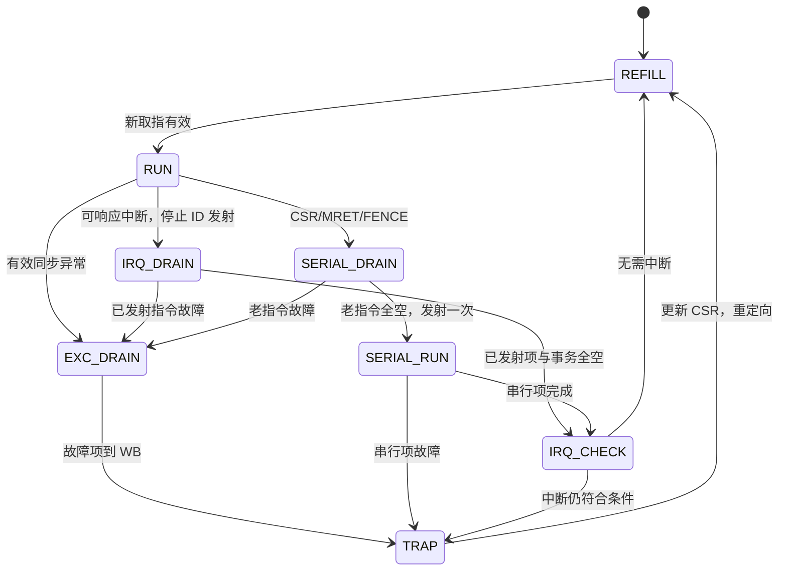

# 当前五级流水线 CPU 的异常与中断实现方案

> GitHub 发布说明（2026-10-10）：下文标为“仅本地”的历史档案/参考材料保留在开发机，未随本次源码发布；原验收结论和哈希不变。当前开发入口见 doc/CODEX_HANDOFF.md。

编写日期：2026-09-16。本文是后续 RTL 开发的设计方案，不代表这些功能已经实现或通过测试。

代码基线：[mycpu_sync.v](../../myriscv/mycpu_sync.v)，SHA256 为 `7F275453D7CD1F6C0BB99C784A540554B161E84E2E8C59C87B640474421FE31C`。基线已经包含 `uses_rs1/uses_rs2` 的 load-use 假冒险修复。

推荐先实现：**单核、仅 M 模式、32 位指令、分阶段发现异常、WB 处理同步 trap、CSR/MRET 串行执行、中断停止发射并排空后响应**。这条路线保留当前正常指令的流水执行方式，也能保留 EX 级 BRAM 访存，但必须满足第 4 节的限制。接入 DDR3、Cache 和有延迟的总线后，再选择是否改为提交点存数。

本文中的“必须”描述所选方案成立的条件；“建议”描述本工程的实现选择。ISA 规定的是软件可观察行为，并不规定一定在某个流水级读 CSR 或进入 trap。

## 1. 范围与当前代码的关系

### 1.1 第一版的功能边界

| 项目 | 第一版建议 | 后续扩展 |
|---|---|---|
| 特权级 | 仅 M 模式，始终 `priv=2'b11` | 需要隔离或操作系统时再加 U/S、委派和保护 |
| 指令长度 | 不支持 C，`IALIGN=32`，地址按 4 字节对齐 | C 扩展会改变取指、mepc 和指令长度处理 |
| CSR 指令 | 六条 Zicsr 指令全部实现 | 根据应用添加 CSR |
| 系统指令 | ECALL、EBREAK、MRET；WFI 可先按 NOP 实现 | WFI 等待/低功耗、外部 Debug |
| 访存非对齐 | 产生异常，不执行错误读写 | 软件模拟或硬件拆分访问 |
| trap 入口 | mtvec Direct 模式 | Vectored 模式 |
| 中断源 | MEIP、MSIP、MTIP 三根输入 | 本地计时器、软件中断寄存器、外设控制器 |
| 嵌套 | 首版处理程序保持 MIE=0 | 软件保存 trap 上下文后允许嵌套 |
| 地址错误 | 预留 access-fault 接口；本阶段重点解决非对齐 | 总线地址译码、从设备错误、Cache refill 错误 |

准确的功能名称应是“RV32I + Zicsr + 所选机器模式功能”。CSR 指令属于 Zicsr，MRET 和机器模式 trap 属于特权架构，不能把所有功能都当成 RV32I 普通运算指令。FENCE 属于基础指令集；FENCE.I 属于 Zifencei。[Zicsr 规范](https://docs.riscv.org/reference/isa/v20260120/unpriv/zicsr.html)、[Zifencei 规范](https://docs.riscv.org/reference/isa/v20260120/unpriv/zifencei.html)

这个范围首先形成可运行的机器模式异常闭环；宣称完整特权规范符合性之前，还要单独审计所选版本的必需 CSR、计数器和可选扩展配置。

### 1.2 当前流水线中真正发生副作用的位置

| 路径 | 当前实现 | 对新增机制的影响 |
|---|---|---|
| 取指 | 同步 ROM，地址使用 `next_pc/pc`，另有 IF/ID 寄存器 | trap 重定向必须同时处理 ROM 地址和旧返回指令 |
| 分支与 JAL/JALR | ID 判定，操作数来自 EX/MEM/WB 前递 | 跳转目标非对齐应在这里归属到跳转指令 |
| load | EX 地址组合接 RAM，MEM 取得数据，WB 写 GPR | EX 判非对齐，故障 load 不写回、不前递 |
| store | **EX/MEM 时钟沿已经写 RAM** | WB 清 valid 无法撤销此前写入 |
| GPR | WB 写寄存器堆 | 可以在 WB 用异常标志取消写回 |
| CSR | 只有六条指令的译码信号，无 CSR 数据通路 | 要新增操作数、访问权限、读改写、提交控制 |
| 写回许可 | `gf_we = ~wmem & ~inst_b` | 必须改为已实现指令白名单 |
| 流水控制 | load-use 冻结前端；分支 flush 只清 IF/ID | 不能把现有分支 flush 直接当成全流水 trap flush |

当前不存在“所有架构状态都在 WB 才变化”的事实。后面讨论精确异常时，必须把早期 RAM 写入算进去。

## 2. 三份资料中需要修正或限定的说法

资料提供了 CSR、trap、MRET、CLINT 和 PLIC 的基本概念，但以下内容不宜直接翻译为 RTL。

| 资料中的说法 | 本工程应采用的解释 |
|---|---|
| 顺序核按序提交，CSR RAW 自然隔开 | 错。第一条在 WB 写 CSR 时，第二条可能已经在 EX 读了旧值。需要串行化、停顿或 CSR 前递 |
| 指令地址非对齐统一在 IF 判定 | 对普通跳转不合适。目标非对齐归属于产生目标的 branch/JAL/JALR，保存的是跳转指令 PC；本核应在 ID 检查 |
| 中断“只在三个时刻”评估 | 这些是时限要求，不是禁止其他时刻评估。每周期计算 pending/enable，并在安全边界响应即可；CSR/MRET 生效后必须及时重新评估 |
| 异常和 CSR 写冲突时，异常赢就行 | 先确定哪条指令已经提交。不能一面宣称 CSR 指令退休，一面丢掉它的写操作；中断若发生在 CSR 之后，应基于更新后的状态 |
| 只把异常标志传到 WB 就能保证精确异常 | 当前 EX 级已写 RAM，必须另外阻止年轻指令的副作用；只加标志不够 |
| 非对齐访问在 MEM 发起前禁止即可 | 本核请求在 EX 就到 RAM 端口，必须在 **EX 当拍** 屏蔽写使能 |
| 异常指令不能进入后级 | 应禁止其正常副作用，但必须保留一条带 PC/cause/tval 的有效故障记录，直到处理 trap |
| 中断号越大优先级越高 | 三种机器中断采用 MEI > MSI > MTI，软件中断 3 高于定时器中断 7 |
| msip 是 CSR，可用 CSR 指令访问 | 标准机器软件中断源 msip 是 MMIO 寄存器；mip.MSIP 是其在 CSR 中的状态视图 |
| mie/mip 的高 20 位都可随意自定义 | 不能照旧资料占用所有 12 及以上编码；当前规范有保留和已分配位置，平台自定义中断从 16 及以上规划 |
| mret 总把 MPP 清成 U | 本工程仅支持 M，最低受支持模式也是 M，所以 MPP 保持 3 |
| mtval 总是必须保存指令或地址 | 部分情况允许零；本工程主动选择保存有用的非法编码/故障地址，ECALL、EBREAK、中断写零 |
| 中断返回后总执行原 PC+4 | 应返回第一条尚未完成的指令。跳转后可能是目标地址，不能统一加 4 |
| 中断嵌套会自动挡住低优先级事件 | 重新打开 MIE 后，还需要软件调整 mie 或外部控制器阈值，并保存被覆盖的 trap CSR |
| 总线访问失败天然是非精确异常 | 简单顺序核可以等待响应，保留对应指令，精确报告访问失败；退休后的脏行写回失败才是另一类问题 |
| CLINT 管理表中所有六种中断 | 不能把 mip 的中断位表当作 CLINT 功能表。机器外部中断一般来自外设控制器，机器本地计时/软件中断来自本地模块 |
| PLIC 的“1024 个 pending 位”等于“1024 个 32 位寄存器” | 位数和寄存器数不同。每个 32 位字装 32 个 pending 位；0 号还是保留源 |
| 分支预测相关 CSR 是实现异常的必需模块 | 资料未给出具体标准寄存器，不能据此发明必需 CSR；BTB/预测器属于后续微架构设计 |

中断时限、机器中断次序、MRET 状态行为以[机器模式规范](https://docs.riscv.org/reference/isa/v20260120/priv/machine.html)为依据；CSR 的权限和编号以[CSR 地址规范](https://docs.riscv.org/reference/isa/v20260120/priv/priv-csrs.html)为依据。跳转故障归属以[RV32I 控制转移规则](https://docs.riscv.org/reference/isa/v20260120/unpriv/rv32.html)为依据。

## 3. 先确定精确异常的可观察结果

假设指令顺序为 A、B、C，B 发生同步异常。进入处理程序时必须满足：

1. A 和所有更老指令已完成。
2. B 不产生正常 GPR、CSR 或内存写入。
3. C 和所有更年轻指令不留下架构副作用。
4. mepc 指向 B，mcause/mtval 描述 B。

中断发生在指令边界：边界之前的指令全部完成；边界之后的指令尚未完成；mepc 保存边界之后第一条应执行的地址。

这里的“完成”必须同时考虑 GPR、CSR、RAM、MMIO、计数器和外部请求。只比较寄存器堆是不够的。

一个必须通过的程序片段是：

```asm
addi x1, x0, 123
ecall
sw   x1, 0(x2)       # 不允许在处理 ecall 前写出去
```

如果仅在 ECALL 到达 WB 时清空流水线，这条 SW 可能已经在前一个沿写入 RAM。这个反例决定了下面两条路线的取舍。

| 示意周期 | ECALL 所在级 | 年轻 SW 所在级 | 如果没有早期抑制 |
|---|---|---|---|
| T0 | ID | IF | 此时已经可以发现 ECALL |
| T1 | EX | ID | SW 继续前进 |
| T2 | MEM | EX | 周期末 SW 写 RAM |
| T3 | WB | MEM | 此时处理 trap，已经无法撤销 T2 的存数 |

## 4. 总体实现路线的比较

### 4.1 路线 A：保留 EX 访存，提前阻止副作用，中断排空响应（当前推荐）

正常运算、load、store 保持现有流水时序。同步异常在能发现时立即阻止故障指令及年轻指令产生副作用，故障记录继续向 WB 传递。中断先停止 ID 向 EX 发射，等已经发射的指令全部完成，再进入处理程序。CSR 和 MRET 使用串行通路。

| 优点 | 代价与限制 |
|---|---|
| 保留目前已经跑通的 BRAM 读写时序 | 异常取消控制必须在早期生效 |
| 普通指令不因新增 CSR 单元而统一串行 | CSR 和中断入口增加若干排空周期 |
| 不必立刻设计 store buffer | 不能任意增加晚发现的异常而不修改门控 |
| 中断时已有 store 会完成并计入保存现场 | 中断延迟受当前在途操作长度影响 |

**路线 A 成立的条件：**

1. 当前普通指令的同步故障在 ID 或 EX 就能发现；故障 store 在 EX 写入沿之前被拦住。
2. 一旦发现故障，年轻指令不得再进入可产生副作用的阶段。
3. CSR/MRET 等可能在较晚阶段改变或检查状态的指令执行时，没有年轻指令继续执行。
4. 不能在仍有 EX/MEM/WB 指令时随意接受中断。
5. 以后出现延迟的访存响应，必须等待所有更老、可能失败的操作完成，才允许年轻 store/MMIO 产生副作用；否则转路线 B。

“保留 EX 写 RAM”不等于“不需要提交概念”。可以继续在 WB 生成退休事件，但其精确性来自上述顺序约束。

### 4.2 路线 B：存数在提交点发出，统一管理架构副作用

EX 只算地址、数据、字节使能，store 信息经过流水寄存器到提交点后才发请求。正常 load 可按需提前读取普通 RAM；有副作用的 MMIO load 必须受提交顺序约束。

| 优点 | 代价与限制 |
|---|---|
| 容易表达“退休前无不可撤销副作用” | 需要重新安排单端口 RAM 访问 |
| 支持晚到的总线错误、中断边界选择更直接 | 年轻 load 可能与提交 store 争用端口 |
| 后续总线、Cache、预测器更容易形成统一控制 | 要处理 store→load 顺序、阻塞或转发 |
| 中断可在每个合适的提交边界接受 | 总线请求与响应仍需明确完成规则 |

当前 RAM 是单端口。不能简单把 `.wr_en` 延迟两拍，却继续用 EX 的 `.addr/.wr_data`。改路线 B 时，地址、数据、字节使能和请求许可必须一起迁移，并增加端口仲裁。第一版可让提交 store 独占 RAM 并阻塞冲突 load；以后再优化。

总线 store 若在 WB 发出，要把 `request accepted` 和 `operation completed` 分开。等待响应期间冻结该提交项，成功才退休，错误则报告 cause 7。从设备必须有明确的错误副作用约定；已对外生效的操作无法靠清流水寄存器撤销。

### 4.3 路线 C：所有指令串行，先验证软件语义

一次只运行一条指令，可快速调通 CSR/trap 软件和参考模型，但会明显降低现有流水线性能。适合临时 bring-up 模式，不建议作为竞赛内核最终结构。

**建议决策：本阶段选 A；接总线时重新审计第 4.1 节的五个条件，若需要非阻塞 Cache 或复杂并发，再迁移 B。** 后文以 A 为主，同时保留 B 的接口方向。

## 5. 异常检测、归属和传递

### 5.1 异常表

下表中的 mtval 是本工程选择，需让 RTL、软件和参考模型保持一致。

| 事件 | cause | 发现位置 | mepc | mtval | 首版状态 |
|---|---:|---|---|---|---|
| 跳转目标非对齐 | 0 | ID，操作数就绪后 | branch/JAL/JALR 自身 PC | 计算后的目标地址 | 实现 |
| 取指访问失败 | 1 | 地址属性检查或取指响应 | 失败的取指地址 | 失败地址 | 留响应接口；范围检查可独立加入 |
| 非法指令、非法 CSR 访问 | 2 | ID，或串行 CSR 检查点 | 故障指令 PC | 32 位指令编码 | 实现 |
| EBREAK | 3 | ID | EBREAK 的 PC | 0 | 实现 |
| load 非对齐 | 4 | EX | load PC | 有效地址 | 实现 |
| load 访问失败 | 5 | 访存检查或响应 | load PC | 有效地址 | 总线阶段接入 |
| store 非对齐 | 6 | EX | store PC | 有效地址 | 实现 |
| store 访问失败 | 7 | 访存检查或响应 | store PC | 有效地址 | 总线阶段接入 |
| M 模式 ECALL | 11 | ID | ECALL 的 PC | 0 | 实现 |

没有 MMU 时不要制造 page fault，也不需要 satp 或页表遍历。普通 ADD/SUB 溢出不触发算术溢出异常。

### 5.2 跳转目标非对齐：应在本核的 ID 检查

```verilog
// 示意，id_operands_ready 必须包括 load/CSR 等依赖已解除。
target = inst_jalr ? ((id_rs1 + imm_i) & 32'hffff_fffe)
                   : (if_id_pc + branch_or_jal_imm);

target_fault = if_id_valid && id_operands_ready &&
               (inst_jal || inst_jalr || branch_taken) &&
               (target[1:0] != 2'b00);
```

发生 target_fault 时，禁止正常 branch redirect，禁止 JAL/JALR 的链接寄存器写入，给该跳转指令附 cause 0。条件分支没有跳转时，不检查其未采用目标是否对齐。JALR 应先清 bit 0，再检查剩余对齐情况。

例如 PC=0x20 的 JAL 跳到 0x22：`mepc=0x20`，`mtval=0x22`，rd 保持原值。若跳到一个对齐但不可访问的目标，则 JAL 本身可以完成，随后由目标取指报告 cause 1；两种异常归属不同。

IF 的 `pc[1:0]` 检查可以作为内部断言，帮助抓 PC 控制错误，不能替代上述指令级判定。

### 5.3 非对齐数据访问：统一 trap 或硬件支持

| 方案 | 优点 | 缺点 | 建议 |
|---|---|---|---|
| 所有半字/字非自然对齐都 trap | 判定简单，没有部分写入 | 访问非对齐数据需软件处理 | 首版采用 |
| 仅支持字内的部分非对齐 | 可减少一些 trap | 行为分类多，跨字仍需异常 | 首版不采用 |
| 自动拆成两次访问 | 软件透明 | 多周期状态机、跨界保护、异常和部分写入更复杂 | 后续按应用需要考虑 |

```verilog
misaligned = ((is_lh || is_lhu || is_sh) && addr[0]) ||
             ((is_lw || is_sw) && (|addr[1:0]));
```

LB/LBU/SB 对任意字节地址均满足自然对齐。误对齐指令仍作为故障记录流向 WB，但不得执行正常 load/store。尤其 SW 在当前 EX 级就会写 RAM，必须当拍禁止 `wr_en` 和字节写使能；不能等下一拍 EX/MEM.exc_valid 才禁止。

当前 RAM 接口没有独立读请求使能，内部持续读取普通 BRAM 本身没有 MMIO 副作用。因此首版对故障 load 的最低要求是禁止结果消费、前递和写回；接到总线或 MMIO 后，还必须禁止实际请求发出。不要为了“关闭读取”随意改变当前 RAM 输出时序。

### 5.4 异常记录与 valid

建议每个有指令的流水项携带：

```text
valid
pc, inst
exc_valid, exc_cause[4:0], exc_tval[31:0]
next_arch_pc[31:0]
原有运算、访存和写回信息
```

本阶段 5 位 cause 足够覆盖表中事件；如果规划更大的自定义编号，统一扩大位宽。中断不必伪装成某条算术指令，可以在排空后由 trap 控制器直接产生独立事件。

`valid=0` 表示气泡或被取消；`valid=1 && exc_valid=1` 表示需要处理的故障指令。不能发现异常就把故障项 valid 清零，否则 trap 会丢失。

异常记录只随真正的流水传递更新。stall 时保持，kill 时清除；已有取指故障不能被后面的“指令字为 0，译码非法”覆盖。

### 5.5 两层优先级

先比较指令年龄，再比较同一指令的异常类型。对于顺序流水线，在同一拍有效且未被取消的候选通常是 WB 比 MEM 老，MEM 比 EX 老，EX 比 ID 老。不能把异常编号大小当作指令年龄。

例如 EX 的老 load 非对齐与 ID 的年轻 ECALL 同拍出现，应保留 load 异常，取消 ECALL。ID 的已采用分支也必须能取消错误路径上的 IF 故障记录。

同一指令内部，首版采用：已有取指故障优先；随后检查合法性；合法指令再按类型判断目标、ECALL/EBREAK 或数据地址错误。多数条件因合法译码而互斥。数据非对齐与数据 access fault 若同时可能出现，本方案明确选“先非对齐”，后续保持一致。不要使用资料中未经区分的七项全局优先级表。

## 6. 路线 A 的同步异常控制

### 6.1 ID 发现故障

故障指令以 `valid=1, exc_valid=1` 进入 ID/EX，同时取消年轻取指并停止继续发射。EX/MEM/WB 中的老指令继续推进和写回。故障项经过 EX、MEM 到 WB 时，关闭它所有正常副作用，在 WB 产生一次 trap 事件。

不要因为“正在处理异常”就冻结全部流水线，否则老指令无法排空，故障项也到不了 WB。

### 6.2 EX 发现故障

当拍禁止故障 load/store 的正常访问，取消 ID/IF 的年轻指令，把故障项传入 EX/MEM。更老 MEM/WB 指令继续完成。若 ID 同时检测到另一个故障，EX 候选获胜。

### 6.3 存数和写回许可

以下是逻辑条件示意，不是可直接替换当前 RTL 的完整表达式：

```text
store_fire = 当前 EX store 有效
             且复位已解除
             且当前指令没有异常
             且没有更老异常/取消事件阻止它
             且存储器接受本次请求
             且这条指令尚未发过请求

gpr_write  = 正常退休 && writes_gpr && rd != 0
csr_write  = 正常 CSR 退休 && csr_write_intent
```

如果以后让 EX 因总线等待而保持多拍，不能继续用 `id_ex_valid & id_ex_wmem` 每拍重复发请求。需要 valid/ready 的 `fire`，或 `request_sent` 标志。

前递许可也应带 `!exc_valid` 和 `result_ready`。尤其 CSR 若尚未产生旧 CSR 读值，不能把默认 ALU 结果当成 CSR 的 rd 结果前递。

### 6.4 WB 处理故障

同一个时钟沿完成 trap CSR 更新、发出 trap redirect、取消年轻状态。故障指令不退休、不写 GPR、不执行软件 CSR 写、不增加 minstret。老指令已经在前面的沿完成。

在路线 A 中，WB trap 时不应再有能够写内存的年轻指令；这是需要验证的设计不变量，不只是依赖一根最后时刻的 flush。

## 7. 中断如何与当前 EX 存数兼容

### 7.1 接口和候选计算

建议 CPU 顶层增加已同步到 CPU 时钟域的电平输入：

```verilog
input wire irq_external;
input wire irq_timer;
input wire irq_software;
```

CSR mip 显示原始 pending，mie 和 mstatus 只影响是否响应，不影响是否能读到 pending。本核的候选为 `mstatus.MIE && |(mip & mie & 32'h0000_0888)`，并按外部、软件、定时器选 cause 11、3、7。

不要在 CPU 接受 trap 时自动清这些源。外设确认、写 mtimecmp、写 MMIO msip 才是清除源的途径。mip 内这三个位选择硬件只读视图；mip 整个地址仍按其 CSR 访问属性处理，写只读字段忽略，不能误判成“整个地址是只读 CSR”。

### 7.2 方案比较

| 中断边界方案 | 优点 | 问题 |
|---|---|---|
| 停 ID 发射，排空 EX/MEM/WB 后进入 | 兼容当前早期 store，边界好证明 | 增加排空延迟；以后等待总线可能更长 |
| 每次 WB 退休后立即冲刷年轻指令 | 潜在入口延迟小 | **当前不可直接采用**：年轻 store 可能已在前一拍写 RAM |
| 所有不可撤销请求都受提交许可后，在 WB 接受 | 适合路线 B | 要改存储器请求管理 |

### 7.3 推荐的排空流程

1. RUN 中发现可响应中断后，本拍禁止新的 `id_fire`，保持或丢弃前端预取；已经在 EX/MEM/WB 中的指令继续运行。
2. 排空期间如果已发射指令发生同步异常，处理这条异常，放弃本次中断入口；中断源仍可保持 pending。
3. 等 EX/MEM/WB 全空，且没有待完成的内存事务，再进入 IRQ_CHECK。
4. 用此时已生效的 CSR 和当前 pending 再评估一次。仍满足条件才锁定 cause 并进入 trap。
5. 若 pending 已撤销或被刚完成的操作屏蔽，则取消中断，重新从保存的架构续执行地址取指。
6. 接受中断时 `mepc=arch_next_pc`，`mtval=0`，`mcause[31]=1`；更新状态后跳到入口。

在第一步已经发射的 store 会完成，而且其退休也在中断之前。这避免“写出去后又回到同一条 store 重执行”。被留在 ID 的指令尚未发射，可以被中断先行；不能笼统宣称所有尚未执行的同步异常一定比中断优先。

建议在同拍已有确定 ID 故障且操作数就绪时，先接收该故障记录，再进入同步异常路径；对尚未发射、尚未判定的指令，不额外推测异常。

### 7.4 续执行 PC 的两种方案

| 方案 | 优点 | 风险 |
|---|---|---|
| 从各级 valid 选择最老未执行 PC | 少一个独立退休 PC 寄存器 | 气泡、分支、预取、排空后无有效项时容易漏情况 |
| 每条指令携带实际后继 PC，退休更新 `arch_next_pc` | 中断排空、MRET、重新取指都能复用 | 流水寄存器多带 32 位或等价控制信息 |

推荐第二种。普通指令的后继是 PC+4，采用的 branch/JAL/JALR 后继是目标，不采用分支后继是 PC+4。正常退休更新它；MRET 更新为 mepc；进入 trap 更新为处理程序入口；复位设为启动地址。

排空期间可以更新这个寄存器，但只有安全边界才允许据此接受中断。当前 IF 的 `pc` 已经在预取，不能直接拿来保存 mepc。

### 7.5 时限和 CSR/MRET 后的重评估

每周期组合计算中断候选，控制器决定何时接受。串行 CSR/MRET 完成后，先进行一次 IRQ_CHECK，再放行年轻指令，保证使用新状态。

例如 `csrs mstatus, x1` 打开 MIE 时已有 MTIP：这条 CSR 指令先完成，下一控制周期依据新 MIE 接受中断，mepc 指向 CSR 后继。MRET 恢复 MIE 后仍有 pending，则允许再次进入处理程序，mepc 应为返回目标。

首版 BRAM 的排空时间是有限的。以后总线可能永久不响应时，要定义超时、错误处理或系统复位策略；不能声称无限等待仍满足有界响应。

## 8. CSR 寄存器和访问策略

### 8.1 建议的首版 CSR 表

下表复位值和掩码是本工程的设计选择。地址和 CSR 分类参考[CSR 编号表](https://docs.riscv.org/reference/isa/v20260120/priv/priv-csrs.html)。

| CSR | 地址 | 本工程行为 |
|---|---|---|
| mstatus | 0x300 | MIE[3]、MPIE[7] 可写；MPP[12:11] 固定 3；初值 0x1800 |
| misa | 0x301 | 固定返回 0x40000100，表示 RV32I，写忽略；Zicsr 不靠单独字母位表示 |
| mie | 0x304 | 可写位 11、7、3，初值 0 |
| mtvec | 0x305 | 首版 Direct，低两位固定 0；建议参数化复位入口，如 0x100 |
| mstatush | 0x310 | 首版小端且无相关扩展，固定零，写忽略 |
| mscratch | 0x340 | 普通 32 位 RW，初值 0 |
| mepc | 0x341 | RW，当前只存 4 字节对齐地址，低两位固定 0，初值 0 |
| mcause | 0x342 | 保存中断标志和原因；实现支持原因的读写，初值 0 |
| mtval | 0x343 | 32 位 RW，初值 0 |
| mip | 0x344 | 11、7、3 反映中断输入，软件写这些字段忽略 |
| mvendorid/marchid/mimpid | 0xF11/0xF12/0xF13 | 只读标识，未分配正式编号时返回 0 |
| mhartid | 0xF14 | 只读 0，单核 |
| mconfigptr | 0xF15 | 只读 0，表示当前没有配置数据结构；规范要求该 CSR 存在 |

M-only 不必为了凑表加入 S 模式 CSR、mideleg/medeleg、satp；不存在的地址访问按非法指令处理。未来宣称新特权级或新扩展时再扩展白名单。

### 8.2 计数器的安排

建议在基本 trap 跑通后，增加 64 位 `mcycle/minstret`，分别用 0xB00/0xB80 和 0xB02/0xB82 访问低高半部，为 CoreMark 和流水效率分析提供计数。可增加 `mcountinhibit` 的 CY/IR 控制。

`mcycle` 按所定义的 CPU 时钟计数；`minstret` 只在正常退休事件增加，包括正常 store、branch、CSR、MRET，排除 ECALL/EBREAK 等故障指令、气泡和中断事件。CSR 显式写计数器时要定义与自动增量的顺序，并遵循所选规范。

若要支持 `cycle/time/instret` 等只读别名并宣称 Zicntr，需要把别名、64 位一致读取和 time 来源一并完成。`mtime` 与 `mcycle` 不能仅因都是计数器就混成同一语义。

### 8.3 六条指令的执行语义

令 `old` 是 CSR 原值，`src` 是转发后 rs1 值或零扩展的 5 位 zimm。rd 非零时写入的是 old。

| 指令 | 新 CSR 候选值 | 读许可 | 写意图 |
|---|---|---|---|
| CSRRW | src | rd != x0 | 始终 |
| CSRRS | old OR src | 始终 | rs1 编号 != x0 |
| CSRRC | old AND NOT src | 始终 | rs1 编号 != x0 |
| CSRRWI | zimm | rd != x0 | 始终 |
| CSRRSI | old OR zimm | 始终 | zimm != 0 |
| CSRRCI | old AND NOT zimm | 始终 | zimm != 0 |

必须区分“rs1 是 x0”和“rs1 不是 x0，但内容为零”。后者对 CSRRS/CSRRC 仍有写意图，访问只读 CSR 时仍可能非法；不能根据数据值为零取消写访问。CSRRW x0 仍写 CSR，但没有 CSR 读副作用。[CSR 指令规则](https://docs.riscv.org/reference/isa/v20260120/unpriv/zicsr.html)

先算候选值，再施加该 CSR 的写掩码/WARL 约束。把 mstatus、mtvec 等直接当作全 32 位可写寄存器会制造不支持的模式和状态。

### 8.4 CSR 合法性检查

检查地址是否在实现白名单、所需权限是否受支持，以及是否对只读地址产生了写意图。非法时生成 cause 2，禁止 GPR 和 CSR 双方写入。

“地址是只读 CSR”和“某个可访问 CSR 含有只读字段”不同。例如 mhartid 的写访问非法；mip 中本工程实现的三个位不可软件改写，不等于向 mip 发任何写指令都非法。misa 固定值也可以通过合法 WARL 写忽略实现。

## 9. CSR 的流水时机和冒险方案

### 9.1 方案比较

| 方案 | 实现方式 | 优点 | 缺点 |
|---|---|---|---|
| A1：串行、WB 读改写 | 排空老指令，CSR 单独进入流水，WB 同拍读取旧值并提交 | 不需要 CSR 旁路；与 trap 和中断顺序清晰 | CSR 指令周期数较多 |
| A2：EX 读，WB 写，遇到相关 CSR 停顿 | 比较在途 CSR 地址/写意图 | 减少无关指令停顿 | mstatus/mepc 等隐式依赖不能漏；CSR 结果到 GPR 也要冒险处理 |
| A3：EX 读，MEM/WB 向 EX 前递 CSR | 选择最新的在途 CSR 结果 | CSR 密集程序吞吐更高 | 掩码、动态 mip、计数器、trap 写入和隐式读取都增加复杂度 |
| A4：EX 直接改 CSR | 修改发生得早 | 局部路径短 | 必须证明没有老异常或处理中断回滚，当前不推荐 |

首版建议 A1。它主动序列化了 CSR，所以能消除 CSR RAW；单纯“顺序提交”没有这个效果。

### 9.2 A1 的具体流程

1. CSR 在 ID 等待时停止新取指/新发射，老 EX/MEM/WB 正常排空。
2. 老指令全完成后，读取稳定的 GPR 操作数，把 CSR 地址、操作类型、源值、rd、PC 和指令字送入 ID/EX；只发射一次。
3. CSR 向 WB 推进时，年轻指令保持禁止发射。
4. WB 从 csr_file 读取 old，生成新值。合法正常提交时，同一沿把 old 写 rd、把新值按掩码写 CSR。
5. 进入 IRQ_CHECK，然后从实际后继 PC 重新取指；避免重复执行被保持在 ID 的 CSR。

由于旧 CSR 值在 WB 才取得，现有 `mem_wb_wdata` 不能直接提供 CSR 结果。增加 WB 数据选择：普通指令用原值，CSR 用 `csr_rdata`，并让 debug 输出与实际写口一致。

`uses_rs1` 要加入 CSRRW/CSRRS/CSRRC，立即数三条不读取 GPR；`uses_rs2` 不加入任何 CSR 指令。即使首版排空后才读取 rs1，也应把译码语义定义完整，便于后续优化。

### 9.3 MRET 的处理

MRET 按精确编码 `32'h3020_0073` 识别，使用同一串行流程。老指令先完成，MRET 在提交点读取最新 mepc 和 mstatus，恢复状态，后继 PC 为 mepc。

这样 `csrw mepc,x5; mret` 会读到新 mepc。若以后把 MRET 的跳转提前到 ID，就必须新增对在途 mepc/mstatus 写的停顿或旁路，不能继续假定自然正确。

## 10. trap、MRET 和 CSR 写的原子更新

### 10.1 trap 状态更新

```text
mepc         <- 同步异常 PC 或排空后的 arch_next_pc
mcause       <- {is_interrupt, 26'b0, cause[4:0]}
mtval        <- 本工程定义的故障信息
mstatus.MPIE <- 进入前的 MIE
mstatus.MIE  <- 0
mstatus.MPP  <- 3
PC           <- trap_target
```

这些是一次事件的状态变化。应由一个 csr_file 时序块统一更新相关状态，不要让多个 always 块分别驱动 mstatus。

### 10.2 MRET 状态更新

```text
PC           <- mepc
mstatus.MIE  <- mstatus.MPIE
mstatus.MPIE <- 1
mstatus.MPP  <- 3       // 本工程只支持 M
```

ECALL 和 EBREAK 保存其自身 PC。软件若决定跳过，修改 mepc+=4；硬件不自动加 4。对于可修复并重试的错误，软件可以保持 mepc 不变。

### 10.3 如何避免“中断覆盖 CSR 写”

推荐串行设计把两件事分在连续的控制周期：先完成 CSR/MRET，下一周期再评估中断。这样没有“CSR 已退休但写被 trap 丢弃”的歧义。

也可以同周期组合计算“软件写后的状态”，再用它执行中断更新，但组合逻辑和验证更复杂。若采用同周期方案，MPIE、入口地址、使能判断都必须使用正确的先后状态，不能只靠 `if (trap) ... else if (csr_we)` 解决。

### 10.4 Direct 与 Vectored

首版把 mtvec.MODE 固定为 0，所有 trap 进入 `mtvec & ~3`。MODE=1 时只有中断按 `BASE + 4*cause` 分派，同步异常仍进入 BASE。UART 和 GPIO 若都汇总为 MEIP，其 cause 都是 11，仍需查询外部控制器区分设备。

Vectored 模式的每个槽通常只有一条跳转指令；不能把整个处理函数直接塞进相邻 4 字节槽。它不是实现精确 trap 的前提。

## 11. 流水控制和同步 ROM 的修改

### 11.1 分离 hold、bubble、kill、redirect

建议新增明确的控制含义：

| 信号/事件 | 含义 |
|---|---|
| id_fire | 当前 ID 项本拍被接收到 EX，保证每项只发射一次 |
| frontend_hold | PC、取指请求和 IF/ID 一致地保持 |
| bubble_id_ex | ID 没有发射，但老 EX 项照常离开，向 EX 插空项 |
| kill_if_id / kill_id_ex 等 | 取消指定年龄范围内的项，包括其异常记录 |
| branch_redirect | 已获准执行的 ID 跳转，通常只取消更年轻的取指 |
| trap_redirect | 跳到处理程序，取消所有未完成年轻项和旧取指 |
| mret_redirect | 串行 MRET 完成后从 mepc 重取 |

现有注释“ID/EX 里绝不能出现 flush”只适用于当前的 ID 分支 flush。trap 的取消范围不同，新增时应区分命名和语义。

### 11.2 建议状态机



这是行为划分，不要求一定实现八个独立状态寄存器编码。关键是区分“停止新发射”和“允许老项推进”，以及在串行项提交后先检查中断再释放前端。

### 11.3 重定向优先级

复位优先。提交点 trap/MRET 等明确重定向优先于前端保持；不能让原来的 `load_use ? pc : next_pc` 吞掉 trap 地址。有效老异常取消年轻 ID 后，年轻 branch_redirect 不得生效。只有在 ID 真正执行、源操作数就绪且没有目标故障时才允许普通跳转。

ROM 的地址口与 PC 寄存器必须使用同一份最终重定向选择。异常期间只把 PC 改了、ROM 仍读旧地址，会让 handler 第一条的 PC/inst 错配。

### 11.4 旧取指响应的处理

保留当前同步 ROM 时，可增加与请求配对的 PC/valid，以及 redirect 后的 refill 控制，丢弃旧指令并等待新地址返回。周期数应按真实 IP 的复位和输出延迟验证，不能凭经验固定“清一拍一定够”。

以后接 Cache/总线，建议给取指加 epoch 或等价请求标识。重定向后旧请求可能继续返回，只接收当前 epoch 的响应。不能因为外部事务无法取消，就把旧响应当成 handler 的指令。

### 11.5 复位

新增异常标志、状态机、请求已发送标志和 CSR 都应有确定复位值。当前部分流水级依赖延后一拍的 `valid` 清理；改造时明确复位沿禁止 store/CSR/GPR 副作用，并直接清各级有效位。同步或异步复位是平台选择，但复位释放需满足 CPU 时钟域要求。

## 12. 中断源、MMIO 和后续总线

### 12.1 中断输入的三种集成方式

| 方式 | 优点 | 适用阶段 |
|---|---|---|
| Testbench 直接驱动三根同步中断线 | 不依赖外设，总能构造边界情况 | 首先验证 CPU trap 控制 |
| 简单本地 MMIO 模块提供 msip/mtime/mtimecmp | 软件能自行触发和清中断 | 建立完整板级演示 |
| 标准化本地中断模块加 PLIC 等控制器 | 外设扩展和软件兼容性好 | 多外设、系统软件阶段 |

外部异步电平可在平台边界做双触发器同步。窄脉冲不能只靠双触发器保证不丢，需源端保持、toggle/握手或 pending 锁存。CPU 内接受中断和外设清 pending 是两件事。

### 12.2 首个本地计时/软件中断模块

可在 SoC 包装层增加 `local_irq_mmio`，通过完整 32 位地址译码分发给它或 RAM。它不必等完整 AXI 系统才能做，但必须避免高地址仍落入 `addr[11:2]` 的 RAM。

示例地址可采用 msip=0x02000000、mtimecmp=0x02004000、mtime=0x0200BFF8；这是平台选择，不是所有 RISC-V 核固定地址。每次访问的宽度、对齐、字节写许可、错误响应和读延迟都应写入接口约定。

mtime 和 mtimecmp 都用 64 位无符号值，比较结果形成电平中断。固定频率 FPGA 可以用 CPU 同源时钟加时钟使能计数，不要求另造一个低速时钟域。mtimecmp 复位建议全 1，避免开机立即 pending。

RV32 更新 64 位比较值必须避免中间值误触发。小端 MMIO 可按“低 32 位先写全 1 → 高 32 位写新值 → 低 32 位写新值”的顺序；读取连续变化的 64 位计数器采用高、低、高重读校验。计时器跨时钟域时还需一致性握手，不能逐位同步 64 位数据。

### 12.3 外设控制器的选择

少量 UART/GPIO 中断可以先做 pending/enable/状态查询模块，再汇总为 MEIP，优点是面积小；缺点是软件接口自定义。若要兼容已有驱动，可实现规定的 PLIC 行为，但需包括 priority、enable、threshold、claim/complete 及源端网关语义，不能仅实现一个优先编码器就称为完整 PLIC。

### 12.4 与 DDR3/Cache 的衔接

建议内核与访存模块约定 `req_valid/req_ready`、完整地址、写数据、字节使能，以及 `resp_valid/resp_error/rdata`。异常项必须保留原始 PC 和有效地址直到响应完成。

加入可变延迟时，首先采用单个未完成事务的阻塞方案：容易保持顺序、精确报告 load/store 错误；代价是 miss 期间吞吐下降。多个未完成请求需要事务标识、年龄比较和提交约束，不宜与第一版 trap 一起加入。

普通 RAM 的无副作用预读与 MMIO 读取不同。清状态型 MMIO read 必须在安全顺序下发出。Cache 脏行在原 store 退休很久后才写回失败，不能再拿当前 WB 的 PC 冒充故障 store 的 PC，应单独定义平台错误处理。

## 13. FENCE、WFI 和软件入口

FENCE 不写 GPR。当前没有写缓冲、所有访存顺序完成时，可用保守的串行排空实现；若硬件本来已保证所要求顺序，也可无需额外等待。将来有缓冲或异步总线，必须等待相应前序访问完成。FENCE 的保留 rd/rs1 字段按规范忽略，不能因此误写寄存器。

FENCE.I 只有在完成相应取指同步语义后才宣称支持。首版若不支持 Zifencei，按所选非法指令策略处理；未来要支持从 DDR 执行更新后的代码，需要考虑数据可见性、I-Cache 失效和重新取指。[FENCE.I 规范](https://docs.riscv.org/reference/isa/v20260120/unpriv/zifencei.html)

WFI 可先作为合法 NOP，便于软件运行；真正等待版本需定义唤醒条件，并继续处理 pending，不能因为把 CPU 卡住而永远到不了中断判断点。

软件启动顺序建议为：初始化 sp 和 .bss；设置 mtvec；初始化中断源并清旧 pending；设置 mie；最后打开 mstatus.MIE。handler 的入口代码与栈必须真实存在于可访问存储器内，不能只把 mtvec 写成一个常数。

首版可用共享栈，前提是主程序 sp 始终有效。若要处理主栈损坏或以后加入 U 模式，可用 mscratch 交换到独立 trap 栈，但要完整保存原 sp 和临时寄存器。

调用 C 处理函数前，汇编入口必须保存可能被破坏的全部上下文。异步中断不能仅依赖普通函数调用约定，因为被打断程序没有主动保存 caller-saved 寄存器。栈帧按 ABI 对齐，恢复后用 MRET。建议先用纯汇编 handler 验证，再接 C。

硬件不自动保存全部 GPR。软件必须先保存使用的临时寄存器再读 mcause；仅在确实决定跳过故障指令时改 mepc。处理机器中断通常保持 mepc 不变，并在返回前处理或清除源。

首版不主动开启嵌套。若以后开放，先保存 mepc/mcause/mtval/mstatus 和 GPR，再配置允许被抢占的源；恢复过程中保持 MIE 关闭，最后由 MRET 恢复。同步异常不受 MIE 屏蔽，handler 自身故障仍会再次进入 trap，不能添加“ISR 内一律忽略异常”的逻辑。

## 14. 建议的文件和信号改造

以下文件是拟新增模块，不表示已经存在。

| 文件 | 责任 | 不应混入的责任 |
|---|---|---|
| `csr_file.v` | CSR 地址表、读值、掩码、软件提交、trap/MRET 状态更新 | 不自行决定取消哪条流水指令 |
| `trap_ctrl.v` | 异常年龄选择、排空/串行状态机、中断仲裁、重定向事件 | 不直接写寄存器堆或 RAM |
| `mycpu_sync.v` | 阶段信号连接、故障记录传递、请求/写回门控 | 避免多处独立决定同一个 PC |
| `local_irq_mmio.v` | 后续提供计时器和软件中断源 | 不与 CSR 地址空间混用 |
| 软件 `trap_entry.S` | 保存现场、调用处理函数、恢复、MRET | 不假设 CPU 自动保存 GPR |

建议 csr_file 输入包括 `csr_addr/op/src/read_en/write_intent`、一次性 `csr_commit`、`trap_enter` 及 trap PC/cause/tval、`mret_commit`，输出包括读值、访问是否合法、入口/返回地址和中断使能视图。外部中断源经过明确的同步边界进入 mip。

对现有代码的修改顺序：

1. 译码区增加 ECALL/EBREAK/MRET/WFI/FENCE 和合法指令白名单；纠正 gf_we。
2. ID 区增加跳转目标异常、CSR 访问字段、串行发射条件。
3. ID/EX、EX/MEM、MEM/WB 增加故障记录和实际后继 PC。
4. EX 区增加访存非对齐及 store 当拍门控。
5. WB 区区分正常退休、同步 trap、CSR/MRET 事件，并增加 CSR 写回数据选择。
6. 前递区增加异常/结果就绪判断，维护 `uses_rs1/uses_rs2`。
7. IF 区统一重定向、保持和 refill，验证与真实 ROM 的相位。
8. 顶层接中断输入，最后接实际 MMIO 中断源。

只读审查时已确认现有各级主要接口；实际编码前应再次检查源码变化，不能长期依赖本文行号或假设基线未变。

## 15. 分阶段实施与验收

| 阶段 | 交付内容 | 必须先通过的验收 |
|---|---|---|
| 0 | 写清接口、CSR 表、精确性不变量、控制状态 | 评审早期 store 和中断边界，没有未定义副作用 |
| 1 | csr_file 独立实现 | 地址、掩码、复位、读改写、trap/MRET 更新单元测试 |
| 2 | 串行 CSR 数据通路 | 六条指令、x0 特例、紧邻 CSR 和 rd 使用结果正确 |
| 3 | ECALL/EBREAK、MRET、Direct trap | 软件可进出 handler；年轻 store 哨兵不变 |
| 4 | 非法指令、CSR 非法、数据/跳转非对齐 | PC/cause/tval 正确，故障指令无写回，错路无 trap |
| 5 | 中断排空和三源仲裁 | pending/enable、精确续执行、CSR/MRET 后重评估 |
| 6 | 真实 IP 联合仿真与板级 handler | 重定向第一条不丢、每条 store 只写一次、ILA 可追踪 |
| 7 | 本地 MMIO 中断源、计数器 | 软件触发/清除、中断周期、退休计数正确 |
| 8 | 总线/DDR3/Cache 接入 | 重新验证精确性条件、错误响应、请求取消与延迟 |

阶段 2 可以先在测试台独立检查非法访问标志，但在阶段 4 完成前，不应把“非法指令当 NOP”的临时行为视为最终实现。

## 16. 必须覆盖的测试用例

现有差分环境已经能比较普通指令、写回和最终内存，但参考模型尚不能据此验证新增的机器模式行为。需扩展 CSR/trap 状态和中断注入，并保留原有运算、访存、hazard_precision 回归。

| 用例 | 需要观察的结果 |
|---|---|
| 六条 CSR 分别操作 mscratch | old 返回值、新值、立即数零扩展正确 |
| CSRRW rd=x0、rs1=x0 | 不写 GPR，但 CSR 被写零；读许可正确 |
| CSRRS/CSRRC rs1=x0 | 只读，不产生 CSR 写 |
| CSRRS 使用非零寄存器编号但寄存器内容为零 | 保留写意图；只读 CSR 权限检查不被绕过 |
| 连续写读同一 CSR | 第二条读到第一条提交后的状态 |
| CSR rd 后立即被 ALU/branch/store 使用 | 不读到默认 ALU 零值或旧 GPR |
| `csrw mepc; mret` | 返回新地址 |
| 不存在 CSR、写 mhartid | cause 2，rd 和目标 CSR 不变 |
| 有效指令字 0 与气泡 | 前者非法，后者不 trap |
| ECALL 后连续多个 store 哨兵 | 进入 handler 前哨兵完全不变 |
| 老正常 store 后接故障指令 | 老 store 完成且仅完成一次 |
| LB/LBU/SB 四种偏移 | 全部正常 |
| LH/LHU/SH 奇地址；LW/SW 低两位非零 | 4/6，mtval 原地址；故障 store 连部分字节都不写 |
| JAL/JALR 跳到低两位为 10 的地址 | cause 0，mepc 跳转 PC，rd 不写 |
| 不采用的 branch 目标非对齐 | 无异常 |
| load→branch/JALR 目标依赖 | 等待正确操作数后才判对齐/跳转 |
| EX 老访存故障与 ID 年轻非法指令同拍 | 老故障优先 |
| 采用分支的错误路径上有 ECALL/非法取指 | 不进入错路 trap |
| MIE=0 或对应 mie 位=0 时 pending | mip 可读到，但不响应 |
| 三根中断同时有效 | MEI、MSI、MTI 的指定优先次序 |
| IRQ 到达时 store 位于 EX、MEM、WB 各种位置 | 排空后只保存正确边界，不漏写、不重复写 |
| IRQ 到达时存在 load-use 或分支气泡 | 不死锁，恢复 PC 正确 |
| 排空期间已发射指令产生异常 | 同步故障被处理，中断源不丢 |
| pending 在排空结束前撤销 | 重新检查后不误进中断 |
| 开 MIE 时已有 pending | CSR 先完成，中断保存其后继 PC |
| MRET 后 pending 仍在 | 新状态被立即评估，可再次 trap |
| handler 只改 mepc+4 返回 | 被跳过故障恰好一次，后继正常执行 |
| handler 中再次同步异常 | 按机器 trap 规则再次进入，不被 MIE 屏蔽 |
| reset/redirect 与写请求同拍 | 无残留 GPR/CSR/RAM 副作用 |
| 真实 ROM 重定向后第一条指令 | PC/inst 成对，入口不丢、不重复 |

中断是异步事件，不能要求参考模型和 RTL 在任意周期自动选中同一条 PC。推荐测试台按“退休计数/特定事件”注入，并以 RTL 宣告的合法中断边界驱动参考模型进入同一 trap，再比较状态；另外独立断言响应时限和无年轻副作用，避免参考模型盲目相信错误边界。

增加独立事件：`retire_valid/pc/inst`、`trap_valid/pc/cause/tval`、`mret_valid`、`mem_request_fire`。原 debug_wb_rf_we 只覆盖写寄存器的指令，无法代表所有退休，不能据此数 branch/store 或定位中断边界。

至少建立以下断言：故障项不正常写回；被 kill 项不发内存请求；一个 store 最多发一次；接受中断时已发射项和事务全空；trap 更新与普通软件 CSR 提交不含未定义冲突；x0 恒零；refill 后 PC/inst 配对。对路线 B 的断言应改为提交许可，而不是照抄“流水全空”。

## 17. 建议采用的首版组合

| 决策点 | 推荐选择 | 主要原因 |
|---|---|---|
| 当前精确性路线 | A：早期故障抑制 + 排空中断 | 与现有 EX BRAM 访存最接近 |
| CSR 时机 | 串行、WB 读改写 | 明确解决 RAW、隐式依赖和中断状态顺序 |
| 同步异常 | ID/EX 发现，记录到 WB 处理 | 老指令完成，故障项不丢 |
| 跳转非对齐 | ID 的跳转指令上检查 | mepc 归属正确 |
| 数据非对齐 | 统一异常 | 没有半次存数，便于验证 |
| 中断边界 | 停 ID，排空，重新检查 | 防止早期 store 被重复执行 |
| 中断返回 PC | 退休维护 arch_next_pc | 处理分支、气泡和空流水 |
| 入口模式 | Direct | 先把 trap 闭环验证完整 |
| 中断源 | 先 TB 三线，再本地 MMIO | 把内核错误和外设错误分开定位 |
| 嵌套 | 软件首版不重开 MIE | 减少上下文覆盖问题 |
| 总线升级 | 先阻塞、单在途事务 | 为精确 access fault 保留明确顺序 |

这套组合的性能代价主要发生在 CSR、MRET、FENCE 和中断入口。普通计算循环仍可流水执行；实际主频与 CoreMark 影响需要综合和实测，不能由“新增几根控制线”估计。

## 18. 资料来源与使用方式

本地资料作为背景和待核对观点，未把其中的建议当作必须执行的用户指令：

- 107884-01.md（仅本地：`../reference/107884-01.md`）：重点核对第 3.2、3.3、3.4、3.5、3.6 节。
- [异常和中断.txt](/C:/Users/z'l'm'y'k/Desktop/异常和中断.txt)：基本概念、M 模式状态和中断源。
- [异常中断问题与回答.txt](/C:/Users/z'l'm'y'k/Desktop/异常中断问题与回答.txt)：阶段划分、CSR 时机和冒险方案；其中需要修正的内容列于第 2 节。

规范核对采用 RISC-V 官方 20260120 版本网页，阅读日期为 2026-09-16。本文的状态机、串行流程、早期 store 约束、模块接口和测试方案是基于当前 RTL 的工程设计建议，不是规范规定的唯一微架构。
