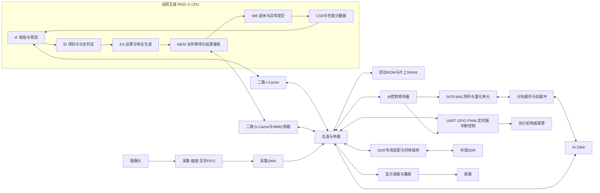

# RISC-V 边缘 AI 加速多方案比较与推荐实施方案

2026-10-10交接补充：本文保留2026-09-22的方案与当时状态。当前已有可等待请求/响应总线、128-bit Pango DDR用户口、UART/Loader/BSP/CoreMark及MMIO计数器源码，摄像头/CNN/DMA仍未实现；下文旧DDR宽度、旧CPU/MMIO状态不适用于现工程。开始开发请读[最新摄像头/CNN交接](../project/摄像头与CNN开发交接_2026-10-10.md)。

编制日期：2026-09-22。

依据：用户提供的赛题文本、主办方新增评判要求、《CPU当前实现现状与后续方案输入.md》，以及少量工程配置核对。本文是设计建议，不是已经实现或测得的结果。输入文档末尾的任务清单作为背景，本方案围绕本次要求展开：比较 AI 加速路线，说明 CPU 和配套模块需求，形成一套可实施的推荐方案。

**推荐采用“+ 显示/分拣控制”，以固定工位的小目标种类检测与分拣作为作品场景。先完成可测量的应用闭环，再增加二路 Cache、BTB，并用对照实验解释它们对整机的作用。**

## 1. 先确定作品要解决什么问题

新增要求将作品评价重点放在真实应用能力上。建议把论证顺序固定为：

1. 场景：在固定相机、固定工位下识别少数几类物品，判断类别和位置，输出分拣动作或报警。
2. 应用效果：检测准确率、漏检率、每秒处理帧数、每分钟正确分拣数量、采集到动作的延迟。
3. 系统设计：CPU、加速器、存储、传感器、显示和执行机构如何协同。
4. CPU 能力：CoreMark、主频、流水线效率、Cache/分支预测效果。
5. 实现代价：CPU 与整个 SoC 的 LUT、FF、片上 RAM、DSP、时序和外部内存占用。

这意味着“MAC 单元算得快”或“CoreMark 高”本身不足以说明作品完成得好。摄像头排队、DDR 搬运、后处理慢、错误动作多，都必须计入整体评价。

### 建议场景及取舍

| 场景 | 主要应用指标 | 额外模块 | 适配性 |
|---|---|---|---|
| 固定工位物品检测与分拣 | mAP、漏检率、正确分拣率、件/分钟、动作延迟 | 摄像头、显示、GPIO/PWM；可选到位传感器 | 首选，容易控制输入条件和建立可复现实验 |
| 人员/物品越界检测与报警 | precision、recall、误报次数/小时、报警延迟 | 摄像头、显示、蜂鸣器 | 没有机械机构时的替代场景 |
| 人脸身份识别 | 身份匹配准确率、误接受/误拒绝率、完整识别延迟 | 检测、对齐、特征提取、图库比对 | 比目标检测多一整条识别链，初版不推荐 |
| 语音关键词机械控制 | 命令识别率、误触发、响应延迟 | 麦克风、音频采集、特征提取、PWM | 小模型容易落地，但不能自行等同于赛题“YOLO 或轻量版大模型”路线 |

YOLO 检出“人脸”或“人物”不等于身份识别。若展示身份识别，必须确实实现后续特征与匹配流程。

## 2. 当前项目能直接复用什么

| 当前基础 | 对 AI 方案的影响 |
|---|---|
| 五级、单发射、顺序 RV32I，已有前递、冲刷与异常/中断框架 | 足以作为控制核，不需要先重做成乱序或多核 |
| 不支持乘除法、向量、自定义 AI 指令 | 软件推理较弱，但不妨碍通过 MMIO 控制独立加速器 |
| 固定一拍取指/访存，无请求响应握手 | 是接总线、Cache、DDR、MMIO 的首要阻塞项 |
| 当前 SoC 为 16 KiB ROM + 16 KiB RAM | 无法直接容纳有实用规模的检测网络工作集 |
| 无 UART/GPIO、计时器、DMA、Cache、性能计数器 | 应用闭环与可信测量均需补齐 |
| 文档记录 40/42 项测试通过 | 可作为回归起点；本次未重新运行，不视作新验证结论 |

用户已确认平台为 **RK3568_MES2L100H，FPGA 为 PG2L100H-6IFBG484，ARM 为 RK3568J**；FPGA 独享一颗 16 bit、512 MByte DDR3，料号 F60C1A0004-M79W，板卡说明的数据率上限为 1066 Mbps/引脚。厂商产品页将该料号列为 4 Gb DDR3L，容量与用户提供的 512 MByte 相符。[存储厂商产品页](https://lexarenterprise.com/product/ddr3l-2/)

工程 `RISCV.pds` 的 PG2L100H/FBG484/-6 配置与上述 FPGA 相符；`ipcore/ddr3` 已有 IP，但当前 `soc_top.v` 没有例化它。作品于 **2026-11-04** 提交，距 2026-09-22 相隔 43 天。摄像头/屏幕接线、ARM–FPGA 实际通信链路和可投入人力仍未知，以下工期是范围收敛安排，不是交付保证。

核对还发现：现有 DDR IP 配置与生成顶层均为 `MEM_DQ_WIDTH=32`、`MEM_DQS_WIDTH=4`，用户数据端口宽度为 256 bit；这与板上 **16 bit DDR** 不一致。应按板卡参考工程与芯片数据手册重新配置生成 IP，连同 DQS、DM、行列 bank 参数、电压、速率、引脚和时钟一起核对，不能只改顶层参数。按该封装的宽度关系，16 bit 外存对应 128 bit 用户数据端口，最终以重新生成结果为准。

现有配置 row=14、column=10、bank=3，在改为 x16 后对应容量为 `2^(14+10+3) × 2 B = 256 MiB`，也不匹配所述 512 MiB。必须核实完整地址几何；若 column/bank 不变，则容量计算需要 15 位 row，但不能未经芯片资料确认就直接修改。

该 IP 还缺少标准 AXI4 的若干握手/响应端口，例如 `RREADY`、标准写响应通道。**不能直接接一个通用 AXI4 主机就认为联调完成**。地址单位、写数据时序和完成语义必须根据该 IP 文档与示例核实。

按用户提供的最高数据率计算，外存理论峰值为 `1066×10^6 ×16/8 = 2.132 GB/s`（十进制）。1066 是每引脚数据率，对 DDR 相当于约 533 MHz 时钟，并非 CPU 或 AI 时钟；实际持续有效带宽受刷新、读写切换、burst、控制器及多主机仲裁影响，必须测量。512 MiB 容量可以容纳小型 YOLO 的候选部署，能达到的实时性能仍取决于计算和数据复用。

## 3. 七种 AI 实现路线

这些路线可以组合，但应选一条作为主线。下表中的难度和风险是针对当前项目作出的工程判断。

| 路线 | CPU 所需功能 | 其他主要模块 | 优点 | 缺点与适用范围 |
|---|---|---|---|---|
| A. CPU 纯软件推理 | 基础 C 环境、计时器、可等待访存；强烈建议乘法，较大模型需要 Cache/DDR | 传感器接口、内存、显示/控制；INT8 算子库 | 改动少；最能体现 CPU 自身能力；适合作为正确性与速度基线 | RV32I 软件乘法和访存开销大；小分类器可行，检测网络吞吐风险高；不形成独立硬件 AI 加速单元 |
| B. 自定义打包 INT8 指令 | 修改译码、EX、冒险和写回；定义指令语义、软件封装和多周期控制 | 4 路或 8 路点积单元、量化辅助单元；仍需内存与传感器 | CPU 特色强；可以复用现有流水线；面积相对可控 | 取数、循环和发射仍由 CPU 承担；加速倍数受带宽和指令数限制；整网吞吐提升未必大 |
| C. MMIO 独立 INT8 加速器 | 正确的 MMIO、可等待访存、FENCE、定时器；中断与性能计数器建议必做 | MAC 阵列、片上分块缓存、DMA、DDR 桥、量化和算子调度 | 易与现有 CPU 解耦；支持 CPU 与计算重叠；性能/资源可参数化；适合完整 YOLO 作品 | DMA、数据布局和软件导出工作较多；需处理共享内存一致性与带宽竞争；**综合推荐** |
| D. 按网络定制的流式硬件 | 配置寄存器、帧控制、异常处理、结果读取 | 各层专用流水、行缓存、层间 FIFO、量化算子 | 数据局部性好；可降低中间特征图外存流量；固定模型下延迟有优势 | 分支/拼接导致缓存复杂；模型变化常需改 RTL；资源不一定小；易被最慢一层限制 |
| E. 标准 RVV 向量处理器 | 向量寄存器、VL/VTYPE、mask、向量访存、相关性、异常与工具链支持 | 向量执行单元、高带宽存储与向量软件算子 | 通用性强，软件可编程性好 | 相当于新增一套较大处理器子系统；当前阶段验证成本很高，不推荐作为比赛主线 |
| F. 小型语言模型 + GEMV/GEMM 加速 | 内存调度、计时中断、tokenizer、模型运行时；建议乘法 | INT4/INT8 矩阵单元、解包/反量化、DDR、KV cache、非线性算子；语音还需前后端 | 交互展示直观，贴合轻量版大模型方向 | 容量/带宽和复杂算子压力大；首 token、持续生成速度与回答质量均需达标；风险最高 |
| G. ARM/NPU 推理，RISC-V 控制 | 通信驱动、事件/命令处理、GPIO/PWM、计时与中断 | RK3568 侧推理软件、ARM–FPGA 链路、显示与采集 | 可以发挥开发板现成应用处理能力，快速搭建整体产品 | AI 性能主要来自 ARM/NPU，自研 RISC-V 与 FPGA AI 创新的贡献较弱；能否满足该赛题高阶项须有明确口径，不推荐作本作品主线 |

### A：纯软件应保留为基线，避免作为整网实时检测的唯一方案

先用 RV32I C 程序实现小规模矩阵乘和卷积，验证量化、内存布局及测量方法。对于整个 YOLO，代码、权重和激活均需要额外存储；不能仅把模型转换成 C 数组就假设当前 16 KiB RAM 可以运行。

硬件乘法建议优先于除法。可先实现标准 Zmmul 的 `MUL/MULH/MULHU/MULHSU`，除法暂用软件；若标称 RV32IM，则必须实现完整 M 扩展并验证除零和有符号溢出。Zmmul 是正式的乘法子集，不能只实现一条 MUL 就宣称支持完整扩展。[RISC-V M/Zmmul 规范](https://docs.riscv.org/reference/isa/v20240411/unpriv/m-st-ext.html)

### B：自定义指令适合做增量优化

建议最小指令为两源一目的的 `DOT4 rd, rs1, rs2`：两个 32 位寄存器各含四个有符号 INT8 数，四组相乘求和后写回 32 位结果；累加先用普通 ADD，避免隐含读取旧 rd 带来的第三读口和新冒险。指令编码使用自定义空间，配套 C intrinsic 或内联汇编。

乘法/加法树可采用多周期设计，避免拉长 CPU EX 关键路径。必须验证符号扩展、依赖前递、stall、flush、非法编码和中断排空。后续若加入隐藏累加器，还必须定义保存恢复和异常行为。

优先在真实热点上应用，如后处理、小矩阵或少量 CPU 回退算子；不建议与独立大阵列同时起步，避免维护两套未验证的计算路径。

### C：推荐的可配置加速器

CPU 写“输入位置、权重位置、尺寸、步幅、量化参数”，加速器自行搬运并执行；每个输出像素的乘加不再由 CPU 逐条发指令。使用同一硬件支持多个层、不同尺寸和权重，兼顾工作量与可复用性。

初版可由 CPU 每层配置一次；确认配置开销后再扩展为内存描述符链。先实现常用算子并保留正确的软件回退，统计回退占比，避免“只加速卷积微基准、整网却被其余算子拖慢”。

### D：流式方案是资源充足且网络稳定后的选择

卷积层之间用 FIFO/行缓存流转，尽量不把每层结果写回 DDR。对于小型、线性网络有吸引力；YOLO 中跨层连接、上采样与拼接需要单独规划缓存和对齐。低比特网络还需要训练或量化适配，不能把 INT8 模型直接截位成二值网络。

FINN 可作为量化网络数据流架构的参考，但其工具依赖 AMD/Xilinx 工具生态，不能把其生成流程直接视为紫光同创可用 IP；本项目采用该思路时应实现并验证目标平台 RTL。[FINN 官方项目](https://github.com/Xilinx/finn)

### E：不要把少量 SIMD 指令称为完整 RVV

如果仅做 4 路点积，这是方案 B。完整 RVV 还包含向量长度、mask、访存和异常等软件可见语义。对当前项目，扩展资源宜先投入数据搬运与应用完整性。

### F：语言模型路线的筛选门槛

先计算权重容量下限：`参数量 × 位宽 / 8`。例如 0.5B 参数、4 bit 权重仅原始位数据就约 250 MB（十进制），还不含分组 scale、元数据、KV cache、激活和程序。若每个生成 token 需要从外存读约 250 MB 权重、有效带宽假设为 1 GB/s，则仅权重传输上限约为 4 token/s，实际还会受计算与其他流量限制；这是假设推算，不是本板性能。

矩阵加速之外，还需要归一化、激活、注意力/Softmax、KV 管理和 tokenizer；加入语音交互还要增加识别/合成链路。考核应包括首 token 延迟、token/s、固定任务集成功率和峰值内存。量化推理项目可供软件理解参考，但不能假定现有大型运行时能直接在当前裸机 RV32I 上编译运行。[llama.cpp 官方项目](https://github.com/ggml-org/llama.cpp)

只有在实际 DDR 容量与持续带宽、可接受响应时间、适配人员均明确时才考虑改选此路线。

### G：这块板可以利用 ARM，但须明确分工

RK3568 系列具备片上 NPU，因此存在“ARM/NPU 做检测，RISC-V 做控制”的技术路线。[瑞芯微官方介绍](https://www.rock-chips.com/a/cn/news/rockchip/2021/0114/1371.html) 这能够展示完整产品，但不能把它的检测 FPS 归因于自研 RISC-V 或 FPGA MAC 阵列；也不应自行断言主办方允许或禁止这种分工。

推荐将 RK3568J 用于加载权重、传输测试图片、记录日志和显示 UI。主测路径的整网推理与决策仍由 FPGA 内自研 RISC-V + INT8 加速器完成；ARM/NPU 结果可作为独立系统对照，明确标注计算位置。

如果摄像头/屏幕只接在 ARM 侧，可由 ARM 采集原始帧并显示 FPGA 返回结果，但须将这条路径标为 ARM 辅助采集显示，统计链路时间和 ARM 资源；不能默默把预处理/NMS 也移至 ARM。FPGA DDR 与 ARM DDR 不应假设可直接共享，须先核实板间互连。

现有可用 SPI/并行链路优先于从零开发 PCIe/HSST。UART 适合日志、模型分批加载和单图联调，通常不适合实时视频：例如 160×160 RGB888、5 FPS 已需 384,000 B/s 净荷；8N1 UART 115200 baud 理论仅 11,520 B/s。接口必须由板卡原理图和实测决定。

## 4. 最终推荐：固定工位视觉检测与分拣 SoC

### 4.1 应用闭环与模型选择

作品暂定名：**基于自研 RISC-V CPU 的边缘视觉检测与智能分拣系统**。

流程：到位传感器/摄像头采集 → 裁剪缩放与量化 → INT8 YOLO 推理 → CPU 框解码与 NMS → 类别/位置决策 → 显示检测结果、计数和延迟 → GPIO/PWM 输出动作。

第一版使用固定相机、固定区域和少数类别；先用静止工位验证，再增加移动物品。若没有机械装置，以屏幕和 GPIO 指示完成闭环，只报告检测与控制输出能力，不声称已验证机械分拣率。

模型候选为 YOLOv5n，先以 **160×160、batch=1** 建立正确性，再按小目标召回率和资源条件提高至 224×224 或 320×320。选择成熟小模型便于冻结网络与导出结果，并不保证该模型在本平台最快。冻结代码提交、权重、类别和输入尺寸；最终以实际导出的算子图为准。[YOLOv5n 模型定义](https://github.com/ultralytics/yolov5/blob/master/models/yolov5n.yaml)

训练与量化在 PC 离线进行，FPGA 板上完成输入处理、推理与输出控制。官方工程有 INT8 导出路径，但导出成功不等于自研硬件已支持全部算子；本项目仍需编写离线权重/量化参数/层描述符导出器与参考计算。[YOLOv5 导出实现](https://github.com/ultralytics/yolov5/blob/master/export.py)

不得直接把默认 SiLU 替换为 ReLU 而声称模型精度不变。第一版可按量化定义实现 SiLU 查表；若为简化硬件修改激活或网络，须重新训练/校准并重新测量准确率。

### 4.2 CPU 结构与 SoC 框架



框图是目标架构，Cache/BTB 分阶段加入。CPU 内部还需在详细报告画出 EX/MEM/WB→ID 前递、load-use 暂停、流水线 valid/ready、flush 与精确异常优先级。

CPU 负责模型调度、外设、后处理、系统决策和错误恢复；加速器负责卷积/矩阵乘与量化；DMA 负责搬运；采集和显示尽量不由 CPU 逐像素搬运。训练不在 FPGA 上完成。

### 4.3 CPU 必须补齐、建议补齐、暂缓的功能

| 优先级 | 功能 | 目的 |
|---|---|---|
| 必须 | I/D 请求响应握手、等待状态、流水线背压 | 接受变延迟存储器，避免重复读写与错误写回 |
| 必须 | 地址译码、MMIO 属性、总线错误处理 | UART/AI/DDR 可寻址；错误地址不再别名到片内 RAM |
| 必须 | UART、GPIO、硬件计时器、启动与 C 裸机环境 | 满足基础任务，提供日志、控制和可信计时 |
| 必须 | 系统级 FENCE、明确的共享内存规则 | 保证“写参数/数据→启动→完成→读结果”的顺序 |
| 推荐纳入提交版 | 外部中断保持/清除与同步器、定时器中断 | 在推理期间处理其他任务、检测超时和可靠完成通知 |
| 推荐纳入提交版 | mcycle/minstret 及停顿计数 | 解释 CPI、访存等待和优化收益 |
| 推荐 | Zmmul 或完整 M 扩展 | 加快地址计算和 CPU 后处理；不是独立 NPU 的硬性前提 |
| 高阶目标 | 二路 I/D Cache、burst、BTB + 两位预测计数器 | 满足高阶 CPU 展示与外存程序效率需求 |
| 高阶配套 | FENCE.I 与取指同步 | 支持加载新代码后安全执行；涉及 I-Cache 失效和预取清空 |
| 暂缓 | Linux、MMU、S/U 模式、完整 RVV、浮点、多核 | 对初版 INT8 视觉闭环收益不足以抵消开发量 |

FENCE.I 属于 Zifencei，不能仅因未实现它就断言基础 RV32I 算术访存均不合规；非对齐访存也可以按执行环境约定触发异常。现有两个测试的失败应如实解释，并与竞赛验收口径对齐，不必为了 AI 强行优先实现跨字访问拆分。[RISC-V 非特权指令规范](https://docs.riscv.org/reference/isa/v20240411/_attachments/riscv-unprivileged.pdf)

### 4.4 总线与精确异常：先简单、再扩展带宽

CPU 内部使用单未完成事务的请求/响应接口：

```text
req_valid, req_ready, req_addr[31:0], req_write,
req_wdata[31:0], req_wstrb[3:0]
rsp_valid, rsp_ready, rsp_rdata[31:0], rsp_error
```

指令侧独立使用只读版本。`valid && ready` 才表示接收；等待时请求内容保持；握手后不可重复发送；读和写均需要明确完成响应。初版每个端口最多一个未完成请求，通过 pending/响应缓冲解耦，不必让 CPU 内核直接维护 AXI 通道。

对总线的选择：自定义 ready/valid 易于改造内核，但协议要自行验证；Wishbone/AHB-Lite 可完成简单访问，不过和现有 DDR IP 仍需桥接；AXI4-Lite 适合控制寄存器，不能用它承载所需 burst；标准 AXI4 适合未来多主机和突发数据通路，但实现与验证更重。**建议 CPU 侧简洁握手，MMIO 单拍访问，DMA/Cache 侧具备突发接口，再由专用桥接适配现有 DDR IP。**

必须处理的边界：

- stall 不只是冻结 PC：保存流水项及 pending 状态，保证 WB 不重复退休、store 不重复写、MMIO 不重复触发；总线响应必须仍能被接收并缓冲。
- load 必须等响应有效才允许前递和写回；取指被重定向后，旧请求返回的数据/错误要按其有效性丢弃，可使用 epoch 标记。
- store 只能在确认所有更老指令无异常后向外发送；保留该 store 的 PC/地址直到完成。在可能返回错误的前台访存上，禁止年轻 store/MMIO 提前产生不可撤销副作用。
- 初版采用阻塞、非投机、非 posted 的 CPU 写事务，便于精确异常；不能简单沿用“EX 写使能直接驱动外设”。
- CPU 可见译码/访问错误映射到相应访问故障；不具有错误报告能力的 DDR 物理故障不能凭空转换为精确异常。
- 超时后不能直接复用事务槽而接收旧响应，应隔离或复位/排空对应通道。已经写出的部分 DMA 数据不能声称已经回滚。
- 中断只需在本核安全退休边界处理，并正确保存/处理本核未完成事务。**无须等待所有无关 DMA 都空闲**；否则连续视频 DMA 可能让 CPU 长期无法响应中断。

### 4.5 存储与 Cache：先保证可解释的一致性

建议内存规划如下，地址为新方案提议，须同步修改链接脚本、启动代码和测试环境：

| 地址 | 用途 | 属性 |
|---|---|---|
| `0x0000_0000–0x0000_3FFF` | 16 KiB 启动 ROM | 只读、可执行 |
| `0x1000_0000–0x1000_FFFF` | 64 KiB 片上 SRAM 预留窗口 | 首版可只实现 16 KiB，未实现区域返回错误 |
| `0x2000_0000–0x2000_0FFF` | UART | 不缓存、非投机 |
| `0x2000_1000–0x2000_1FFF` | GPIO/PWM | 不缓存、非投机 |
| `0x2000_2000–0x2000_2FFF` | 定时器、mtime/mtimecmp、软件中断 | 不缓存 |
| `0x2000_3000–0x2000_3FFF` | 简化中断控制器 | pending/enable/ack，不冒称完整 PLIC |
| `0x2000_4000–0x2000_4FFF` | AI 控制寄存器 | 不缓存 |
| `0x2000_5000–0x2000_5FFF` | DMA、采集、显示寄存器 | 不缓存 |
| `0x8000_0000–0x9FFF_FFFF` | 512 MiB DDR：程序、模型和特征图 | 完成容量/地址测试后启用全范围；分为可缓存私有区和不缓存共享区 |

Cache 起步：I-Cache 4 KiB、D-Cache 4 KiB，均二路组相联，32 B line、每路每组一个块，共 64 组；替换用每组一位 LRU。容量是试验起点，按综合与 miss 数据调整。

I-Cache 使用阻塞式 refill。D-Cache 初版采用 **write-through、no-write-allocate、无 posted 写缓冲**，降低脏块与错误追溯的复杂度；提交版若带宽测量证明写流量是瓶颈，再考虑 write-back。二路 Cache 并不要求必须 write-back。

DMA 缓冲区和描述符首版全部放在**唯一、不缓存的物理地址范围**；不能再通过可缓存别名访问同一物理内存。这样可避免第一版同时开发硬件一致性协议。CPU 热数据放可缓存区，整帧数据由 DMA 搬运。

若后续允许缓存共享缓冲区，则必须增加 clean/invalidate 等维护机制及所有权规则。**FENCE 只保证约定的访问顺序，不自动等于 D-Cache 清洗；FENCE.I 也不是 DMA 一致性指令。**启动 AI 前软件执行编译器屏障和硬件顺序屏障；完成后按设备协议读取状态并取得结果所有权。

模型存储预算要包含权重、量化参数、各时刻同时存活的激活、分支保留张量、帧缓冲、DMA、栈和堆。320×320 RGB888 单帧为 307,200 B，双缓冲为 614,400 B；这还没有计入中间特征图，不能仅用权重大小估算内存。

### 4.6 AI 加速器结构与算子边界

| 模块建议名 | 主要功能 | 初版边界 |
|---|---|---|
| `ai_regs` | 控制与状态、地址/尺寸/量化参数、完成中断 | 单任务在途；busy 时拒绝或明确忽略 start，并置错误 |
| `ai_ctrl` | 层与 tile 调度、计数、错误状态 | CPU 每层提交，后续扩展描述符 |
| `ai_dma` | 输入/权重读取、输出写回、burst 与边界拆分 | 地址范围检查、长度检查、末拍字节掩码 |
| `tensor_buffer` | 输入/权重分块缓存、双缓冲 | 使用片上 RAM，按实际端口数安排 banking |
| `mac_array` | INT8×INT8，INT32 累加 | 先 8～16 路并行 MAC，闭环后尝试 32/64 路 |
| `requant` | bias、定点缩放、舍入、饱和 | 参数按输出通道配置，位精确对照参考模型 |
| `activation` | 激活函数 | 与冻结模型一致的 LUT 或分段实现 |
| `tensor_ops` | MaxPool、Add、Upsample、Concat 搬运 | 按导出图实现，不支持的节点显式软件回退 |
| `camera_rx/preprocess` | 帧/行同步、缩放、颜色与量化 | 接口依板卡确定，跨域用 FIFO |
| `display_ctrl` | 帧读取与检测框叠加 | 初版低分辨率，避免显示抢占全部带宽 |

卷积从 1×1 与 3×3、stride 1/2 开始。建议使用直接卷积或分块计算，避免在 DDR 显式展开完整 im2col；其展开可能放大特征数据搬运。MAC 的数据复用策略以片上缓存大小和实际端口带宽为依据，不凭“脉动阵列”名称决定优劣。

基本寄存器包括 `CTRL(start/abort)`、`STATUS(busy/done/error)`、`IRQ_ENABLE/STATUS`、输入/权重/输出地址、H/W/C、kernel/stride/padding、量化参数地址、`ERROR_CODE`、总周期/忙周期/DMA 等待周期。状态位可采用写 1 清除；启动时锁存配置，执行期间不允许改变正在使用的参数。

控制流程：`IDLE → CHECK → LOAD → COMPUTE → STORE → DONE/ERROR`。双缓冲稳定后允许 LOAD/COMPUTE 重叠。完成中断必须在输出写入达到软件可见的完成点后置位，不能只以最后一个乘法结束作为完成。`abort` 要停止新请求并排空已接收事务，结果缓冲区标为无效。

### 4.7 量化是软硬件契约的一部分

建议权重有符号 INT8、每输出通道 scale、权重 zero-point 为 0；激活 INT8，允许每张量 scale/zero-point；bias 与累加使用 INT32。量化关系为 `real = scale × (q − zero_point)`。这是常见的 LiteRT INT8 设计方式，具体导出算子仍须逐项核对。[LiteRT INT8 量化规范](https://developers.google.com/edge/litert/conversion/tensorflow/quantization/quantization_spec)

必须在自己的整数参考模型中固定：张量布局、通道 padding、输入零点修正、bias 缩放、乘数和移位、负数舍入、饱和范围以及累加溢出策略。输入 padding 应填入量化零点，而非一律写整数 0。每层检查最坏累加范围；INT32 不是无条件不溢出的保证。

软件准备离线定点参数，CPU 无须为此先实现 FPU。CPU 上的解码/NMS 也可使用定点，但应验证坐标精度与置信度阈值影响。Add/Concat 处要处理各分支 scale 差异，不能直接拼接不同量化含义的数据后当成同一张量。

## 5. 性能和资源：先估算，后实测

### 5.1 不把峰值算力写成应用速度

若每周期可完成 `N` 个 INT8 MAC、加速器频率为 `f`：

```text
峰值 MAC/s = N × f
若一个 MAC 计作乘与加两个操作，则峰值 OPS = 2 × N × f
计算时间估算 = 实际模型 MAC 数 / (N × f × 利用率)
搬运时间下限 = 实际外存传输字节 / 实测有效带宽
```

仅作演算：32 路 MAC、100 MHz，峰值为 3.2 GMAC/s，即 6.4 GOPS；假设整网 100 MMAC、利用率 50%，仅计算约需 62.5 ms。该示例的模型规模、频率和利用率均是假设，**不代表 YOLOv5n 的实际 MAC 数或本工程实测 FPS**。

计算和搬运完全重叠时才可能接近二者最大值；不能重叠时要相加。整体延迟还要计入采集、排队、预处理、CPU 后处理和输出。稳定流水吞吐受最慢阶段约束，而单帧延迟仍包含跨阶段经历的时间。

先从导出模型统计每层 MAC 数、输入/输出/权重大小，再结合 tile 复用计算实际流量；实测 DDR 带宽须包含采集、显示、CPU 和 NPU 并发情况。增加 MAC 路数前确认供数充足，否则只会增加资源消耗。

### 5.2 资源使用说明必须覆盖全系统

最终报告至少给出以下表格，并以布局布线后的工具报告为准：

| 模块 | LUT/逻辑单元 | FF | 片上 RAM 块与 bit | DSP | 时钟/频率 | 备注 |
|---|---:|---:|---:|---:|---|---|
| CPU 核，不含 Cache | 待测 | 待测 | 待测 | 待测 | 待测 | 标明 ISA 与乘法实现 |
| I/D Cache 与预测器 | 待测 | 待测 | 待测 | 待测 | 待测 | 标明容量、line、替换策略 |
| 互连、桥接与 DDR 控制器 | 待测 | 待测 | 待测 | 待测 | 待测 | 纳入厂商 IP 开销 |
| AI 阵列、量化、片上缓存 | 待测 | 待测 | 待测 | 待测 | 待测 | 标明并行度和位宽 |
| DMA、相机、显示与基础外设 | 待测 | 待测 | 待测 | 待测 | 待测 | 纳入 FIFO 与帧控制 |
| 调试核 | 待测 | 待测 | 待测 | 待测 | 待测 | 测试版和提交版分别记录 |
| 完整 SoC | 待测 | 待测 | 待测 | 待测 | 各时钟域 | 与器件可用量计算占比 |

同时报告外部 DDR 的静态权重大小、峰值运行内存、帧缓冲大小、持续带宽。LUT/FF/DSP/RAM 应分别占比，不能混合相加成一个资源百分数。跨层优化可能使层次用量不严格可加，应保留工具总计并说明归属口径。

不预先假定一个 DSP 能打包几个 INT8 乘法；先用目标器件原语和综合结果验证。资源安排先保留 CPU、DDR、采集显示与调试空间，再决定 MAC 并行度和 tile 大小，避免只根据乘法器数量塞满器件。

### 5.3 时序说明的具体交付物

- 时钟拓扑：CPU、AI、DDR 用户时钟、摄像头像素时钟、显示时钟及其来源和频率。
- 每个时钟域布局布线后的 setup/hold WNS、TNS、违例数；合法约束范围内 setup/hold 均通过。
- 关键路径起止点与逻辑原因：CPU ID 分支/前递、加法树、地址译码、RAM 输出、跨模块高扇出等。
- 时钟和 I/O 约束、generated clock、异步域处理；false path 仅用于有明确 CDC 方案的路径，不用来掩盖真实时序问题。
- CDC 说明：异步 FIFO、单 bit 同步器、pending 保持、复位同步释放；多 bit 数据不能逐位简单双触发同步。
- 设计目标频率、实际运行频率、通过布局布线的频率和板级压力验证频率分列。未做频率扫描就不宣称“最高频率”。

初版 CPU/AI 尽量同域，DDR 使用 IP 规定时钟并加桥接；只有确有收益再拆 CPU 与 AI 时钟。每增加一个域，都要重新统计桥接延迟与资源。

## 6. 分阶段实施与验收

以下按依赖顺序执行，随后给出针对 11 月 4 日提交的目标日程。每阶段保留可回退的已验证版本。

| 阶段 | 目标与模块 | 关键控制/异常 | 验证与进入下一阶段条件 |
|---|---|---|---|
| 0. 冻结场景和模型 | 训练/导出脚本、数据集、整数参考模型 | 列出所有算子、量化和内存需求；不支持节点明确回退 | 留出测试集准确率可接受；记录 MAC 数、峰值激活与参数大小；禁止在测试集调参 |
| 1. CPU 可等待访存 | 改 `mycpu_sync`，新增取指/LSU 事务控制与 SRAM wrapper | request/response、pending、epoch、精确 store、错误响应 | 随机插入 0～几十拍等待及错误；无重复退休/写入；现有差分与异常中断回归不退化 |
| 2. 可测量最小 SoC | 改 `soc_top/csr_file`；地址译码、UART、GPIO、timer、irq、计数器、启动代码 | 未映射地址报错；中断 pending 保持/清除；64 bit 计数读取避免撕裂 | C 程序、打印、定时中断、GPIO 通过；CoreMark 有效完成与 CRC 正确，形成基线 |
| 3. DDR 与基础搬运 | `ddr_bridge`、仲裁、DMA、跨域 FIFO | 校准完成前不访问；宽度/地址转换；backpressure；错误/超时隔离 | 地址走查、随机数据、部分写与 burst 边界正确；并发搬运校验无误，获得持续带宽 |
| 4. 小规模 AI 内核 | `mac_array/tensor_buffer/requant/ai_regs` | 单层、单任务；输入边界、饱和、busy/start、done 可见性 | 1×1/3×3 各尺寸与负数、padding、通道尾部逐元素等于整数参考；DMA 与计算计数可信 |
| 5. 整网离线图片 | 导出器、层调度、其余算子、CPU NMS | 张量生存期和量化转换；回退路径；错误帧作废 | 每层/每 tile 核对；整个测试集精度与软件参考差异可解释；输出完整延迟分解 |
| 6. 实时应用闭环 | camera/preprocess、采集DMA、display、PWM、帧队列 | 帧所有权、丢帧政策、时间戳、采集过载和恢复 | 固定协议连续运行；帧号和结果对应；统计 FPS、P50/P95/P99 延迟、漏检、正确动作率 |
| 7. CPU 高阶与优化 | 二路 I/D Cache、burst、BTB/两位计数器；可选乘法扩展 | refill/冲刷、FENCE.I、MMIO 绕过；预测元数据与恢复 | Cache/预测/中断交叠随机回归通过；同场景比较 CoreMark 与应用增益，重新核对资源及时序 |
| 8. 参数收敛与报告 | 调整并行 MAC、tile、缓存和输入分辨率 | 每次只改变可解释的主要变量 | 完成布局布线、板级压力与留出集测试；图表和原始日志可复现 |

阶段 7 中 Cache 可在阶段 3 后提前加入，以改善 DDR 执行效率；但不能让 BTB 或扩大 Cache 成为首次应用闭环的前置条件。阶段 4 最初也可用片上 RAM 测试，不必等所有摄像头接口完成。

DDR 桥需重点验证现有 IP 无 `RREADY` 时的接收能力：发读命令前预留足够响应 FIFO 空间，不允许返回数据被下游暂停丢弃。写完成和读后写顺序必须按该 IP 的真实语义建立，不能自行虚构标准 AXI B 响应。

关于精确异常的边界：前台总线访问错误可归属于对应指令；未来若采用 write-back Cache，脏块后台写回错误一般不能简单算到当前执行指令，应另设总线/机器检查类错误处理。AI DMA 错误通过 AI 状态和中断上报，而不是伪装成 CPU 某条 load/store 的同步异常。

### 6.1 43 天目标日程与停止扩展点

| 日期 | 必须收敛的成果 | 未达标时的处理 |
|---|---|---|
| 9/22–9/28 | CPU 等待接口、最小外设/计时、模型图冻结；核对并重新生成 x16 DDR IP | 先停 BTB/自定义指令；复用板卡匹配的 DDR 参考工程，不从头写 PHY |
| 9/29–10/5 | DDR 地址/数据压力测试、DMA、CoreMark 基线、模型与数据加载通道 | 片上 RAM 继续验证 AI 单层；ARM/PC 传图片仅供单图联调，不虚报实时能力 |
| 10/6–10/12 | 小 MAC 阵列、量化、关键算子与 CPU 回退；逐层对照 | 限定 160 输入、少数类别；不扩大阵列、不更换新模型系列 |
| 10/13–10/19 | 完整 YOLO 单图推理与真实摄像头闭环；形成分阶段延迟表 | 缩减类别/分辨率/显示复杂度，必要时输出报警代替机械分拣；不改走大模型 |
| 10/20–10/26 | 二路 Cache、BTB 等高阶完善；有限性能调优、最终资源及时序结果 | 先保证完整场景稳定，未完成高阶项如实标明；不为加功能破坏已验证版本 |
| 10/27–11/2 | 功能冻结，压力测试、留出集精度、对照实验、报告与演示录像 | 仅修影响正确性/交付的问题，不新增架构 |
| 11/3–11/4 | 干净环境复现、资料打包、最终提交 | 保留时间处理构建/提交问题 |

这是对当前基础而言较紧的计划，尤其整网算子适配、DDR 联调和 Cache 同时存在工作量。**10 月 19 日前跑通整网与应用闭环，10 月 27 日前冻结功能**，比追求更多 AI 指令或更大阵列更重要。若只有一人开发，应更早放弃自定义指令、机械机构和 PCIe，优先保障主路线；不要承诺 43 天内必然完成全部高阶项。

## 7. 怎样按新增要求证明作品能力

### 7.1 应用测量协议

在测试前固定类别、分辨率、置信度阈值、IoU/NMS 阈值、光照/距离范围、数据划分、预热方式和采样长度。

- 检测：mAP@0.5、条件允许时 mAP@0.5:0.95、precision、recall，并展示误检/漏检案例；不要只写一个含义不明的“识别率”。
- 吞吐：每秒真正完成推理并形成结果的帧数；同时报告输入帧率、丢帧率与队列深度。屏幕刷新率不是推理 FPS。
- 延迟：明确从帧采集开始或采集完成，到结果/控制信号有效的起止点，报告平均及 P50/P95/P99；物理执行机构的到位延迟另行测量。
- 分拣：`正确动作件数 / 实际输入件数`，并列漏检、错分和机械未到位数；报告件/分钟。
- 稳定性：固定时长连续运行、帧丢失、DMA 错误、超时恢复计数。可将连续 30 分钟作为初步工程门槛，不冒称赛题强制标准。

可先设内部目标为 160×160 输入下 ≥5 FPS、采集完成到控制输出 P95 ≤250 ms、量化相对 FP32 mAP@0.5 下降 ≤2 个百分点；这些只是待建模验证的起始目标。绝对准确率门槛须由类别、测试集难度和场景要求确定，不能用低精度换取帧率后只报告速度。

### 7.2 CPU 和硬件加速的对照实验

| 对照 | 固定条件 | 能回答的问题 |
|---|---|---|
| CPU 软件 INT8 vs 同模型 NPU INT8 | 输入、权重、量化、输出阈值和测量范围一致 | 硬件到底使整网快了多少 |
| 无 Cache vs 二路 Cache | CPU/AI 时钟及其他配置一致 | CPU 访存、CoreMark 和应用后处理是否改善 |
| 无预测 vs BTB/动态预测 | 编译参数、缓存和时钟一致 | 分支优化是否有通用收益 |
| 16/32/64 MAC 参数比较 | 同模型、同输入；同频比较可实现的配置 | 加算力是否被带宽限制，资源效率是否提升 |
| FP32 软件 vs INT8 软件 vs INT8 硬件 | 同一留出集 | 区分量化精度损失和硬件实现错误 |

若 CPU 运行整网过慢，至少测完整单张图并给出真实时间；只做子层对比时明确限定为该子层，不能外推成已测整网加速比。主机只用于训练、加载和日志，不代替板上推理。

CPU 优化实验同时提供同频结果与各配置可达频率结果：前者解释架构，后者反映实际性能。无法综合通过的“64 路”配置只列为未实现候选，不作为已测结果。

### 7.3 CoreMark 和资源效率的口径

```text
CoreMark = iterations / elapsed_seconds
CoreMark/MHz = CoreMark / 实际 CPU 频率（MHz）
CPU 资源效率 = CoreMark / CPU 范围 LUT
应用资源效率参考 = 完整应用 FPS / 完整 SoC LUT
```

CPU 范围是否含 I/D Cache 必须写清，建议核本体与核+Cache 分别列出；应用效率还必须伴随相同的精度条件和 DSP/RAM 占用，不用单一 LUT 指标掩盖其他资源代价。

使用赛题要求的 CoreMark v1.0，保留官方计算逻辑，记录编译器版本、统一编译参数、迭代次数、计时频率、CRC、内存位置和 Cache 配置，运行至少 10 秒。NPU 不参与 CoreMark 计算；任何代码变化和参数设置都按规则披露。[EEMBC CoreMark 官方说明](https://github.com/eembc/coremark/blob/main/README.md)

ILA/片上逻辑分析记录 PC、各级 valid/stall/flush、退休、访存握手、Cache miss、trap/irq，解释典型程序片段的 CPI 与停顿来源；另记录 AI start/done、DMA 等待和帧事件以解释整机瓶颈。调试核资源和其对时序的影响单独说明。

## 8. 报告内容与最终取舍

建议作品报告采用以下顺序：应用需求与实测效果 → 整体框架 → CPU 五级流水与异常中断 → 存储/互连/加速器 → 模型与量化 → 完整资源表 → 时钟/CDC/时序结果 → CoreMark 和应用对照实验 → 局限与复现方法。

最终提交清单：

1. CPU 内部框图、SoC 框图、AI 数据流图、内存布局和时钟域图。
2. 固定版本 RTL、约束、软件、模型、导出脚本及构建/运行说明。
3. 测试集说明、应用原始结果、延迟分解与资源/时序工具报告。
4. CPU 正确性回归、有效 CoreMark 输出与关键 ILA 波形。
5. 演示中清晰显示输入帧号、检测结果、控制状态和性能统计。

**具体决策：主线选择方案 C，保留方案 A 作为正确性和性能基线；方案 B 仅在后处理分析确有热点后添加。首版不做完整 RVV 和语言模型，不同时承担多条模型路线。**

先用 8～16 路 INT8 MAC、片上分块缓存和一层一调度跑通，再按实测带宽扩大阵列；采用成熟小型 YOLO 的可核对导出图；CPU 先补齐变延迟访存、外设、计数与控制能力，二路 Cache/BTB 作为最终高阶完善项。

若 DDR 或板卡资源暂不满足，先完成片上小网络和低分辨率应用闭环作为阶段成果；这不应被宣称已经完成“YOLO 或轻量版大模型”的高阶要求。最终是否达成该项，以实际移植并运行的模型及赛题口径为准。
