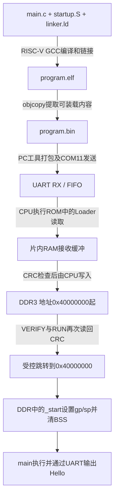

# C 程序编译、UART 下载到 DDR3 与运行流程

日期：2026-10-09。以已实板通过的 `program_hello` 和 `verify_run_hello` 为准。用户操作上板/复位/COM11，Codex负责开发、仿真和离线核验。成功镜像及170项快照保留，不执行重建。

## 两套软件及其作用

1. Loader 固件：在片内指令ROM常驻，片内数据RAM存常量及运行时状态/接收缓冲/栈。位流中包含Loader的ROM/RAM初始化。只要这份Loader位流仍在运行，换应用无需重新生成FPGA位流。
2. DDR应用：本例为Hello，PC编译成BIN后经UART下载到DDR3；CPU由Loader跳转到DDR应用入口。C源文件本身不通过串口发送，ELF也不直接逐字节装进DDR。



## 1. C 编译成应用程序

应用目录：`D:/riscv/RISCV/tests/uart_loader/program_hello/`。

| 文件（目录内） | 作用 |
| --- | --- |
| `main.c` | C应用。本例检查64字节初始化data、96字节BSS，并经UART MMIO输出Hello |
| `startup.S` | 程序入口 `_start`，关闭IRQ、初始化gp/sp、清零BSS，再调用main |
| `linker.ld` | DDR基址/入口0x40000000，代码/常量/data/BSS在低60KiB，保留应用栈0x4000F000–0x4000FFFF |
| `build.py` | 调用交叉编译器、生成ELF/BIN、反汇编与manifest，并做Hello专用内容/ISA审查 |

编译器目录：`D:/riscv/RISCV/xpack-riscv-none-elf-gcc-15.2.0-1/bin/`。`riscv-none-elf-gcc.exe`使用 `-march=rv32i -mabi=ilp32`，以裸机方式编译/链接启动汇编和C，不依赖操作系统或默认C运行库。`linker.ld`决定最终指令和数据在DDR中的地址；`main`之前先执行startup。

编译/链接得到 `build/program.elf`，含机器码、段地址、入口和调试信息。`riscv-none-elf-objcopy.exe -O binary`提取可装载段得到 `build/program.bin`；这个BIN才是UART发送的数据。`build/manifest.json`记录基址、入口、大小、CRC32、SHA256和段布局。`program.map`、`program.dis`、`program.readelf.txt`用于定位和审查，不作为UART下载内容。

首次构建入口（仅说明生成方式，不要对已有成功目录执行）：

```powershell
& C:/python/python.exe D:/riscv/RISCV/tests/uart_loader/program_hello/build.py
```

当前已有成功ELF/BIN，该脚本会拒绝重建。换自己的C程序时须新建独立实验目录，保留当前成功目录；复制启动/链接/构建源文件时不复制已有build产物，并调整Hello专用审查、预期输出和配套发送计划。现有build.py不是不加修改就适用任意C程序的通用构建脚本。

本例BIN大小367字节、CRC32 `5E142E06`：

| 内容 | DDR地址 | 大小 | 是否随BIN下载 |
| --- | --- | ---: | --- |
| `.text`启动与main机器码 | 0x40000000 | 252 | 是 |
| `.rodata`字符串等常量 | 0x400000FC | 46 | 是 |
| 对齐填充 | 0x4000012A | 2 | 是 |
| `.data`已初始化全局变量 | 0x4000012C | 64 | 是 |
| `.image_tail`尾标记 | 0x4000016C | 3 | 是 |
| `.bss`未初始化全局变量 | 0x40000170 | 96 | 否，startup在DDR清零 |

代码、常量和data都在DDR，data无需从片内RAM再次复制。应用的BSS/栈空间另由链接脚本预留。

## 2. 板上的 Loader 已经准备好

Loader目录：`D:/riscv/RISCV/tests/uart_loader/candidates/verify_run_hello/`。

| 文件 | 作用 |
| --- | --- |
| `uart_loader.c` | 解析RVLD请求、管理LOAD/VERIFIED状态、回应READY/ACK/NACK和执行VERIFY/RUN |
| `uart_io.c` | 通过UART MMIO读取接收字节、发送响应、等待TX发送完毕 |
| `ddr_random.c` | CPU对DDR地址执行SW/SB写入和LW/LBU读回CRC |
| `crc32.c` | 固件CRC32计算 |
| `startup.S` | ROM启动，以及 `loader_enter_app`关闭IRQ、FENCE后跳到0x40000000 |
| `build/loader_rom.dat` | 片内ROM指令初始化 |
| `build/loader_ram.dat` | 片内RAM常量及零初始化布局 |

候选位流：

`D:/riscv/RISCV/sim/uart_loader/build/verify_run_hello/pds_candidate/generate_bitstream/board_top.sbit`

此位流已经包含同一对Loader DAT，也包含CPU、UART、DDR桥/控制器等硬件。PDS主工程仍保留阶段⑩成功配置，不需要修改主IP INIT_FILE重新构建。下载隔离位流后，DDR初始化完成才释放CPU，CPU从ROM Loader开始等待UART。

## 3. PC 发送 BIN，Loader 写入 DDR

PC工具目录：`D:/riscv/RISCV/tools/uart_loader/candidates/verify_run_hello/`。

| 文件 | 作用 |
| --- | --- |
| `acceptance.py` | 打开COM11、停等发送/读回应答、核对字段/CRC/状态/Hello、保存原始日志 |
| `protocol.py` | 生成32-byte RVLD Header、DATA CRC和解析60-byte响应 |
| `cases.py` | 固定读取 `tests/uart_loader/program_hello/build/program.bin`，将其切成最大256-byte块，并生成LOAD/VERIFY/RUN请求 |
| `board_cases.py` | 157响应的实板验收计划，含关键错误拒绝、恢复及最后完整Hello链路 |

LOAD命令为CMD2，每块顺序如下：PC发Header → Loader检查Header及目标范围并返回READY → PC发该块DATA和4-byte CRC → Loader检查DATA CRC并由CPU写DDR → 返回ACK，PC再发下一块。Header含SEQ、目标地址、块长度、整镜像大小、整镜像CRC、BEGIN/END标记及Header CRC。

367-byte Hello分成两块：第一块256字节写0x40000000，带BEGIN；第二块111字节写0x40000100，带END。完整END后状态为LOADED_UNVERIFIED，不能直接执行。

UART本身只收字节进FIFO。CPU执行Loader将字节读入片内RAM缓冲，再做DDR写入；没有DMA直接将串口搬到DDR。

硬件写路径：CPU → `myriscv/data_bus_interconnect.v` → `myriscv/dual_sram_to_pango_ddr_bridge.v` → `soc_ddr3_top.v`例化的 `ddr3` IP → DDR3芯片。桥将32-bit CPU访问放入128-bit Pango用户口数据拍并设置字节使能，用户口不能直接等同标准AXI4。

## 4. VERIFY、RUN 和应用启动

CMD3 VERIFY：Loader通过CPU数据总线重新读取实际DDR里的整个367-byte文件，CRC与PC提供的整镜像身份一致，才授予VERIFIED。

CMD4 RUN：再次检查VERIFIED、入口/长度/身份，并重新读取DDR CRC；成功后先返回完整RUN ACK，等UART TX空闲，关闭IRQ并跳转0x40000000。不存在自动执行或自动重复RUN。

此时CPU指令访问0x40000000，由 `myriscv/inst_bus_interconnect.v`译码，经同一DDR桥从DDR取指。入口是应用startup的 `_start`，并非C的main；startup设置gp、sp=0x40010000，清零BSS，最后调用main。main通过UART MMIO输出13-byte `Hello World\r\n`。当前程序输出一次后循环等待，不回到Loader；重新下载要先KEY0复位回到ROM Loader。

## 5. 用户操作

首次上板或重新上电后，按实际板上状态下载上述已归档候选sbit；本次用户已成功下载并完成157/157实板PASS。同一位流仍在运行时复测应用只需KEY0复位，不必重新生成或下载位流。

1. 关闭串口助手，确保COM11空闲。
2. 按KEY0复位并等待DDR就绪，CPU回到Loader、SEQ从1开始。
3. 在PowerShell执行以下完整命令，从任意当前目录都可运行；日志名按时间生成，不覆盖成功日志。

```powershell
$stageHelloBit = 'D:/riscv/RISCV/sim/uart_loader/build/verify_run_hello/pds_candidate/generate_bitstream/board_top.sbit'
$stageHelloTool = 'D:/riscv/RISCV/tools/uart_loader/candidates/verify_run_hello/acceptance.py'
$stageHelloLog = 'D:/riscv/RISCV/sim/uart_loader/board/verify_run_hello_recheck_' + (Get-Date -Format 'yyyyMMdd_HHmmss') + '.json'
& C:/python/python.exe $stageHelloTool --port COM11 --bitstream $stageHelloBit --log $stageHelloLog
```

最后应为 `RESULT: PASS combined LOAD -> VERIFY -> RUN -> Hello World`。当前工具执行完整157响应验收，会在最后成功RUN前进行多组错误拒绝/恢复和重新下载；不只是两块Hello上传。不要使用普通串口助手“发送文件”直接发送BIN，RVLD协议需要Header/CRC/READY停等。工具与串口助手不能同时占用COM11，Hello本次由工具读取且只输出一次。

当前验收入口绑定固定Hello，并没有通用 `--bin 任意文件` 参数。自己的新C程序需要在独立目录编译/审查，并配套新的发送工具/计划，不能替换冻结Hello BIN或修改成功验收脚本硬套。DDR是易失存储，断电后应用需要重新下载。

成功证据及保存位置见[合并实板验收](../uart_loader/UART_Loader_VERIFY_RUN_Hello实板验收_2026-10-09.md)。下一关在保持成功Loader位流的前提下继续至少10轮复位、第二份BIN和CoreMark；本说明只解释流程，没有重复构建或操作实板。
